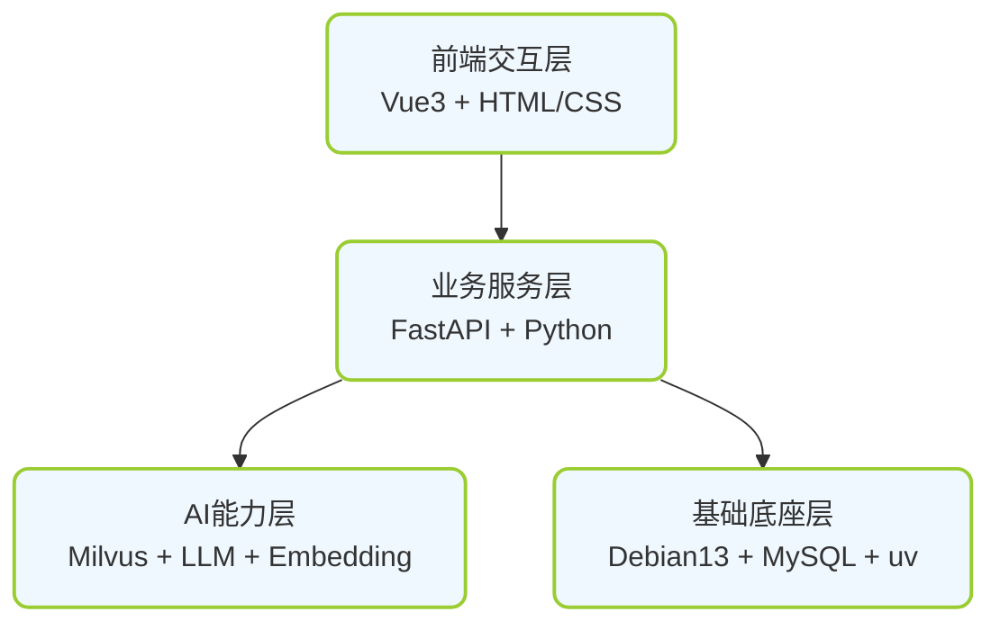
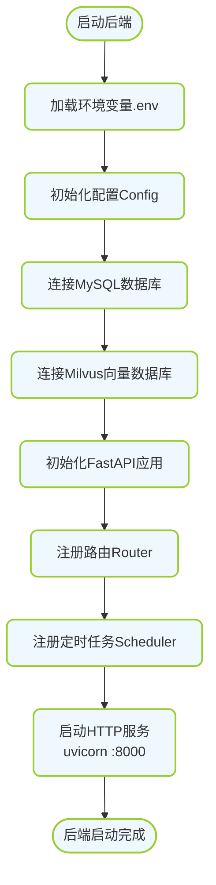
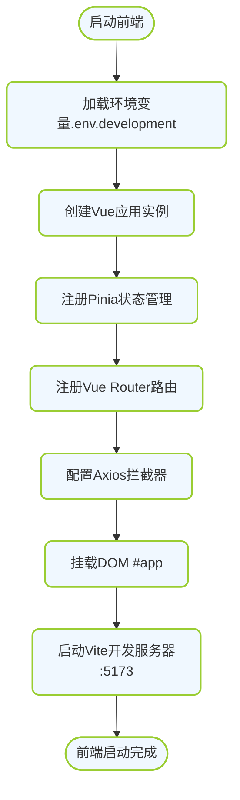
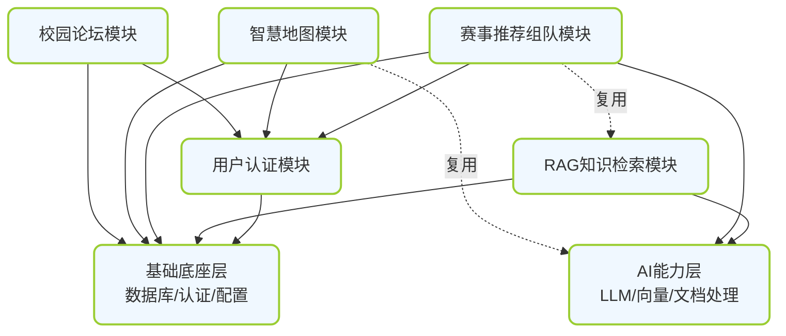

# 校园AI助手 - 系统总体架构

---

## 🏗️ 一、顶层架构设计

### 1.1 系统分层总览



### 1.2 分层职责详解

| 层级 | 核心职责 | 技术栈 | 开发优先级 |
|-----|---------|-------|----------|
| **前端交互层** | 用户界面、交互逻辑、状态管理、API调用 | Vue3、Vite、Pinia、Axios | 与后端并行 |
| **业务服务层** | 业务逻辑、接口定义、流程编排、定时任务 | FastAPI、SQLAlchemy、APScheduler | 中高 |
| **AI能力层** | 向量检索、LLM调用、文档处理、图像识别 | Milvus、mineru、Embedding模型 | 次高 |
| **基础底座层** | 环境管理、数据存储、用户认证、通用工具 | Debian13、MySQL、JWT、uv | **最高** |

---

## 🛠️ 二、技术栈详解

### 2.1 后端技术栈

| 技术 | 版本/选型 | 用途 | 安装方式 |
|-----|----------|------|---------|
| **操作系统** | Debian 13 | 生产/开发环境 | 标准系统安装 |
| **包管理工具** | uv | Python依赖管理、项目构建 | `curl -LsSf https://astral.sh/uv/install.sh | sh` |
| **Web框架** | FastAPI | API服务开发 | `uv add fastapi` |
| **数据库ORM** | SQLAlchemy 2.0+ | MySQL ORM映射 | `uv add sqlalchemy` |
| **数据库驱动** | pymysql / asyncmy | MySQL连接驱动 | `uv add asyncmy` |
| **向量数据库** | Milvus 2.3+ | 向量存储与检索 | Docker / 二进制部署 |
| **向量数据库SDK** | pymilvus | Milvus Python客户端 | `uv add pymilvus` |
| **文档处理工具** | mineru | PDF转结构化Markdown | 独立部署 |
| **认证方案** | JWT (python-jose) | Token认证 | `uv add python-jose[cryptography]` |
| **定时任务** | APScheduler | 定时爬虫、提醒任务 | `uv add apscheduler` |
| **数据验证** | Pydantic 2.0+ | 请求/响应数据验证 | FastAPI内置 |
| **数据库迁移** | Alembic | 数据库版本管理 | `uv add alembic` |

### 2.2 前端技术栈

| 技术 | 版本/选型 | 用途 | 安装方式 |
|-----|----------|------|---------|
| **核心框架** | Vue 3.4+ | 前端框架 | `npm create vite@latest . -- --template vue` |
| **构建工具** | Vite 5.0+ | 构建与开发服务器 | 随Vite项目初始化 |
| **路由管理** | Vue Router 4.2+ | 前端路由 | `npm install vue-router@4` |
| **状态管理** | Pinia 2.1+ | 全局状态管理 | `npm install pinia` |
| **HTTP客户端** | Axios 1.6+ | API调用 | `npm install axios` |
| **UI组件库** | (可选) Element Plus / Naive UI | 组件库 | 根据需要选择 |

### 2.3 数据存储技术栈

| 存储类型 | 技术选型 | 存储内容 | 部署方式 |
|---------|---------|---------|---------|
| **关系型数据** | MySQL 8.0+ | 用户、赛事、帖子、评论等结构化数据 | Docker / 本机安装 |
| **向量数据** | Milvus 2.3+ | 知识向量、赛事向量等语义数据 | Docker Compose |
| **缓存/会话** | (可选) Redis | 会话缓存、热点数据 | Docker |
| **文件存储** | 本地文件系统 / MinIO | PDF附件、图片等 | 本地目录 / MinIO |

---

## 📂 三、项目目录结构（可直接落地）

### 3.1 完整项目树

```
ysustar/
├── backend/                          # Python后端
│   ├── pyproject.toml                # uv项目配置
│   ├── .env                          # 环境变量（不提交git）
│   ├── .env.example                  # 环境变量示例
│   ├── alembic.ini                   # Alembic配置
│   ├── alembic/                      # 数据库迁移
│   │   ├── versions/
│   │   └── env.py
│   ├── src/
│   │   └── campus_ai/
│   │       ├── __init__.py
│   │       ├── main.py               # FastAPI应用入口
│   │       │
│   │       ├── core/                 # 基础设施层
│   │       │   ├── __init__.py
│   │       │   ├── config.py         # 全局配置
│   │       │   ├── security.py       # JWT认证、密码哈希
│   │       │   ├── database.py       # MySQL连接
│   │       │   ├── milvus.py         # Milvus连接
│   │       │   └── utils/            # 通用工具
│   │       │       ├── llm_client.py    # LLM调用封装
│   │       │       ├── embedder.py      # 向量嵌入生成
│   │       │       ├── mineru_helper.py # mineru工具集成
│   │       │       ├── crawler_base.py  # 爬虫基类
│   │       │       ├── text_cleaner.py  # 文本清洗
│   │       │       └── document_processor.py # 文档处理
│   │       │
│   │       ├── models/               # 领域层（数据库模型）
│   │       │   ├── __init__.py
│   │       │   ├── user.py           # 用户相关表
│   │       │   ├── rag.py            # RAG相关表
│   │       │   ├── contest.py        # 赛事相关表
│   │       │   ├── map.py            # 地图相关表
│   │       │   ├── forum.py          # 论坛相关表
│   │       │   └── knowledge.py      # 知识库相关表
│   │       │
│   │       ├── schemas/              # 应用层（Pydantic模型）
│   │       │   ├── __init__.py
│   │       │   ├── user.py
│   │       │   ├── rag.py
│   │       │   ├── contest.py
│   │       │   ├── map.py
│   │       │   └── forum.py
│   │       │
│   │       ├── services/             # 应用层（业务逻辑）
│   │       │   ├── __init__.py
│   │       │   ├── user_service.py
│   │       │   ├── rag_service.py
│   │       │   ├── contest/          # 赛事子模块
│   │       │   │   ├── __init__.py
│   │       │   │   ├── crawler_service.py
│   │       │   │   ├── preprocess_service.py
│   │       │   │   ├── ai_process_service.py
│   │       │   │   ├── storage_service.py
│   │       │   │   ├── match_service.py
│   │       │   │   ├── team_service.py
│   │       │   │   └── attachment_service.py
│   │       │   ├── map_service.py
│   │       │   └── forum_service.py
│   │       │
│   │       ├── api/                  # 接口层（FastAPI路由）
│   │       │   ├── __init__.py
│   │       │   ├── deps.py           # 路由依赖
│   │       │   ├── router.py         # 总路由
│   │       │   └── v1/               # API v1
│   │       │       ├── __init__.py
│   │       │       ├── auth.py
│   │       │       ├── rag.py
│   │       │       ├── contest.py
│   │       │       ├── map.py
│   │       │       └── forum.py
│   │       │
│   │       └── tasks/                # 定时任务
│   │           ├── __init__.py
│   │           ├── contest_tasks.py
│   │           └── reminder_tasks.py
│   │
│   ├── scripts/                      # 辅助脚本
│   │   ├── init_db.py
│   │   ├── crawl_all.py
│   │   ├── process_all_contests.py
│   │   └── ...
│   │
│   ├── uploads/                      # 上传文件目录
│   ├── data/                         # 数据目录
│   │   ├── raw/                      # 原始数据
│   │   ├── processed/                # 处理后数据
│   │   └── attachments/              # 附件
│   │
│   └── tests/                        # 测试
│       ├── __init__.py
│       ├── test_auth.py
│       ├── test_rag.py
│       └── test_contest.py
│
├── frontend/                         # Vue3前端
│   ├── package.json
│   ├── vite.config.js
│   ├── index.html
│   ├── .env.development
│   ├── .env.production
│   ├── public/
│   └── src/
│       ├── main.js
│       ├── App.vue
│       ├── router/
│       │   └── index.js
│       ├── store/
│       │   ├── index.js
│       │   └── modules/
│       │       ├── user.js
│       │       ├── contest.js
│       │       └── map.js
│       ├── api/
│       │   ├── request.js
│       │   ├── auth.js
│       │   ├── rag.js
│       │   ├── contest.js
│       │   ├── map.js
│       │   └── forum.js
│       ├── utils/
│       ├── assets/
│       ├── components/
│       │   ├── layout/
│       │   ├── common/
│       │   └── map/
│       └── views/
│           ├── auth/
│           ├── home/
│           ├── rag/
│           ├── contest/
│           ├── map/
│           └── forum/
│
├── docs/                             # 项目文档（本目录）
├── 知识库/                           # 知识库原始数据
├── 智慧地图/                         # 地图相关数据
├── docker-compose.yml                # Docker编排
├── .gitignore
└── README.md
```

---

## 🚀 四、系统启动流程

### 4.1 后端启动流程



### 4.2 前端启动流程



---

## 🔗 五、模块依赖关系



---

## 📋 六、开发环境检查清单

| 检查项 | 要求 | 验证命令 |
|-------|------|---------|
| 操作系统 | Debian 13 / Ubuntu 22.04+ | `cat /etc/os-release` |
| Python | 3.11+ | `python3 --version` |
| uv | 最新版 | `uv --version` |
| MySQL | 8.0+ | `mysql --version` |
| Docker | 24.0+ (可选) | `docker --version` |
| Node.js | 18+ | `node --version` |
| npm | 9+ | `npm --version` |
| Git | 任意版本 | `git --version` |
