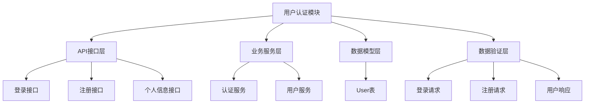
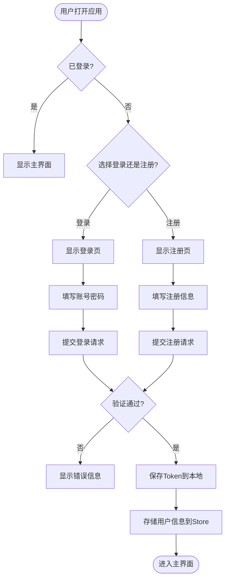
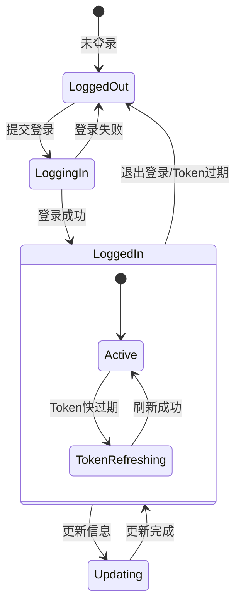
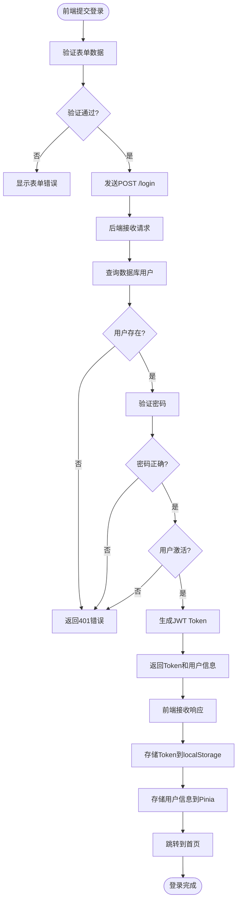
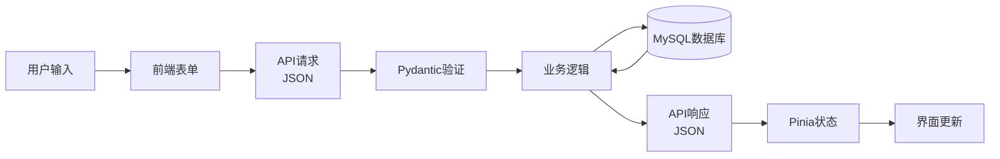

# 用户认证与权限模块 - 详细落地文档

---

## 🏗️ 一、模块架构

### 1.1 模块分层



---

## 🚪 二、入口说明

### 2.1 前端入口

| 功能 | 路由路径 | 页面位置 | 菜单位置 |
|-----|---------|---------|---------|
| 登录页 | `/login` | `frontend/src/views/auth/Login.vue` | 未登录时顶部菜单 |
| 注册页 | `/register` | `frontend/src/views/auth/Register.vue` | 未登录时顶部菜单 |
| 个人中心 | `/profile` | `frontend/src/views/auth/Profile.vue` | 用户下拉菜单 |

### 2.2 后端API入口

| 功能 | 方法 | 路径 | 说明 |
|-----|------|------|------|
| 登录 | POST | `/api/v1/auth/login` | OAuth2密码模式 |
| 注册 | POST | `/api/v1/auth/register` | 新用户注册 |
| 获取当前用户 | GET | `/api/v1/auth/me` | 获取登录用户信息 |
| 更新个人信息 | PUT | `/api/v1/auth/me` | 更新用户资料 |
| 修改密码 | POST | `/api/v1/auth/change-password` | 修改密码 |

### 2.3 进入模块流程



---

## ⚙️ 三、运转机制

### 3.1 认证状态管理



### 3.2 登录流程详解



---

## 📊 四、数据流

### 4.1 数据流向图



### 4.2 数据存储结构

**前端存储:**
| 存储位置 | 数据项 | 类型 | 说明 |
|---------|-------|------|------|
| localStorage | `access_token` | string | JWT Token |
| localStorage | `token_type` | string | Token类型, 固定"bearer" |
| Pinia Store | `user` | object | 用户信息对象 |
| Pinia Store | `isLoggedIn` | boolean | 登录状态 |

**后端数据库:** 见下节数据标准

---

## ✅ 五、数据标准

### 5.1 数据库表结构 - User表

```python
# backend/src/campus_ai/models/user.py
from sqlalchemy import Column, Integer, String, Boolean, DateTime, Text
from sqlalchemy.sql import func
from campus_ai.core.database import Base

class User(Base):
    __tablename__ = "users"

    id = Column(Integer, primary_key=True, autoincrement=True, comment="用户ID")
    student_id = Column(String(20), unique=True, nullable=True, index=True, comment="学号/工号")
    username = Column(String(50), unique=True, nullable=False, index=True, comment="用户名")
    email = Column(String(100), unique=True, nullable=True, index=True, comment="邮箱")
    phone = Column(String(20), unique=True, nullable=True, index=True, comment="手机号")
    hashed_password = Column(String(255), nullable=False, comment="密码哈希")
    real_name = Column(String(50), nullable=True, comment="真实姓名")
    nickname = Column(String(50), nullable=True, comment="昵称")
    avatar = Column(String(255), nullable=True, comment="头像URL")
    role = Column(String(20), nullable=False, default="student", comment="角色: student/teacher/admin")
    department = Column(String(100), nullable=True, comment="院系")
    major = Column(String(100), nullable=True, comment="专业")
    grade = Column(String(20), nullable=True, comment="年级")
    tags = Column(Text, nullable=True, comment="用户标签(JSON数组)")
    bio = Column(Text, nullable=True, comment="个人简介")
    is_active = Column(Boolean, nullable=False, default=True, comment="是否激活")
    is_verified = Column(Boolean, nullable=False, default=False, comment="是否认证")
    last_login_at = Column(DateTime(timezone=True), nullable=True, comment="最后登录时间")
    created_at = Column(DateTime(timezone=True), nullable=False, server_default=func.now(), comment="创建时间")
    updated_at = Column(DateTime(timezone=True), nullable=False, server_default=func.now(), onupdate=func.now(), comment="更新时间")
```

### 5.2 数据合格标准 - User表字段

| 字段 | 类型 | 必填 | 验证规则 | 合格示例 | 不合格示例 |
|-----|------|------|---------|---------|-----------|
| `username` | str | 是 | 4-20字符, 字母数字下划线 | `"zhangsan2024"` | `"a"`/`"a@b"` |
| `email` | str | 否 | 有效的邮箱格式 | `"a@b.com"` | `"ab.com"` |
| `phone` | str | 否 | 11位手机号 | `"13800138000"` | `"12345"` |
| `password` | str | 是 | 6-32字符 | `"Test@123"` | `"123"` |
| `role` | str | 是 | 枚举值 | `"student"` | `"other"` |
| `student_id` | str | 否 | 1-20字符 | `"2024001"` | `""` |

### 5.3 API数据模型

```python
# backend/src/campus_ai/schemas/user.py
from pydantic import BaseModel, Field, EmailStr, field_validator
from typing import Optional
from datetime import datetime

class LoginRequest(BaseModel):
    username: str = Field(..., description="用户名/学号/邮箱/手机号")
    password: str = Field(..., min_length=6, max_length=32, description="密码")

class RegisterRequest(BaseModel):
    username: str = Field(..., min_length=4, max_length=20, description="用户名")
    password: str = Field(..., min_length=6, max_length=32, description="密码")
    email: Optional[EmailStr] = Field(None, description="邮箱")
    student_id: Optional[str] = Field(None, max_length=20, description="学号")
    real_name: Optional[str] = Field(None, max_length=50, description="真实姓名")

    @field_validator('username')
    @classmethod
    def validate_username(cls, v):
        import re
        if not re.match(r'^[a-zA-Z0-9_]+$', v):
            raise ValueError('用户名只能包含字母、数字和下划线')
        return v

class UserResponse(BaseModel):
    id: int
    username: str
    real_name: Optional[str] = None
    nickname: Optional[str] = None
    avatar: Optional[str] = None
    role: str
    student_id: Optional[str] = None
    department: Optional[str] = None
    major: Optional[str] = None
    bio: Optional[str] = None
    tags: Optional[list] = None
    is_active: bool
    created_at: datetime

    class Config:
        from_attributes = True

class LoginResponse(BaseModel):
    access_token: str
    token_type: str = "bearer"
    user: UserResponse
```

---

## 📝 六、落地步骤

### 第一步: 创建数据模型 (Model)

**文件**: `backend/src/campus_ai/models/user.py`

```python
# 见上文 5.1 User表结构
from campus_ai.models import Base  # 确保在__init__.py导出

# backend/src/campus_ai/models/__init__.py
from .user import User
__all__ = ["User"]
```

### 第二步: 创建数据验证模型 (Schema)

**文件**: `backend/src/campus_ai/schemas/user.py`

```python
# 见上文 5.3 API数据模型
from campus_ai.schemas import Base  # 确保在__init__.py导出

# backend/src/campus_ai/schemas/__init__.py
from .user import (
    LoginRequest,
    RegisterRequest,
    UserResponse,
    LoginResponse,
)
__all__ = [
    "LoginRequest",
    "RegisterRequest",
    "UserResponse",
    "LoginResponse",
]
```

### 第三步: 创建业务服务 (Service)

**文件**: `backend/src/campus_ai/services/user_service.py`

```python
from typing import Optional
from sqlalchemy.ext.asyncio import AsyncSession
from sqlalchemy import select, or_
from campus_ai.models.user import User
from campus_ai.core.security import get_password_hash, verify_password
from campus_ai.schemas.user import RegisterRequest

class UserService:
    def __init__(self, db: AsyncSession):
        self.db = db

    async def get_by_id(self, user_id: int) -> Optional[User]:
        """通过ID获取用户"""
        result = await self.db.execute(select(User).where(User.id == user_id))
        return result.scalar_one_or_none()

    async def get_by_username(self, username: str) -> Optional[User]:
        """通过用户名获取用户"""
        result = await self.db.execute(select(User).where(User.username == username))
        return result.scalar_one_or_none()

    async def get_by_login(self, login: str) -> Optional[User]:
        """通过多种方式获取用户(用户名/邮箱/学号/手机号)"""
        result = await self.db.execute(
            select(User).where(
                or_(
                    User.username == login,
                    User.email == login,
                    User.student_id == login,
                    User.phone == login,
                )
            )
        )
        return result.scalar_one_or_none()

    async def create(self, data: RegisterRequest) -> User:
        """创建新用户"""
        hashed_pw = get_password_hash(data.password)
        user = User(
            username=data.username,
            email=data.email,
            student_id=data.student_id,
            real_name=data.real_name,
            hashed_password=hashed_pw,
            role="student",
            is_active=True,
        )
        self.db.add(user)
        await self.db.commit()
        await self.db.refresh(user)
        return user

    async def authenticate(self, login: str, password: str) -> Optional[User]:
        """验证用户"""
        user = await self.get_by_login(login)
        if not user:
            return None
        if not verify_password(password, user.hashed_password):
            return None
        if not user.is_active:
            return None
        return user

    async def update_last_login(self, user: User):
        """更新最后登录时间"""
        from sqlalchemy.sql import func
        user.last_login_at = func.now()
        await self.db.commit()
```

### 第四步: 创建API路由 (Router)

**文件**: `backend/src/campus_ai/api/v1/auth.py`

```python
from datetime import timedelta
from fastapi import APIRouter, Depends, HTTPException, status
from fastapi.security import OAuth2PasswordRequestForm
from sqlalchemy.ext.asyncio import AsyncSession

from campus_ai.core.database import get_db
from campus_ai.core.config import get_settings
from campus_ai.core.security import (
    create_access_token,
    get_current_active_user,
)
from campus_ai.models.user import User
from campus_ai.schemas.user import (
    LoginResponse,
    UserResponse,
    RegisterRequest,
)
from campus_ai.services.user_service import UserService

settings = get_settings()
router = APIRouter(prefix="/auth", tags=["认证"])

@router.post("/login", response_model=LoginResponse)
async def login(
    form_data: OAuth2PasswordRequestForm = Depends(),
    db: AsyncSession = Depends(get_db),
):
    """登录接口 - OAuth2兼容"""
    user_service = UserService(db)

    user = await user_service.authenticate(form_data.username, form_data.password)
    if not user:
        raise HTTPException(
            status_code=status.HTTP_401_UNAUTHORIZED,
            detail="用户名或密码错误",
            headers={"WWW-Authenticate": "Bearer"},
        )

    # 创建Token
    access_token_expires = timedelta(minutes=settings.ACCESS_TOKEN_EXPIRE_MINUTES)
    access_token = create_access_token(
        data={"sub": str(user.id), "type": "access", "role": user.role},
        expires_delta=access_token_expires,
    )

    # 更新最后登录时间
    await user_service.update_last_login(user)

    return {
        "access_token": access_token,
        "token_type": "bearer",
        "user": UserResponse.model_validate(user),
    }

@router.post("/register", response_model=LoginResponse)
async def register(
    data: RegisterRequest,
    db: AsyncSession = Depends(get_db),
):
    """注册新用户"""
    user_service = UserService(db)

    # 检查用户名是否已存在
    existing = await user_service.get_by_username(data.username)
    if existing:
        raise HTTPException(
            status_code=status.HTTP_400_BAD_REQUEST,
            detail="用户名已被使用"
        )

    # 创建用户
    user = await user_service.create(data)

    # 自动登录
    access_token_expires = timedelta(minutes=settings.ACCESS_TOKEN_EXPIRE_MINUTES)
    access_token = create_access_token(
        data={"sub": str(user.id), "type": "access", "role": user.role},
        expires_delta=access_token_expires,
    )

    return {
        "access_token": access_token,
        "token_type": "bearer",
        "user": UserResponse.model_validate(user),
    }

@router.get("/me", response_model=UserResponse)
async def get_current_user_info(
    current_user: User = Depends(get_current_active_user),
):
    """获取当前登录用户信息"""
    return UserResponse.model_validate(current_user)
```

### 第五步: 注册路由到主应用

**文件**: `backend/src/campus_ai/api/router.py`

```python
from fastapi import APIRouter
from campus_ai.api.v1 import auth

api_router = APIRouter(prefix="/api/v1")

api_router.include_router(auth.router)
```

### 第六步: 前端 - 创建Pinia Store

**文件**: `frontend/src/store/modules/user.js`

```javascript
import { defineStore } from 'pinia'
import { ref, computed } from 'vue'
import { login as loginApi, register as registerApi, getMe } from '@/api/auth'

export const useUserStore = defineStore('user', () => {
  // 状态
  const user = ref(null)
  const token = ref(localStorage.getItem('access_token') || '')
  const tokenType = ref(localStorage.getItem('token_type') || 'bearer')

  // 计算属性
  const isLoggedIn = computed(() => !!token.value && !!user.value)
  const isAdmin = computed(() => user.value?.role === 'admin')

  // 登录
  async function login(username, password) {
    const data = new FormData()
    data.append('username', username)
    data.append('password', password)

    const res = await loginApi(data)

    // 保存token
    token.value = res.access_token
    tokenType.value = res.token_type
    localStorage.setItem('access_token', res.access_token)
    localStorage.setItem('token_type', res.token_type)

    // 保存用户信息
    user.value = res.user
    return res
  }

  // 注册
  async function register(registerData) {
    const res = await registerApi(registerData)

    token.value = res.access_token
    tokenType.value = res.token_type
    localStorage.setItem('access_token', res.access_token)
    localStorage.setItem('token_type', res.token_type)

    user.value = res.user
    return res
  }

  // 获取当前用户信息
  async function fetchUser() {
    if (!token.value) return
    const res = await getMe()
    user.value = res
  }

  // 退出登录
  function logout() {
    user.value = null
    token.value = ''
    localStorage.removeItem('access_token')
    localStorage.removeItem('token_type')
  }

  return {
    user,
    token,
    tokenType,
    isLoggedIn,
    isAdmin,
    login,
    register,
    fetchUser,
    logout,
  }
})
```

### 第七步: 前端 - 创建API封装

**文件**: `frontend/src/api/auth.js`

```javascript
import request from './request'

// 登录
export function login(data) {
  return request({
    url: '/auth/login',
    method: 'post',
    data,
    headers: { 'Content-Type': 'multipart/form-data' },
  })
}

// 注册
export function register(data) {
  return request({
    url: '/auth/register',
    method: 'post',
    data,
  })
}

// 获取当前用户
export function getMe() {
  return request({
    url: '/auth/me',
    method: 'get',
  })
}
```

### 第八步: 前端 - 创建登录页面

**文件**: `frontend/src/views/auth/Login.vue`

```vue
<template>
  <div class="login-container">
    <h2>登录校园AI助手</h2>
    <form @submit.prevent="handleLogin">
      <div class="form-item">
        <label>用户名/学号</label>
        <input v-model="form.username" type="text" required />
      </div>
      <div class="form-item">
        <label>密码</label>
        <input v-model="form.password" type="password" required />
      </div>
      <button type="submit" :disabled="loading">
        {{ loading ? '登录中...' : '登录' }}
      </button>
    </form>
    <p v-if="error" class="error">{{ error }}</p>
    <p>
      还没有账号? <router-link to="/register">立即注册</router-link>
    </p>
  </div>
</template>

<script setup>
import { ref } from 'vue'
import { useRouter } from 'vue-router'
import { useUserStore } from '@/store/modules/user'

const router = useRouter()
const userStore = useUserStore()

const form = ref({
  username: '',
  password: '',
})
const loading = ref(false)
const error = ref('')

async function handleLogin() {
  loading.value = true
  error.value = ''
  try {
    await userStore.login(form.value.username, form.value.password)
    router.push('/')
  } catch (err) {
    error.value = err.message || '登录失败'
  } finally {
    loading.value = false
  }
}
</script>

<style scoped>
.login-container {
  max-width: 400px;
  margin: 50px auto;
  padding: 20px;
}
.form-item {
  margin-bottom: 15px;
}
.form-item label {
  display: block;
  margin-bottom: 5px;
}
.form-item input {
  width: 100%;
  padding: 8px;
  border: 1px solid #ddd;
  border-radius: 4px;
}
button {
  width: 100%;
  padding: 10px;
  background: #4CAF50;
  color: white;
  border: none;
  border-radius: 4px;
  cursor: pointer;
}
.error {
  color: red;
  margin-top: 10px;
}
</style>
```

### 第九步: 创建数据库初始化脚本

**文件**: `backend/scripts/init_db.py`

```python
import asyncio
from campus_ai.core.database import engine, Base
from campus_ai.models.user import User

async def init_db():
    """创建所有数据表"""
    async with engine.begin() as conn:
        await conn.run_sync(Base.metadata.create_all)
    print("数据库表创建完成!")

if __name__ == "__main__":
    asyncio.run(init_db())
```

---

## 🔗 七、上下游依赖

### 依赖模块
- **基础底座层**: 配置、数据库连接、安全工具
- **无其他业务模块依赖**: 本模块是其他模块的基础

### 被依赖模块
- **所有业务模块**: 都需要用户认证
- **RAG模块**: 需要用户信息个性化推荐
- **赛事模块**: 需要用户标签和身份
- **论坛模块**: 需要用户身份发帖

---

## 🧪 八、测试验收

### 8.1 测试用例

```python
# tests/test_auth.py
import pytest
from httpx import AsyncClient
from campus_ai.main import app

@pytest.mark.asyncio
async def test_register():
    """测试注册"""
    async with AsyncClient(app=app, base_url="http://test") as client:
        response = await client.post("/api/v1/auth/register", json={
            "username": "testuser001",
            "password": "test123456",
            "email": "test001@example.com",
        })
        assert response.status_code == 200
        data = response.json()
        assert "access_token" in data
        assert data["user"]["username"] == "testuser001"

@pytest.mark.asyncio
async def test_login():
    """测试登录"""
    async with AsyncClient(app=app, base_url="http://test") as client:
        # 先注册
        await client.post("/api/v1/auth/register", json={
            "username": "testuser002",
            "password": "test123456",
        })

        # 再登录
        data = {"username": "testuser002", "password": "test123456"}
        response = await client.post("/api/v1/auth/login", data=data)
        assert response.status_code == 200
        result = response.json()
        assert "access_token" in result

@pytest.mark.asyncio
async def test_get_me():
    """测试获取当前用户"""
    async with AsyncClient(app=app, base_url="http://test") as client:
        # 注册并获取token
        reg_resp = await client.post("/api/v1/auth/register", json={
            "username": "testuser003",
            "password": "test123456",
        })
        token = reg_resp.json()["access_token"]

        # 使用token获取用户信息
        response = await client.get(
            "/api/v1/auth/me",
            headers={"Authorization": f"Bearer {token}"}
        )
        assert response.status_code == 200
        assert response.json()["username"] == "testuser003"
```

### 8.2 验收标准

| 检查项 | 验收标准 | 验证方法 |
|-------|---------|---------|
| 用户注册 | 可正常创建新用户 | 手动/自动化测试 |
| 用户登录 | 可正常登录获取Token | 手动/自动化测试 |
| 多方式登录 | 支持用户名/学号/邮箱登录 | 手动测试 |
| 权限控制 | 未登录访问受保护接口返回401 | 手动/自动化测试 |
| 密码安全 | 数据库中只存储哈希值 | 检查数据库 |
| Token验证 | Token过期失效 | 等待过期测试 |
| 前端状态 | 登录状态正确管理 | 手动测试 |
| 路由守卫 | 未登录自动跳转到登录页 | 手动测试 |

### 8.3 手动测试流程

1. **启动后端服务**
   ```bash
   cd backend
   uv run python -m uvicorn campus_ai.main:app --reload
   ```

2. **初始化数据库**
   ```bash
   uv run python scripts/init_db.py
   ```

3. **访问API文档测试**
   - 打开浏览器访问: http://localhost:8000/docs
   - 使用 /register 接口创建用户
   - 使用 /login 接口获取token
   - 使用 Authorize 按钮输入token
   - 测试 /me 接口

4. **启动前端测试**
   ```bash
   cd frontend
   npm install
   npm run dev
   ```

5. **前端流程测试**
   - 访问注册页, 注册新用户
   - 自动登录后跳转到首页
   - 退出登录, 重新登录
