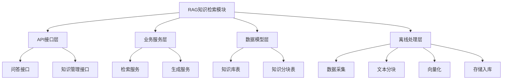
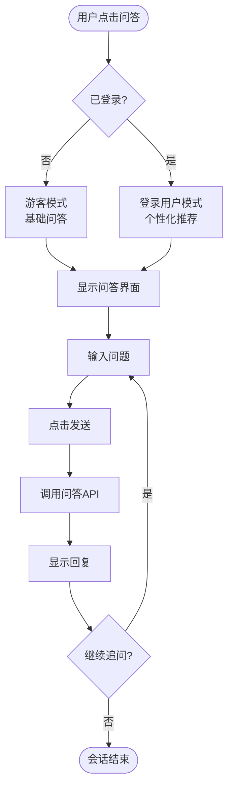
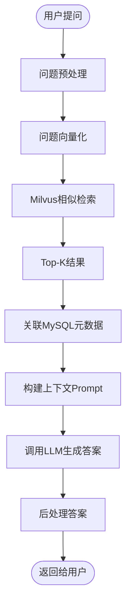
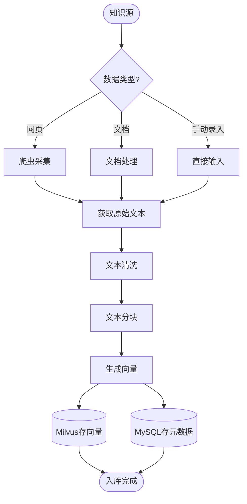
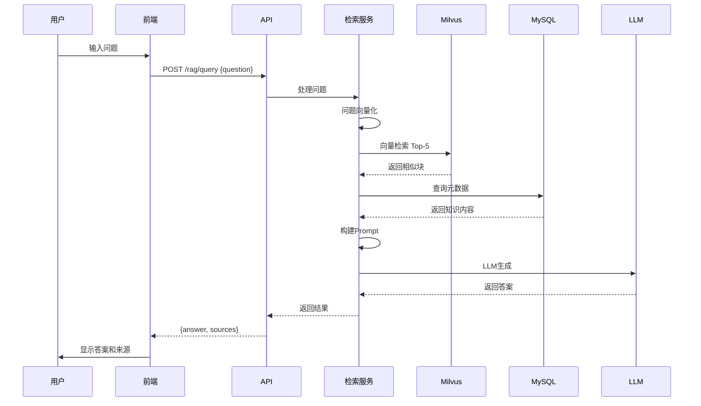

# RAG校园知识检索模块 - 详细落地文档

---

## 🏗️ 一、模块架构

### 1.1 模块分层



---

## 🚪 二、入口说明

### 2.1 前端入口

| 功能 | 路由路径 | 页面位置 | 菜单位置 |
|-----|---------|---------|---------|
| 知识问答 | `/rag` | `frontend/src/views/rag/KnowledgeQa.vue` | 主导航菜单 |
| 知识管理(管理员) | `/admin/knowledge` | `frontend/src/views/rag/AdminKnowledge.vue` | 管理后台 |

### 2.2 后端API入口

| 功能 | 方法 | 路径 | 认证 | 说明 |
|-----|------|------|------|------|
| 提问 | POST | `/api/v1/rag/query` | 是 | 用户提问获取答案 |
| 获取知识库列表 | GET | `/api/v1/rag/knowledge` | 否 | 获取可检索的知识分类 |
| 添加知识 | POST | `/api/v1/rag/knowledge` | 管理员 | 添加新知识 |
| 上传文档 | POST | `/api/v1/rag/upload` | 管理员 | 上传文档自动处理 |

### 2.3 进入模块流程



---

## ⚙️ 三、运转机制

### 3.1 RAG问答流程



### 3.2 离线知识入库流程



---

## 📊 四、数据流

### 4.1 问答请求数据流



### 4.2 数据存储结构

**前端存储:**
| 存储位置 | 数据项 | 类型 | 说明 |
|---------|-------|------|------|
| Pinia Store | `chatHistory` | Array | 会话历史 |

**后端数据库:**
- MySQL: 存储知识元数据、分块信息
- Milvus: 存储向量索引

---

## ✅ 五、数据标准

### 5.1 数据库表结构

```python
# backend/src/campus_ai/models/knowledge.py
from sqlalchemy import Column, Integer, String, Text, DateTime, ForeignKey, Boolean
from sqlalchemy.sql import func
from sqlalchemy.orm import relationship
from campus_ai.core.database import Base

class Knowledge(Base):
    __tablename__ = "knowledge"

    id = Column(Integer, primary_key=True, autoincrement=True)
    title = Column(String(255), nullable=False, comment="知识标题")
    category = Column(String(50), nullable=True, index=True, comment="分类: 校史/制度/专业/等")
    source_type = Column(String(20), nullable=False, comment="来源类型: document/web/manual")
    source_url = Column(String(500), nullable=True, comment="来源链接")
    file_path = Column(String(500), nullable=True, comment="文件路径")
    summary = Column(Text, nullable=True, comment="摘要")
    tags = Column(Text, nullable=True, comment="标签JSON数组")
    is_public = Column(Boolean, default=True, comment="是否公开")
    created_by = Column(Integer, ForeignKey("users.id"), nullable=True)
    created_at = Column(DateTime(timezone=True), server_default=func.now())
    updated_at = Column(DateTime(timezone=True), server_default=func.now(), onupdate=func.now())

    chunks = relationship("KnowledgeChunk", back_populates="knowledge", cascade="all, delete-orphan")

class KnowledgeChunk(Base):
    __tablename__ = "knowledge_chunks"

    id = Column(Integer, primary_key=True, autoincrement=True)
    knowledge_id = Column(Integer, ForeignKey("knowledge.id"), nullable=False, index=True)
    chunk_index = Column(Integer, nullable=False, comment="分块序号")
    content = Column(Text, nullable=False, comment="分块内容")
    content_hash = Column(String(64), nullable=True, comment="内容哈希用于去重")
    embedding_id = Column(String(100), nullable=True, index=True, comment="Milvus中的ID")
    created_at = Column(DateTime(timezone=True), server_default=func.now())

    knowledge = relationship("Knowledge", back_populates="chunks")
```

### 5.2 Milvus集合结构

```python
# Milvus集合定义
from pymilvus import CollectionSchema, FieldSchema, DataType

# 主键字段
id_field = FieldSchema(name="id", dtype=DataType.INT64, is_primary=True, auto_id=True)

# 向量字段
vector_field = FieldSchema(
    name="embedding",
    dtype=DataType.FLOAT_VECTOR,
    dim=1536,  # 根据Embedding模型确定
)

# 元数据字段
chunk_id_field = FieldSchema(name="chunk_id", dtype=DataType.INT64)
knowledge_id_field = FieldSchema(name="knowledge_id", dtype=DataType.INT64)
category_field = FieldSchema(name="category", dtype=DataType.VARCHAR, max_length=50)

schema = CollectionSchema(
    fields=[id_field, vector_field, chunk_id_field, knowledge_id_field, category_field],
    description="校园知识向量库"
)
```

### 5.3 数据合格标准

| 数据项 | 合格标准 | 验证方法 |
|-------|---------|---------|
| 知识标题 | 1-255字符, 描述准确 | 长度检查 |
| 知识内容 | 非空, 有实际价值 | 非空检查 |
| 分块大小 | 500-2000字符 | 长度检查 |
| 向量维度 | 固定1536维 | 维度检查 |
| 分类标签 | 预定义分类之一 | 枚举检查 |

### 5.4 预定义知识分类

| 分类编码 | 分类名称 | 说明 |
|---------|---------|------|
| `history` | 校史沿革 | 学校历史、发展历程 |
| `regulation` | 规章制度 | 学生手册、校规校纪 |
| `major` | 专业介绍 | 各专业培养方案、课程设置 |
| `faculty` | 师资力量 | 院系介绍、导师信息 |
| `campus` | 校园生活 | 宿舍、食堂、图书馆等 |
| `admission` | 招生就业 | 招生政策、就业信息 |
| `faq` | 常见问题 | 高频问答整理 |

### 5.5 API数据模型

```python
# backend/src/campus_ai/schemas/rag.py
from pydantic import BaseModel, Field
from typing import Optional, List
from datetime import datetime

class QueryRequest(BaseModel):
    question: str = Field(..., min_length=1, max_length=500, description="用户问题")
    category: Optional[str] = Field(None, description="指定分类检索")
    top_k: int = Field(5, ge=1, le=20, description="返回最相似的Top-K条")
    stream: bool = Field(False, description="是否流式输出")

class SourceReference(BaseModel):
    knowledge_id: int
    chunk_id: int
    title: str
    category: str
    content: str
    similarity: float

class QueryResponse(BaseModel):
    question: str
    answer: str
    sources: List[SourceReference]
    response_time: float

class KnowledgeResponse(BaseModel):
    id: int
    title: str
    category: str
    summary: Optional[str]
    tags: Optional[List[str]]
    is_public: bool
    created_at: datetime

    class Config:
        from_attributes = True
```

---

## 📝 六、落地步骤

### 第一步: 创建数据模型

**文件**: `backend/src/campus_ai/models/knowledge.py`

```python
# 见上文 5.1
# 并在 __init__.py 导出
```

### 第二步: 创建Milvus管理模块

**文件**: `backend/src/campus_ai/core/milvus.py` (补充)

```python
from pymilvus import (
    connections,
    Collection,
    CollectionSchema,
    FieldSchema,
    DataType,
    utility,
)
from campus_ai.core.config import get_settings

settings = get_settings()

class MilvusClient:
    # ... 之前的代码 ...

    def create_knowledge_collection(self, force: bool = False):
        """创建知识向量集合"""
        collection_name = "knowledge_embeddings"

        if force and utility.has_collection(collection_name):
            utility.drop_collection(collection_name)

        if utility.has_collection(collection_name):
            return Collection(collection_name)

        # 定义字段
        id_field = FieldSchema(name="id", dtype=DataType.INT64, is_primary=True, auto_id=True)
        embedding_field = FieldSchema(
            name="embedding",
            dtype=DataType.FLOAT_VECTOR,
            dim=1536
        )
        chunk_id_field = FieldSchema(name="chunk_id", dtype=DataType.INT64)
        knowledge_id_field = FieldSchema(name="knowledge_id", dtype=DataType.INT64)
        category_field = FieldSchema(name="category", dtype=DataType.VARCHAR, max_length=50)

        schema = CollectionSchema(
            fields=[id_field, embedding_field, chunk_id_field, knowledge_id_field, category_field],
            description="校园知识向量库"
        )

        collection = Collection(name=collection_name, schema=schema)

        # 创建索引
        index_params = {
            "metric_type": "COSINE",
            "index_type": "IVF_FLAT",
            "params": {"nlist": 1024}
        }
        collection.create_index(field_name="embedding", index_params=index_params)

        return collection

    def insert_knowledge_vectors(self, data: list):
        """插入知识向量"""
        collection = self.get_collection("knowledge_embeddings")
        if not collection:
            collection = self.create_knowledge_collection()

        result = collection.insert(data)
        collection.flush()
        return result.primary_keys

    def search_knowledge(
        self,
        query_vectors: list,
        top_k: int = 5,
        category: str = None,
        **kwargs
    ):
        """检索相似知识"""
        collection = self.get_collection("knowledge_embeddings")
        if not collection:
            return []

        collection.load()

        # 构建过滤条件
        filter_expr = f'category == "{category}"' if category else None

        search_params = {
            "metric_type": "COSINE",
            "params": {"nprobe": 10}
        }

        results = collection.search(
            data=query_vectors,
            anns_field="embedding",
            param=search_params,
            limit=top_k,
            expr=filter_expr,
            output_fields=["chunk_id", "knowledge_id", "category"]
        )

        return results

milvus_client = MilvusClient()
```

### 第三步: 创建文本分块工具

**文件**: `backend/src/campus_ai/core/utils/text_splitter.py`

```python
from typing import List
import re

class TextSplitter:
    def __init__(
        self,
        chunk_size: int = 1000,
        chunk_overlap: int = 200,
        separators: List[str] = None
    ):
        self.chunk_size = chunk_size
        self.chunk_overlap = chunk_overlap
        self.separators = separators or ["\n\n", "\n", "。", "！", "？", ".", "!", "?", " "]

    def split_text(self, text: str) -> List[str]:
        """
        分割文本
        
        输入: 完整文本
        输出: 分块列表
        """
        if not text or len(text.strip()) == 0:
            return []

        # 先用分隔符分割
        chunks = self._split_with_separators(text)

        # 合并过小的块
        chunks = self._merge_small_chunks(chunks)

        return chunks

    def _split_with_separators(self, text: str) -> List[str]:
        """尝试用分隔符递归分割"""
        chunks = []

        # 找到合适的分隔符
        separator = self.separators[-1]  # 默认用空格
        for sep in self.separators:
            if sep in text:
                separator = sep
                break

        # 分割
        parts = text.split(separator)

        current_chunk = ""
        for part in parts:
            if not part:
                continue

            candidate = (current_chunk + separator + part) if current_chunk else part

            if len(candidate) <= self.chunk_size:
                current_chunk = candidate
            else:
                if current_chunk:
                    chunks.append(current_chunk)

                # 如果单个部分就超过chunk_size, 需要进一步分割
                if len(part) > self.chunk_size:
                    # 递归分割
                    sub_chunks = self._split_recursive(part)
                    chunks.extend(sub_chunks)
                    current_chunk = ""
                else:
                    current_chunk = part

        if current_chunk:
            chunks.append(current_chunk)

        return chunks

    def _split_recursive(self, text: str) -> List[str]:
        """递归分割过长文本"""
        if len(text) <= self.chunk_size:
            return [text]

        chunks = []
        start = 0
        while start < len(text):
            end = min(start + self.chunk_size, len(text))
            chunk = text[start:end]
            chunks.append(chunk)
            start = end - self.chunk_overlap

        return chunks

    def _merge_small_chunks(self, chunks: List[str], min_size: int = 200) -> List[str]:
        """合并过小的块"""
        if not chunks:
            return []

        merged = []
        current = ""

        for chunk in chunks:
            if len(current) + len(chunk) <= self.chunk_size:
                current = current + chunk if current else chunk
            else:
                if current:
                    merged.append(current)
                current = chunk

        if current:
            merged.append(current)

        return merged

text_splitter = TextSplitter()
```

### 第四步: 创建RAG服务

**文件**: `backend/src/campus_ai/services/rag_service.py`

```python
import time
from typing import List, Optional
from sqlalchemy.ext.asyncio import AsyncSession
from sqlalchemy import select
import numpy as np

from campus_ai.core.milvus import milvus_client
from campus_ai.core.utils.embedder import embedder
from campus_ai.core.utils.llm_client import llm_client
from campus_ai.core.utils.text_splitter import text_splitter
from campus_ai.models.knowledge import Knowledge, KnowledgeChunk
from campus_ai.schemas.rag import QueryRequest, QueryResponse, SourceReference

class RAGService:
    def __init__(self, db: AsyncSession):
        self.db = db
        self._ensure_milvus_collection()

    def _ensure_milvus_collection(self):
        """确保Milvus集合存在"""
        collection = milvus_client.get_collection("knowledge_embeddings")
        if not collection:
            milvus_client.create_knowledge_collection()

    async def query(self, request: QueryRequest) -> QueryResponse:
        """
        RAG问答主流程
        
        输入: QueryRequest
        输出: QueryResponse
        """
        start_time = time.time()

        # 1. 问题向量化
        question_vec = await embedder.embed(request.question)

        # 2. Milvus检索
        search_results = milvus_client.search_knowledge(
            query_vectors=[question_vec.tolist()],
            top_k=request.top_k,
            category=request.category
        )

        # 3. 获取关联元数据
        sources = []
        if search_results and len(search_results) > 0:
            for hit in search_results[0]:
                chunk_id = hit.entity.get("chunk_id")
                knowledge_id = hit.entity.get("knowledge_id")
                similarity = hit.score

                chunk_result = await self.db.execute(
                    select(KnowledgeChunk).where(KnowledgeChunk.id == chunk_id)
                )
                chunk = chunk_result.scalar_one_or_none()

                knowledge_result = await self.db.execute(
                    select(Knowledge).where(Knowledge.id == knowledge_id)
                )
                knowledge = knowledge_result.scalar_one_or_none()

                if chunk and knowledge:
                    sources.append(SourceReference(
                        knowledge_id=knowledge_id,
                        chunk_id=chunk_id,
                        title=knowledge.title,
                        category=knowledge.category,
                        content=chunk.content,
                        similarity=similarity
                    ))

        # 4. 构建Prompt
        context = "\n\n".join([
            f"[{i+1}] {s.title}\n{s.content}"
            for i, s in enumerate(sources)
        ])

        system_prompt = """你是一个校园AI助手。请根据提供的参考资料回答用户的问题。
要求：
1. 仅基于参考资料回答
2. 如果参考资料中没有答案，请明确说明
3. 回答要简洁准确
4. 可以引用参考资料的编号"""

        user_prompt = f"参考资料:\n{context}\n\n用户问题: {request.question}"

        # 5. 调用LLM
        answer = await llm_client.chat_with_system(
            user_prompt=user_prompt,
            system_prompt=system_prompt,
            temperature=0.7
        )

        response_time = time.time() - start_time

        return QueryResponse(
            question=request.question,
            answer=answer,
            sources=sources,
            response_time=response_time
        )

    async def add_knowledge(
        self,
        title: str,
        content: str,
        category: str,
        source_type: str = "manual",
        created_by: Optional[int] = None,
        **kwargs
    ) -> Knowledge:
        """
        添加新知识
        
        输入: 标题、内容、分类等
        输出: Knowledge对象
        """
        # 1. 保存到MySQL
        knowledge = Knowledge(
            title=title,
            category=category,
            source_type=source_type,
            created_by=created_by,
            **kwargs
        )
        self.db.add(knowledge)
        await self.db.flush()

        # 2. 文本分块
        chunks = text_splitter.split_text(content)

        # 3. 保存分块和向量
        milvus_data = []
        for idx, chunk_content in enumerate(chunks):
            # 保存分块
            chunk = KnowledgeChunk(
                knowledge_id=knowledge.id,
                chunk_index=idx,
                content=chunk_content
            )
            self.db.add(chunk)
            await self.db.flush()

            # 生成向量
            vec = await embedder.embed(chunk_content)

            # 准备Milvus数据
            milvus_data.append({
                "embedding": vec.tolist(),
                "chunk_id": chunk.id,
                "knowledge_id": knowledge.id,
                "category": category
            })

        # 4. 插入Milvus
        if milvus_data:
            pk_list = milvus_client.insert_knowledge_vectors([
                [d["embedding"] for d in milvus_data],
                [d["chunk_id"] for d in milvus_data],
                [d["knowledge_id"] for d in milvus_data],
                [d["category"] for d in milvus_data],
            ])

            # 更新embedding_id
            for idx, pk in enumerate(pk_list):
                chunk_id = milvus_data[idx]["chunk_id"]
                chunk_result = await self.db.execute(
                    select(KnowledgeChunk).where(KnowledgeChunk.id == chunk_id)
                )
                chunk = chunk_result.scalar_one()
                chunk.embedding_id = str(pk)

        await self.db.commit()
        await self.db.refresh(knowledge)
        return knowledge

    async def list_knowledge(self, category: Optional[str] = None) -> List[Knowledge]:
        """获取知识库列表"""
        query = select(Knowledge).where(Knowledge.is_public == True)
        if category:
            query = query.where(Knowledge.category == category)
        query = query.order_by(Knowledge.created_at.desc())

        result = await self.db.execute(query)
        return list(result.scalars().all())
```

### 第五步: 创建API路由

**文件**: `backend/src/campus_ai/api/v1/rag.py`

```python
from typing import List
from fastapi import APIRouter, Depends, HTTPException
from sqlalchemy.ext.asyncio import AsyncSession

from campus_ai.core.database import get_db
from campus_ai.core.security import get_current_active_user, RoleChecker
from campus_ai.models.user import User
from campus_ai.schemas.rag import (
    QueryRequest,
    QueryResponse,
    KnowledgeResponse,
)
from campus_ai.services.rag_service import RAGService

router = APIRouter(prefix="/rag", tags=["RAG知识检索"])

@router.post("/query", response_model=QueryResponse)
async def query_knowledge(
    request: QueryRequest,
    current_user: User = Depends(get_current_active_user),
    db: AsyncSession = Depends(get_db),
):
    """问答接口"""
    rag_service = RAGService(db)
    return await rag_service.query(request)

@router.get("/knowledge", response_model=List[KnowledgeResponse])
async def list_knowledge(
    category: str = None,
    db: AsyncSession = Depends(get_db),
):
    """获取知识库列表"""
    rag_service = RAGService(db)
    knowledge_list = await rag_service.list_knowledge(category)
    return [KnowledgeResponse.model_validate(k) for k in knowledge_list]

@router.post("/knowledge")
async def add_knowledge(
    title: str,
    content: str,
    category: str,
    current_user: User = Depends(RoleChecker(["admin"])),
    db: AsyncSession = Depends(get_db),
):
    """添加新知识(仅管理员)"""
    rag_service = RAGService(db)
    knowledge = await rag_service.add_knowledge(
        title=title,
        content=content,
        category=category,
        created_by=current_user.id
    )
    return KnowledgeResponse.model_validate(knowledge)
```

### 第六步: 前端 - 创建Store

**文件**: `frontend/src/store/modules/rag.js`

```javascript
import { defineStore } from 'pinia'
import { ref } from 'vue'
import { queryKnowledge } from '@/api/rag'

export const useRAGStore = defineStore('rag', () => {
  const chatHistory = ref([])
  const isLoading = ref(false)

  async function askQuestion(question, category = null) {
    isLoading.value = true

    chatHistory.value.push({
      role: 'user',
      content: question,
    })

    try {
      const res = await queryKnowledge({
        question,
        category,
        top_k: 5,
      })

      chatHistory.value.push({
        role: 'assistant',
        content: res.answer,
        sources: res.sources,
      })

      return res
    } finally {
      isLoading.value = false
    }
  }

  function clearHistory() {
    chatHistory.value = []
  }

  return {
    chatHistory,
    isLoading,
    askQuestion,
    clearHistory,
  }
})
```

### 第七步: 前端 - 创建API和页面

**文件**: `frontend/src/api/rag.js`

```javascript
import request from './request'

export function queryKnowledge(data) {
  return request({
    url: '/rag/query',
    method: 'post',
    data,
  })
}

export function getKnowledgeList(params) {
  return request({
    url: '/rag/knowledge',
    method: 'get',
    params,
  })
}
```

**文件**: `frontend/src/views/rag/KnowledgeQa.vue`

```vue
<template>
  <div class="rag-container">
    <div class="chat-area">
      <div v-for="(msg, idx) in ragStore.chatHistory" :key="idx" :class="['message', msg.role]">
        <div class="avatar">{{ msg.role === 'user' ? '你' : 'AI' }}</div>
        <div class="content">
          <div class="text">{{ msg.content }}</div>
          <div v-if="msg.sources" class="sources">
            <div class="source-title">参考资料:</div>
            <div v-for="(s, i) in msg.sources" :key="i" class="source-item">
              [{{ i + 1 }}] {{ s.title }} (相似度: {{ (s.similarity * 100).toFixed(1) }}%)
            </div>
          </div>
        </div>
      </div>
      <div v-if="ragStore.isLoading" class="loading">AI思考中...</div>
    </div>

    <div class="input-area">
      <select v-model="selectedCategory">
        <option value="">全部</option>
        <option value="history">校史沿革</option>
        <option value="regulation">规章制度</option>
        <option value="major">专业介绍</option>
        <option value="faq">常见问题</option>
      </select>
      <input
        v-model="question"
        @keyup.enter="handleAsk"
        :disabled="ragStore.isLoading"
        placeholder="输入你的问题..."
      />
      <button @click="handleAsk" :disabled="ragStore.isLoading">发送</button>
    </div>
  </div>
</template>

<script setup>
import { ref } from 'vue'
import { useRAGStore } from '@/store/modules/rag'

const ragStore = useRAGStore()
const question = ref('')
const selectedCategory = ref('')

async function handleAsk() {
  if (!question.value.trim() || ragStore.isLoading) return
  const q = question.value
  question.value = ''
  await ragStore.askQuestion(q, selectedCategory.value || null)
}
</script>

<style scoped>
.rag-container {
  display: flex;
  flex-direction: column;
  height: 80vh;
  max-width: 900px;
  margin: 0 auto;
}
.chat-area {
  flex: 1;
  overflow-y: auto;
  padding: 20px;
}
.message {
  display: flex;
  gap: 10px;
  margin-bottom: 20px;
}
.message.user {
  flex-direction: row-reverse;
}
.avatar {
  width: 40px;
  height: 40px;
  border-radius: 50%;
  background: #4CAF50;
  color: white;
  display: flex;
  align-items: center;
  justify-content: center;
  flex-shrink: 0;
}
.content {
  max-width: 70%;
  background: #f0f0f0;
  padding: 10px 15px;
  border-radius: 10px;
}
.sources {
  margin-top: 10px;
  padding-top: 10px;
  border-top: 1px solid #ddd;
  font-size: 0.9em;
  color: #666;
}
.input-area {
  display: flex;
  gap: 10px;
  padding: 20px;
  border-top: 1px solid #ddd;
}
.input-area input {
  flex: 1;
  padding: 10px;
  border: 1px solid #ddd;
  border-radius: 4px;
}
</style>
```

### 第八步: 创建初始化知识库脚本

**文件**: `backend/scripts/init_knowledge.py`

```python
import asyncio
from campus_ai.core.database import get_db, engine, Base
from campus_ai.services.rag_service import RAGService
from sqlalchemy.ext.asyncio import AsyncSession

# 示例知识数据
SAMPLE_KNOWLEDGE = [
    {
        "title": "学校图书馆开放时间",
        "category": "campus",
        "content": """
燕山大学图书馆开放时间如下：
- 周一至周五：8:00 - 22:00
- 周六、周日：9:00 - 21:00
- 节假日：10:00 - 18:00

注意事项：
1. 请持本人校园卡入馆
2. 借书需要在闭馆前30分钟办理
3. 假期开放时间可能调整，请关注官网通知
        """.strip()
    },
    {
        "title": "学生请假流程",
        "category": "regulation",
        "content": """
学生请假流程：
1. 请假1天以内：向辅导员口头请假，获得批准
2. 请假2-7天：填写请假条，辅导员签字批准
3. 请假8-30天：填写请假条，辅导员同意后报院系批准
4. 请假30天以上：需要报教务处审批

注意：
- 病假需要提供医院证明
- 一学期请假累计超过1/3课时需要休学
        """.strip()
    },
    {
        "title": "燕山大学简介",
        "category": "history",
        "content": """
燕山大学是河北省人民政府、教育部、工业和信息化部、国家国防科技工业局四方共建的全国重点大学，坐落于河北省秦皇岛市。

学校始建于1920年，源于哈尔滨工业大学。1958年哈尔滨工业大学重型机械系及相关专业成建制迁至工业重镇齐齐哈尔市富拉尔基区，组建了哈尔滨工业大学重型机械学院。1960年独立办学，定名为东北重型机械学院。1978年被确定为全国重点高等院校。1985年至1997年学校整体南迁秦皇岛市。1997年经原国家教委批准，更名为燕山大学。1998年由原机械工业部划转到河北省，实行中央与地方共建。
        """.strip()
    },
]

async def init_knowledge():
    """初始化示例知识库"""
    async with AsyncSession(engine) as db:
        rag_service = RAGService(db)

        for item in SAMPLE_KNOWLEDGE:
            await rag_service.add_knowledge(
                title=item["title"],
                content=item["content"],
                category=item["category"],
                source_type="manual",
                is_public=True
            )
            print(f"已添加: {item['title']}")

    print("知识库初始化完成!")

if __name__ == "__main__":
    asyncio.run(init_knowledge())
```

---

## 🔗 七、上下游依赖

### 依赖模块
- **用户认证模块**: 需要登录状态
- **AI能力层**: LLM调用、向量嵌入
- **基础底座层**: MySQL、Milvus连接

### 被依赖模块
- 无直接被依赖，是独立服务

---

## 🧪 八、测试验收

### 8.1 测试用例

```python
# tests/test_rag.py
import pytest
from httpx import AsyncClient
from campus_ai.main import app

@pytest.mark.asyncio
async def test_add_and_query_knowledge():
    """测试添加知识并查询"""
    async with AsyncClient(app=app, base_url="http://test") as client:
        # 1. 先注册登录
        await client.post("/api/v1/auth/register", json={
            "username": "testrag001",
            "password": "test123456",
        })
        login_data = {"username": "testrag001", "password": "test123456"}
        login_resp = await client.post("/api/v1/auth/login", data=login_data)
        token = login_resp.json()["access_token"]
        headers = {"Authorization": f"Bearer {token}"}

        # 2. 查询知识库列表
        resp = await client.get("/api/v1/rag/knowledge")
        assert resp.status_code == 200

        # 3. 提问(需要先初始化知识库)
        resp = await client.post("/api/v1/rag/query", json={
            "question": "图书馆开放时间?",
            "top_k": 5
        }, headers=headers)
        # 如果有知识库应该返回200
        # 没有的话可能返回空答案但状态正常
        assert resp.status_code in [200, 404]
```

### 8.2 验收标准

| 检查项 | 验收标准 | 验证方法 |
|-------|---------|---------|
| 知识入库 | 可添加知识并生成向量 | 手动测试脚本 |
| 相似度检索 | 能返回相关内容 | 测试已知问题 |
| LLM答案 | 基于参考资料回答 | 检查答案质量 |
| 来源显示 | 正确显示参考来源 | 前端界面 |
| 会话历史 | 历史记录正确保存 | 前端测试 |
| 分块合理 | 文本分块大小合适 | 检查分块结果 |
| 响应速度 | 响应时间在合理范围 | 性能测试 |

### 8.3 手动测试流程

1. **启动服务**
   - 后端: `uv run python -m uvicorn campus_ai.main:app --reload`
   - Milvus: 通过Docker启动

2. **初始化数据库和知识库**
   ```bash
   uv run python scripts/init_db.py
   uv run python scripts/init_knowledge.py
   ```

3. **测试问答**
   - 访问前端问答页面
   - 提问："图书馆几点开门？"
   - 提问："学校历史是什么？"
   - 检查答案是否准确
   - 检查参考来源是否显示
