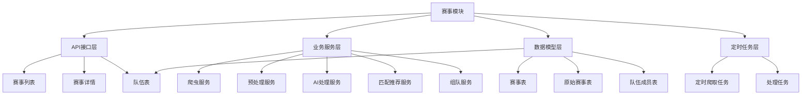
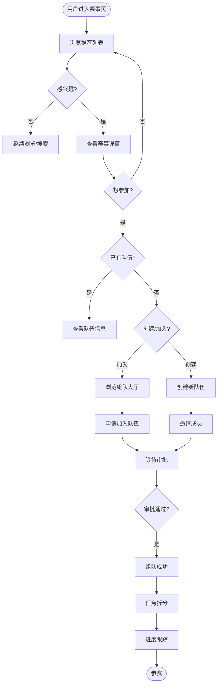
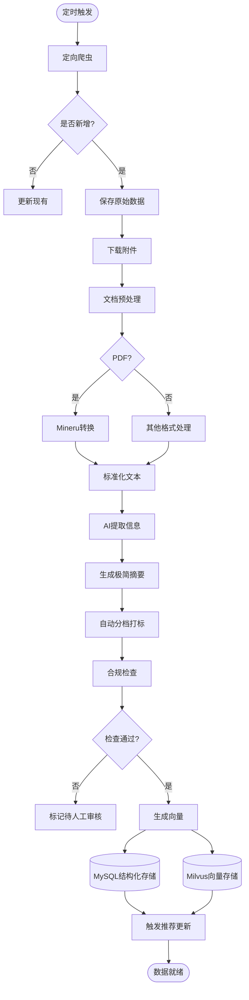
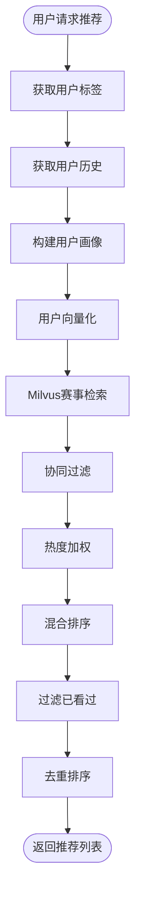
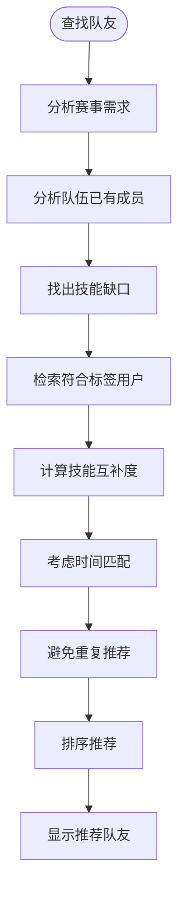
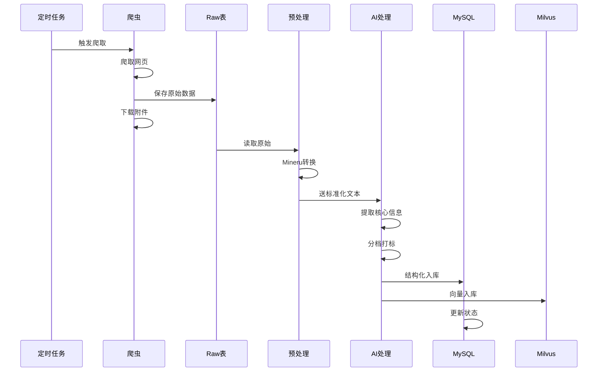

# 赛事智能推荐与组队模块 - 详细落地文档

---

## 🏗️ 一、模块架构

### 1.1 模块分层



---

## 🚪 二、入口说明

### 2.1 前端入口

| 功能 | 路由路径 | 页面位置 | 菜单位置 |
|-----|---------|---------|---------|
| 赛事推荐 | `/contest` | `frontend/src/views/contest/RecommendList.vue` | 主导航 |
| 赛事详情 | `/contest/:id` | `frontend/src/views/contest/ContestDetail.vue` | 推荐列表进入 |
| 组队大厅 | `/contest/team-hall` | `frontend/src/views/contest/TeamHall.vue` | 赛事详情页 |
| 我的队伍 | `/contest/my-teams` | `frontend/src/views/contest/MyTeams.vue` | 用户菜单 |

### 2.2 后端API入口

| 功能 | 方法 | 路径 | 认证 | 说明 |
|-----|------|------|------|------|
| 获取推荐列表 | GET | `/api/v1/contest/recommended` | 是 | 个性化推荐 |
| 获取赛事详情 | GET | `/api/v1/contest/:id` | 否 | 详情页 |
| 搜索赛事 | GET | `/api/v1/contest/search` | 否 | 搜索 |
| 申请组队 | POST | `/api/v1/contest/:id/team/join` | 是 | 加入队伍 |
| 创建队伍 | POST | `/api/v1/contest/:id/team` | 是 | 创建新队伍 |
| 获取我的队伍 | GET | `/api/v1/contest/my-teams` | 是 | 我的队伍 |

### 2.3 用户流程



---

## ⚙️ 三、运转机制

### 3.1 数据处理全流程



### 3.2 推荐匹配流程



### 3.3 队友匹配流程



---

## 📊 四、数据流

### 4.1 数据处理管道



### 4.2 数据存储结构

**MySQL表结构:**
- `contest_raw`: 原始赛事数据(兜底)
- `contest`: 处理后的赛事信息
- `contest_attachment`: 附件信息
- `contest_team`: 队伍
- `contest_team_member`: 队伍成员
- `contest_team_task`: 队伍任务

**Milvus集合:**
- `contest_embeddings`: 赛事向量库

---

## ✅ 五、数据标准

### 5.1 数据库表结构

```python
# backend/src/campus_ai/models/contest.py
from sqlalchemy import (
    Column, Integer, String, Text, DateTime, ForeignKey, Boolean,
    Date, JSON, Enum, Float,
)
from sqlalchemy.sql import func
from sqlalchemy.orm import relationship
import enum
from campus_ai.core.database import Base

class ContestLevel(str, enum.Enum):
    SCHOOL = "school"     # 校赛
    PROVINCE = "province" # 省赛
    NATIONAL = "national" # 国赛
    INTERNATIONAL = "international" # 国际赛

class ContestStatus(str, enum.Enum):
    DRAFT = "draft"           # 草稿
    PENDING = "pending"       # 待审核
    PUBLISHED = "published"   # 已发布
    ENDED = "ended"           # 已结束
    ARCHIVED = "archived"     # 已归档

class ContestRaw(Base):
    __tablename__ = "contest_raw"

    id = Column(Integer, primary_key=True, autoincrement=True)
    source_url = Column(String(500), nullable=False, index=True)
    source_site = Column(String(50), nullable=False, comment="来源站点")
    title = Column(String(500), nullable=True)
    raw_html = Column(Text, nullable=True)
    raw_content = Column(Text, nullable=True)
    raw_metadata = Column(JSON, nullable=True)
    crawl_time = Column(DateTime(timezone=True), server_default=func.now())
    processed = Column(Boolean, default=False, index=True)
    process_error = Column(Text, nullable=True)
    contest_id = Column(Integer, ForeignKey("contest.id"), nullable=True)

class Contest(Base):
    __tablename__ = "contest"

    id = Column(Integer, primary_key=True, autoincrement=True)
    title = Column(String(500), nullable=False, comment="赛事名称")
    summary = Column(String(500), nullable=True, comment="极简摘要(100字内)")
    description = Column(Text, nullable=True, comment="详细介绍")
    level = Column(String(20), nullable=True, index=True, comment="级别")
    category = Column(String(50), nullable=True, index=True, comment="分类")
    tags = Column(JSON, nullable=True, comment="标签数组")
    host = Column(String(200), nullable=True, comment="主办方")

    # 时间信息
    registration_start = Column(Date, nullable=True)
    registration_end = Column(Date, nullable=True)
    contest_date = Column(Date, nullable=True)

    # 链接
    official_url = Column(String(500), nullable=True)
    registration_url = Column(String(500), nullable=True)

    # AI处理信息
    ai_extracted = Column(JSON, nullable=True, comment="AI提取的原始信息")
    ai_verified = Column(Boolean, default=False, comment="AI校验通过")
    manual_verified = Column(Boolean, default=False, comment="人工校验通过")

    # 状态
    status = Column(String(20), nullable=False, default="pending")
    view_count = Column(Integer, default=0)
    is_hot = Column(Boolean, default=False)

    created_at = Column(DateTime(timezone=True), server_default=func.now())
    updated_at = Column(DateTime(timezone=True), server_default=func.now(), onupdate=func.now())

    raw = relationship("ContestRaw", backref="contest", uselist=False)
    attachments = relationship("ContestAttachment", back_populates="contest", cascade="all, delete-orphan")
    teams = relationship("ContestTeam", back_populates="contest", cascade="all, delete-orphan")

class ContestAttachment(Base):
    __tablename__ = "contest_attachment"

    id = Column(Integer, primary_key=True, autoincrement=True)
    contest_id = Column(Integer, ForeignKey("contest.id"), nullable=False)
    file_name = Column(String(255), nullable=False)
    file_path = Column(String(500), nullable=True)
    file_type = Column(String(50), nullable=True)
    file_size = Column(Integer, nullable=True)
    original_url = Column(String(500), nullable=True)
    processed_content = Column(Text, nullable=True)
    processed_with_mineru = Column(Boolean, default=False)

    contest = relationship("Contest", back_populates="attachments")

class ContestTeam(Base):
    __tablename__ = "contest_team"

    id = Column(Integer, primary_key=True, autoincrement=True)
    contest_id = Column(Integer, ForeignKey("contest.id"), nullable=False, index=True)
    name = Column(String(200), nullable=False, comment="队伍名称")
    description = Column(Text, nullable=True, comment="队伍描述")
    max_members = Column(Integer, default=5, comment="最大人数")
    creator_id = Column(Integer, ForeignKey("users.id"), nullable=False)

    contest = relationship("Contest", back_populates="teams")
    creator = relationship("User", foreign_keys=[creator_id])
    members = relationship("ContestTeamMember", back_populates="team", cascade="all, delete-orphan")
    tasks = relationship("ContestTeamTask", back_populates="team", cascade="all, delete-orphan")

class ContestTeamMember(Base):
    __tablename__ = "contest_team_member"

    id = Column(Integer, primary_key=True, autoincrement=True)
    team_id = Column(Integer, ForeignKey("contest_team.id"), nullable=False)
    user_id = Column(Integer, ForeignKey("users.id"), nullable=False)
    role = Column(String(50), nullable=True, comment="角色: 队长/队员")
    skills = Column(JSON, nullable=True, comment="技能标签")
    joined_at = Column(DateTime(timezone=True), server_default=func.now())
    status = Column(String(20), default="active", comment="状态: active/left")

    team = relationship("ContestTeam", back_populates="members")
    user = relationship("User")

class ContestTeamTask(Base):
    __tablename__ = "contest_team_task"

    id = Column(Integer, primary_key=True, autoincrement=True)
    team_id = Column(Integer, ForeignKey("contest_team.id"), nullable=False)
    title = Column(String(200), nullable=False)
    description = Column(Text, nullable=True)
    assigned_to = Column(Integer, ForeignKey("users.id"), nullable=True)
    due_date = Column(DateTime(timezone=True), nullable=True)
    status = Column(String(20), default="pending")
    priority = Column(Integer, default=0)

    team = relationship("ContestTeam", back_populates="tasks")
    assignee = relationship("User", foreign_keys=[assigned_to])
```

### 5.2 Milvus集合结构

```python
# contest_embeddings 集合
# 字段:
# - id (INT64, PK)
# - embedding (FLOAT_VECTOR, dim=1536)
# - contest_id (INT64)
# - level (VARCHAR)
# - category (VARCHAR)
```

### 5.3 数据合格标准

| 数据项 | 合格标准 | 不合格示例 |
|-------|---------|-----------|
| 赛事标题 | 清晰明确, 包含赛事名称 | "有个比赛" |
| 极简摘要 | 100字以内, 包含核心信息 | 超长或空 |
| 赛事级别 | 校赛/省赛/国赛/国际赛 | "不知道" |
| 分类标签 | 从预定义列表选择 | 随意标签 |
| 报名时间 | 有明确起止时间 | 时间混乱 |
| 附件处理 | PDF已转Markdown | 未处理 |

### 5.4 预定义分类和标签

**分类:**
- `programming`: 程序设计
- `robotics`: 机器人
- `math`: 数学建模
- `ai`: 人工智能
- `business`: 商业创新
- `art`: 艺术设计
- `other`: 其他

**级别:**
- `school`: 校赛
- `province`: 省赛
- `national`: 国赛
- `international`: 国际赛

---

## 📝 六、落地步骤

### 第一步: 创建数据模型

**文件**: `backend/src/campus_ai/models/contest.py`

```python
# 见上文 5.1
```

### 第二步: 创建爬虫服务

**文件**: `backend/src/campus_ai/services/contest/crawler_service.py`

```python
import asyncio
import httpx
from typing import List, Dict, Optional
from datetime import datetime
from sqlalchemy.ext.asyncio import AsyncSession
from sqlalchemy import select

from campus_ai.models.contest import ContestRaw
from campus_ai.core.utils.crawler_base import CrawlerBase

class ContestCrawlerService:
    def __init__(self, db: AsyncSession):
        self.db = db
        self.crawler = CrawlerBase()

    async def crawl_all_sites(self) -> int:
        """爬取所有配置的站点"""
        count = 0
        sites = self._get_sites_config()

        for site in sites:
            count += await self.crawl_site(site)

        return count

    def _get_sites_config(self) -> List[Dict]:
        """获取爬虫配置"""
        return [
            {
                "name": "jingsai",
                "url": "https://www.saikr.com/vs",
                "parser": "saikr"
            },
            # ... 更多站点
        ]

    async def crawl_site(self, site: Dict) -> int:
        """爬取单个站点"""
        count = 0
        try:
            html = await self.crawler.get(site["url"])

            # 解析列表页
            items = self._parse_list(html, site["parser"])

            for item in items:
                # 检查是否已存在
                exists = await self._check_exists(item["url"])
                if exists:
                    continue

                # 爬取详情页
                detail_html = await self.crawler.get(item["url"])

                # 保存原始数据
                raw = ContestRaw(
                    source_url=item["url"],
                    source_site=site["name"],
                    title=item.get("title", ""),
                    raw_html=detail_html,
                    raw_content=item.get("content", ""),
                    processed=False
                )
                self.db.add(raw)
                count += 1

            await self.db.commit()

        except Exception as e:
            print(f"爬取 {site['name']} 失败: {e}")
            await self.db.rollback()

        return count

    def _parse_list(self, html: str, parser: str) -> List[Dict]:
        """解析列表页"""
        # 实现解析逻辑
        return []

    async def _check_exists(self, url: str) -> bool:
        """检查URL是否已存在"""
        result = await self.db.execute(
            select(ContestRaw).where(ContestRaw.source_url == url)
        )
        return result.scalar_one_or_none() is not None
```

### 第三步: 创建预处理服务

**文件**: `backend/src/campus_ai/services/contest/preprocess_service.py`

```python
import os
from typing import Optional
from pathlib import Path
from sqlalchemy.ext.asyncio import AsyncSession
from sqlalchemy import select

from campus_ai.models.contest import ContestRaw, ContestAttachment
from campus_ai.core.utils.mineru_helper import mineru_helper
from campus_ai.core.utils.text_cleaner import text_cleaner
from campus_ai.core.config import get_settings

settings = get_settings()

class ContestPreprocessService:
    def __init__(self, db: AsyncSession):
        self.db = db

    async def preprocess(self, raw_id: int) -> Optional[str]:
        """预处理原始赛事数据"""
        raw_result = await self.db.execute(
            select(ContestRaw).where(ContestRaw.id == raw_id)
        )
        raw = raw_result.scalar_one_or_none()

        if not raw:
            return None

        try:
            # 1. 提取正文内容
            text = self._extract_text(raw)

            # 2. 处理附件
            await self._process_attachments(raw)

            # 3. 清洗文本
            clean_text = text_cleaner.clean(text)

            return clean_text

        except Exception as e:
            raw.process_error = str(e)
            await self.db.commit()
            return None

    def _extract_text(self, raw: ContestRaw) -> str:
        """从HTML中提取正文"""
        # 实现HTML解析提取
        return raw.raw_content or ""

    async def _process_attachments(self, raw: ContestRaw):
        """处理附件"""
        # 查找附件记录
        attachments_result = await self.db.execute(
            select(ContestAttachment).where(ContestAttachment.contest_id == raw.contest_id)
        )
        attachments = attachments_result.scalars().all()

        for att in attachments:
            if att.file_type == "pdf" and not att.processed_with_mineru:
                if mineru_helper.is_available():
                    try:
                        content = mineru_helper.process_pdf(att.file_path)
                        att.processed_content = content
                        att.processed_with_mineru = True
                    except Exception as e:
                        print(f"mineru处理失败: {e}")

        await self.db.commit()
```

### 第四步: 创建AI处理服务

**文件**: `backend/src/campus_ai/services/contest/ai_process_service.py`

```python
from typing import Dict, Optional
from sqlalchemy.ext.asyncio import AsyncSession
from sqlalchemy import select

from campus_ai.models.contest import ContestRaw, Contest, ContestAttachment
from campus_ai.core.utils.llm_client import llm_client
from campus_ai.core.utils.embedder import embedder
from campus_ai.core.milvus import milvus_client

EXTRACT_PROMPT = """你是一个赛事信息提取专家。请从给定的文本中提取以下信息，以JSON格式返回：

要求提取的字段：
1. title: 赛事全称
2. summary: 极简摘要(100字以内，包含时间、地点、赛事类型)
3. level: 赛事级别(school/province/national/international)
4. category: 分类(programming/robotics/math/ai/business/art/other)
5. host: 主办方
6. registration_start: 报名开始日期(YYYY-MM-DD)
7. registration_end: 报名截止日期(YYYY-MM-DD)
8. contest_date: 比赛日期(YYYY-MM-DD)
9. official_url: 官网链接
10. tags: 标签数组(3-5个)

注意：
- 不确定的字段填null
- 日期格式必须严格
- category从给定选项中选择最接近的

返回纯JSON，不要其他内容。
"""

VERIFY_PROMPT = """你是一个赛事信息审核员。请检查以下赛事信息是否完整准确：

赛事信息：
{contest_info}

请回答：
1. 信息是否完整(是/否)?
2. 如不完整，缺少哪些信息?
3. 有哪些明显的错误?

用JSON格式返回，包含字段：ok(boolean), missing(list), errors(list)
"""

class ContestAIProcessService:
    def __init__(self, db: AsyncSession):
        self.db = db

    async def process_with_ai(self, raw_id: int, text: str) -> Optional[int]:
        """AI处理主流程"""
        raw_result = await self.db.execute(
            select(ContestRaw).where(ContestRaw.id == raw_id)
        )
        raw = raw_result.scalar_one_or_none()

        if not raw:
            return None

        try:
            # 1. AI提取信息
            extracted = await self._extract_info(text)

            # 2. 校验信息
            verified = await self._verify_info(extracted)

            # 3. 创建赛事记录
            contest = await self._create_contest(raw, extracted, verified)

            # 4. 生成向量并入库
            await self._add_to_vector_db(contest, text)

            # 5. 更新状态
            raw.processed = True
            raw.contest_id = contest.id
            await self.db.commit()

            return contest.id

        except Exception as e:
            raw.process_error = str(e)
            await self.db.commit()
            return None

    async def _extract_info(self, text: str) -> Dict:
        """调用LLM提取信息"""
        prompt = f"{EXTRACT_PROMPT}\n\n待处理文本:\n{text[:8000]}"

        response = await llm_client.chat_with_system(
            user_prompt=prompt,
            system_prompt="你是一个专业的信息提取助手，只返回JSON",
            temperature=0.3
        )

        # 解析JSON
        import json
        try:
            result = json.loads(response)
            return result
        except:
            # 容错处理
            return {}

    async def _verify_info(self, extracted: Dict) -> bool:
        """校验信息完整性"""
        # 简化版校验
        required = ["title", "summary", "level", "category"]
        for field in required:
            if not extracted.get(field):
                return False
        return True

    async def _create_contest(
        self,
        raw: ContestRaw,
        extracted: Dict,
        verified: bool
    ) -> Contest:
        """创建赛事记录"""
        from datetime import datetime

        def parse_date(s):
            if not s:
                return None
            try:
                return datetime.strptime(s[:10], "%Y-%m-%d").date()
            except:
                return None

        contest = Contest(
            title=extracted.get("title", raw.title or "未知赛事"),
            summary=extracted.get("summary", ""),
            description=extracted.get("description", ""),
            level=extracted.get("level", "school"),
            category=extracted.get("category", "other"),
            tags=extracted.get("tags", []),
            host=extracted.get("host", ""),
            registration_start=parse_date(extracted.get("registration_start")),
            registration_end=parse_date(extracted.get("registration_end")),
            contest_date=parse_date(extracted.get("registration_date")),
            official_url=extracted.get("official_url", raw.source_url),
            ai_extracted=extracted,
            ai_verified=verified,
            status="published" if verified else "pending"
        )

        self.db.add(contest)
        await self.db.flush()

        return contest

    async def _add_to_vector_db(self, contest: Contest, text: str):
        """添加到向量库"""
        # 1. 生成向量
        vec = await embedder.embed(f"{contest.title}\n{contest.summary}\n{text[:3000]}")

        # 2. 插入Milvus
        collection = milvus_client.get_collection("contest_embeddings")
        if not collection:
            # 创建集合(省略具体创建代码)
            pass

        # 插入数据
        milvus_client.insert_knowledge_vectors([
            [vec.tolist()],
            [contest.id],
            [contest.id],
            [contest.level]
        ])
```

### 第五步: 创建推荐服务

**文件**: `backend/src/campus_ai/services/contest/match_service.py`

```python
from typing import List
from sqlalchemy.ext.asyncio import AsyncSession
from sqlalchemy import select, desc
from datetime import date

from campus_ai.models.contest import Contest
from campus_ai.models.user import User
from campus_ai.core.utils.embedder import embedder
from campus_ai.core.milvus import milvus_client

class ContestMatchService:
    def __init__(self, db: AsyncSession):
        self.db = db

    async def get_recommended(
        self,
        user: User,
        limit: int = 20
    ) -> List[Contest]:
        """获取个性化推荐"""
        # 1. 构建用户画像
        user_tags = getattr(user, "tags", []) or []
        user_profile_text = " ".join(user_tags)

        # 2. 向量检索
        contest_ids = []
        if user_profile_text:
            vec = await embedder.embed(user_profile_text)
            results = milvus_client.search_knowledge(
                query_vectors=[vec.tolist()],
                top_k=limit * 2
            )
            if results:
                contest_ids = [hit.entity.get("contest_id") for hit in results[0]]

        # 3. 数据库查询
        query = select(Contest).where(
            Contest.status == "published",
            Contest.registration_end >= date.today()
        )

        # 如果有向量结果，优先显示
        if contest_ids:
            query = query.where(Contest.id.in_(contest_ids))

        # 否则按热度和时间排序
        query = query.order_by(desc(Contest.is_hot), desc(Contest.created_at))
        query = query.limit(limit)

        result = await self.db.execute(query)
        return list(result.scalars().all())

    async def search_contests(
        self,
        keyword: str = None,
        category: str = None,
        level: str = None,
        limit: int = 50
    ) -> List[Contest]:
        """搜索赛事"""
        query = select(Contest).where(Contest.status == "published")

        if category:
            query = query.where(Contest.category == category)
        if level:
            query = query.where(Contest.level == level)
        if keyword:
            query = query.where(Contest.title.contains(keyword))

        query = query.order_by(desc(Contest.created_at)).limit(limit)
        result = await self.db.execute(query)
        return list(result.scalars().all())
```

### 第六步: 创建组队服务

**文件**: `backend/src/campus_ai/services/contest/team_service.py`

```python
from typing import List, Optional
from sqlalchemy.ext.asyncio import AsyncSession
from sqlalchemy import select, desc

from campus_ai.models.contest import (
    Contest, ContestTeam, ContestTeamMember, ContestTeamTask
)
from campus_ai.models.user import User

class ContestTeamService:
    def __init__(self, db: AsyncSession):
        self.db = db

    async def create_team(
        self,
        contest_id: int,
        creator: User,
        name: str,
        description: str = None,
        max_members: int = 5
    ) -> ContestTeam:
        """创建队伍"""
        # 检查赛事存在
        contest_result = await self.db.execute(
            select(Contest).where(Contest.id == contest_id)
        )
        contest = contest_result.scalar_one_or_none()
        if not contest:
            raise ValueError("赛事不存在")

        # 创建队伍
        team = ContestTeam(
            contest_id=contest_id,
            name=name,
            description=description,
            max_members=max_members,
            creator_id=creator.id
        )
        self.db.add(team)
        await self.db.flush()

        # 创建者自动加入
        member = ContestTeamMember(
            team_id=team.id,
            user_id=creator.id,
            role="leader"
        )
        self.db.add(member)

        await self.db.commit()
        await self.db.refresh(team)
        return team

    async def get_team(self, team_id: int) -> Optional[ContestTeam]:
        """获取队伍详情"""
        result = await self.db.execute(
            select(ContestTeam).where(ContestTeam.id == team_id)
        )
        return result.scalar_one_or_none()

    async def list_teams(
        self,
        contest_id: int = None,
        user_id: int = None
    ) -> List[ContestTeam]:
        """获取队伍列表"""
        query = select(ContestTeam)

        if contest_id:
            query = query.where(ContestTeam.contest_id == contest_id)
        if user_id:
            # 用户参与的队伍
            query = query.join(ContestTeamMember).where(
                ContestTeamMember.user_id == user_id
            )

        result = await self.db.execute(query)
        return list(result.scalars().all())

    async def join_team(
        self,
        team_id: int,
        user: User
    ) -> ContestTeamMember:
        """加入队伍"""
        # 检查队伍存在且未满
        team = await self.get_team(team_id)
        if not team:
            raise ValueError("队伍不存在")

        # 检查人数
        members = await self.get_team_members(team_id)
        if len(members) >= team.max_members:
            raise ValueError("队伍已满")

        # 检查已加入
        for m in members:
            if m.user_id == user.id:
                raise ValueError("已加入该队伍")

        # 加入
        member = ContestTeamMember(
            team_id=team_id,
            user_id=user.id,
            role="member"
        )
        self.db.add(member)
        await self.db.commit()
        await self.db.refresh(member)
        return member

    async def get_team_members(self, team_id: int) -> List[ContestTeamMember]:
        """获取队伍成员"""
        result = await self.db.execute(
            select(ContestTeamMember).where(ContestTeamMember.team_id == team_id)
        )
        return list(result.scalars().all())

    async def add_task(
        self,
        team_id: int,
        title: str,
        description: str = None,
        assigned_to: int = None,
        due_date = None
    ) -> ContestTeamTask:
        """添加任务"""
        task = ContestTeamTask(
            team_id=team_id,
            title=title,
            description=description,
            assigned_to=assigned_to,
            due_date=due_date
        )
        self.db.add(task)
        await self.db.commit()
        await self.db.refresh(task)
        return task
```

### 第七步: 创建定时任务

**文件**: `backend/src/campus_ai/tasks/contest_tasks.py`

```python
import asyncio
from datetime import datetime
from sqlalchemy.ext.asyncio import AsyncSession
from sqlalchemy import select

from campus_ai.core.database import AsyncSessionLocal
from campus_ai.models.contest import ContestRaw
from campus_ai.services.contest.crawler_service import ContestCrawlerService
from campus_ai.services.contest.preprocess_service import ContestPreprocessService
from campus_ai.services.contest.ai_process_service import ContestAIProcessService

async def scheduled_crawl():
    """定时爬取任务"""
    async with AsyncSessionLocal() as db:
        crawler = ContestCrawlerService(db)
        count = await crawler.crawl_all_sites()
        print(f"[{datetime.now()}] 爬取完成，新增 {count} 条")

async def scheduled_process():
    """定时处理任务"""
    async with AsyncSessionLocal() as db:
        # 获取未处理的原始数据
        result = await db.execute(
            select(ContestRaw).where(ContestRaw.processed == False)
        )
        raws = list(result.scalars().all())

        count = 0
        for raw in raws:
            # 预处理
            preprocess = ContestPreprocessService(db)
            text = await preprocess.preprocess(raw.id)

            if text:
                # AI处理
                ai_process = ContestAIProcessService(db)
                contest_id = await ai_process.process_with_ai(raw.id, text)
                if contest_id:
                    count += 1

        print(f"[{datetime.now()}] 处理完成，新增 {count} 条")

def setup_scheduler():
    """设置定时任务"""
    from apscheduler.schedulers.asyncio import AsyncIOScheduler
    scheduler = AsyncIOScheduler()

    # 每2小时爬取一次
    scheduler.add_job(scheduled_crawl, "interval", hours=2)

    # 每30分钟处理一次
    scheduler.add_job(scheduled_process, "interval", minutes=30)

    return scheduler
```

### 第八步: 创建API路由

**文件**: `backend/src/campus_ai/api/v1/contest.py`

```python
from typing import List, Optional
from fastapi import APIRouter, Depends, HTTPException, Query
from sqlalchemy.ext.asyncio import AsyncSession

from campus_ai.core.database import get_db
from campus_ai.core.security import get_current_active_user
from campus_ai.models.user import User
from campus_ai.models.contest import Contest, ContestTeam
from campus_ai.schemas.contest import (
    ContestResponse,
    ContestDetailResponse,
    TeamResponse,
    CreateTeamRequest,
)
from campus_ai.services.contest.match_service import ContestMatchService
from campus_ai.services.contest.team_service import ContestTeamService

router = APIRouter(prefix="/contest", tags=["赛事"])

@router.get("/recommended", response_model=List[ContestResponse])
async def get_recommended(
    limit: int = Query(20, ge=1, le=100),
    current_user: User = Depends(get_current_active_user),
    db: AsyncSession = Depends(get_db),
):
    """获取推荐赛事"""
    match_service = ContestMatchService(db)
    contests = await match_service.get_recommended(current_user, limit)
    return [ContestResponse.model_validate(c) for c in contests]

@router.get("/search", response_model=List[ContestResponse])
async def search_contests(
    keyword: str = None,
    category: str = None,
    level: str = None,
    limit: int = 50,
    db: AsyncSession = Depends(get_db),
):
    """搜索赛事"""
    match_service = ContestMatchService(db)
    contests = await match_service.search_contests(keyword, category, level, limit)
    return [ContestResponse.model_validate(c) for c in contests]

@router.get("/{contest_id}", response_model=ContestDetailResponse)
async def get_contest_detail(
    contest_id: int,
    db: AsyncSession = Depends(get_db),
):
    """获取赛事详情"""
    result = await db.execute(select(Contest).where(Contest.id == contest_id))
    contest = result.scalar_one_or_none()
    if not contest:
        raise HTTPException(status_code=404, detail="赛事不存在")

    # 更新浏览量
    contest.view_count += 1
    await db.commit()

    return ContestDetailResponse.model_validate(contest)

@router.post("/{contest_id}/team", response_model=TeamResponse)
async def create_team(
    contest_id: int,
    request: CreateTeamRequest,
    current_user: User = Depends(get_current_active_user),
    db: AsyncSession = Depends(get_db),
):
    """创建队伍"""
    team_service = ContestTeamService(db)
    team = await team_service.create_team(
        contest_id=contest_id,
        creator=current_user,
        name=request.name,
        description=request.description,
        max_members=request.max_members
    )
    return TeamResponse.model_validate(team)

@router.get("/my-teams", response_model=List[TeamResponse])
async def get_my_teams(
    current_user: User = Depends(get_current_active_user),
    db: AsyncSession = Depends(get_db),
):
    """获取我的队伍"""
    team_service = ContestTeamService(db)
    teams = await team_service.list_teams(user_id=current_user.id)
    return [TeamResponse.model_validate(t) for t in teams]

@router.post("/team/{team_id}/join")
async def join_team(
    team_id: int,
    current_user: User = Depends(get_current_active_user),
    db: AsyncSession = Depends(get_db),
):
    """加入队伍"""
    team_service = ContestTeamService(db)
    await team_service.join_team(team_id, current_user)
    return {"message": "加入成功"}
```

### 第九步: 前端页面实现

**文件**: `frontend/src/views/contest/RecommendList.vue`

```vue
<template>
  <div class="contest-list">
    <div class="filters">
      <select v-model="filters.category">
        <option value="">全部分类</option>
        <option value="programming">程序设计</option>
        <option value="robotics">机器人</option>
        <option value="math">数学建模</option>
        <option value="ai">人工智能</option>
      </select>
      <select v-model="filters.level">
        <option value="">全部级别</option>
        <option value="school">校赛</option>
        <option value="province">省赛</option>
        <option value="national">国赛</option>
        <option value="international">国际赛</option>
      </select>
      <input v-model="filters.keyword" placeholder="搜索..." />
      <button @click="handleSearch">搜索</button>
    </div>

    <div class="list">
      <div
        v-for="contest in contests"
        :key="contest.id"
        class="contest-card"
        @click="goToDetail(contest.id)"
      >
        <div class="level" :class="contest.level">{{ levelLabel(contest.level) }}</div>
        <div class="info">
          <h3>{{ contest.title }}</h3>
          <p class="summary">{{ contest.summary }}</p>
          <div class="meta">
            <span>报名截止: {{ contest.registrationEnd }}</span>
            <span>浏览: {{ contest.viewCount }}</span>
          </div>
        </div>
      </div>
    </div>
  </div>
</template>

<script setup>
import { ref, onMounted } from 'vue'
import { useRouter } from 'vue-router'
import { getRecommended, searchContests } from '@/api/contest'

const router = useRouter()
const contests = ref([])
const filters = ref({
  keyword: '',
  category: '',
  level: ''
})

const levelLabels = {
  school: '校赛',
  province: '省赛',
  national: '国赛',
  international: '国际赛'
}

function levelLabel(level) {
  return levelLabels[level] || level
}

async function loadRecommended() {
  contests.value = await getRecommended()
}

async function handleSearch() {
  contests.value = await searchContests(filters.value)
}

function goToDetail(id) {
  router.push(`/contest/${id}`)
}

onMounted(() => {
  loadRecommended()
})
</script>

<style scoped>
.contest-list { padding: 20px; }
.filters { display: flex; gap: 10px; margin-bottom: 20px; }
.contest-card {
  display: flex; gap: 15px; padding: 15px;
  border: 1px solid #ddd; border-radius: 8px;
  margin-bottom: 10px; cursor: pointer;
}
.level {
  padding: 5px 10px; border-radius: 4px; color: white; font-size: 0.9em;
  height: fit-content;
}
.level.school { background: #90EE90; }
.level.province { background: #87CEEB; }
.level.national { background: #FFD700; }
.level.international { background: #FF6347; }
</style>
```

### 第十步: 创建数据处理脚本

**文件**: `backend/scripts/pull_and_process.py`

```python
import asyncio
from campus_ai.core.database import AsyncSessionLocal
from campus_ai.services.contest.crawler_service import ContestCrawlerService
from campus_ai.services.contest.preprocess_service import ContestPreprocessService
from campus_ai.services.contest.ai_process_service import ContestAIProcessService
from campus_ai.models.contest import ContestRaw

async def main():
    print("开始爬取...")
    async with AsyncSessionLocal() as db:
        crawler = ContestCrawlerService(db)
        count = await crawler.crawl_all_sites()
        print(f"爬取完成，新增 {count} 条")

    print("\n开始处理...")
    async with AsyncSessionLocal() as db:
        # 获取未处理的
        result = await db.execute(
            select(ContestRaw).where(ContestRaw.processed == False)
        )
        raws = list(result.scalars().all())
        print(f"待处理: {len(raws)} 条")

        for raw in raws:
            print(f"处理 {raw.id}: {raw.title}")
            preprocess = ContestPreprocessService(db)
            text = await preprocess.preprocess(raw.id)

            if text:
                ai_process = ContestAIProcessService(db)
                contest_id = await ai_process.process_with_ai(raw.id, text)
                if contest_id:
                    print(f"  -> 成功，赛事ID: {contest_id}")

if __name__ == "__main__":
    asyncio.run(main())
```

---

## 🔗 七、上下游依赖

### 依赖模块
- **用户认证模块**: 需要登录状态
- **RAG模块**: 可复用向量能力
- **AI能力层**: LLM、向量嵌入、文档处理

### 被依赖模块
- 无直接被依赖

---

## 🧪 八、测试验收

### 8.1 验收标准

| 检查项 | 验收标准 | 验证方法 |
|-------|---------|---------|
| 爬虫运行 | 能正常爬取数据 | 运行脚本 |
| 附件处理 | Mineru能转换PDF | 上传测试文件 |
| AI提取 | 能正确提取信息 | 检查处理结果 |
| 数据入库 | MySQL和Milvus都有数据 | 检查数据库 |
| 推荐列表 | 能显示推荐赛事 | 前端页面 |
| 搜索功能 | 关键词搜索有效 | 测试搜索 |
| 创建队伍 | 能创建和加入队伍 | 手动测试 |
| 定时任务 | 定时任务正常运行 | 观察日志 |

### 8.2 测试流程

1. **初始化数据库**
   ```bash
   uv run python scripts/init_db.py
   ```

2. **手动爬取和处理**
   ```bash
   uv run python scripts/pull_and_process.py
   ```

3. **验证数据**
   - 检查MySQL contest表
   - 检查Milvus集合

4. **启动服务**
   - 后端和前端都启动
   - 测试推荐列表、搜索、组队功能
