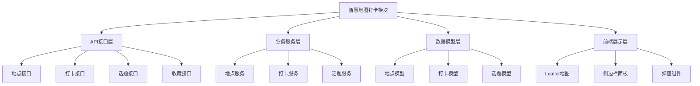
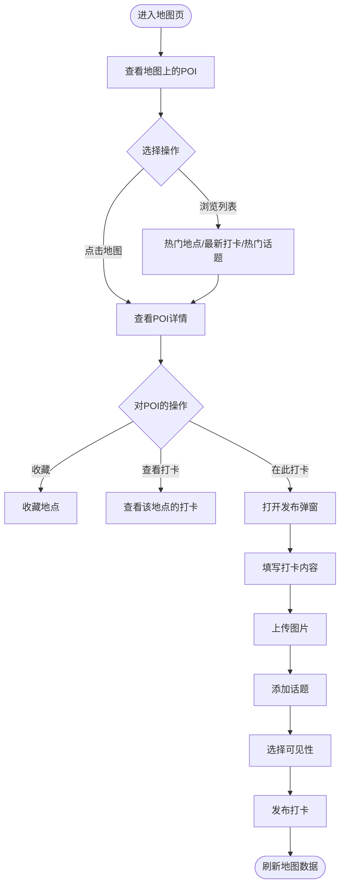
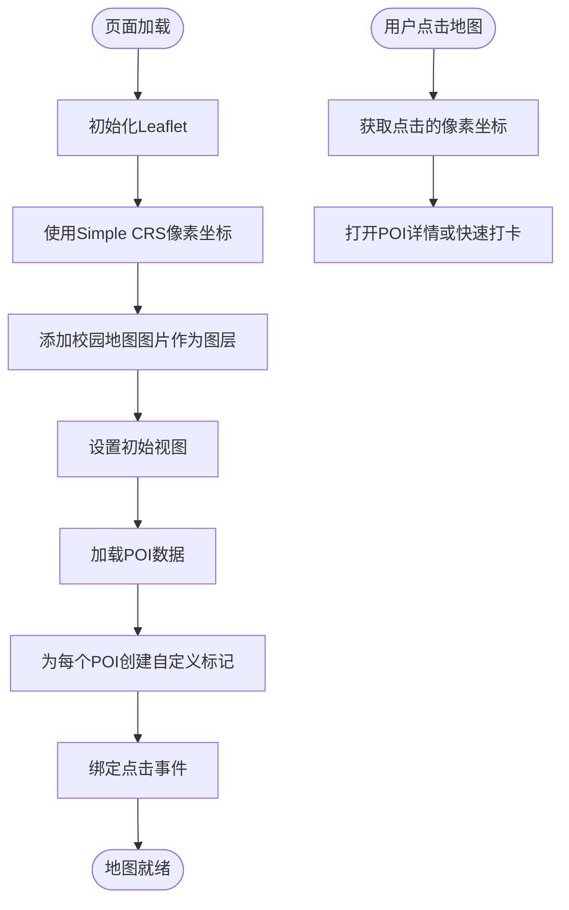
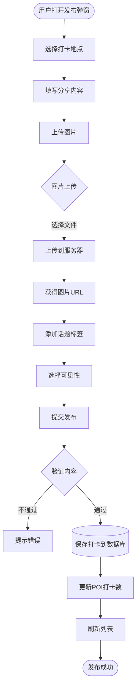

# 智慧地图打卡模块 - 详细落地文档

---

## 🏗️ 一、模块架构

### 1.1 模块分层



---

## 🚪 二、入口说明

### 2.1 前端入口

| 功能 | 路由路径 | 页面位置 | 菜单位置 |
|-----|---------|---------|---------|
| 智慧地图 | /map | `frontend/src/views/map/Index.vue` | 主导航 |

### 2.2 后端API入口

| 功能 | 方法 | 路径 | 认证 | 说明 |
|-----|------|------|------|------|
| 获取热门地点 | GET | `/api/v1/map/hot-pois` | 否 | 获取热门POI列表 |
| 获取地点详情 | GET | `/api/v1/map/pois/:id` | 否 | 获取POI详情 |
| 搜索地点 | GET | `/api/v1/map/pois/search` | 否 | 搜索POI |
| 创建打卡 | POST | `/api/v1/map/checkins` | 是 | 创建打卡 |
| 获取打卡列表 | GET | `/api/v1/map/checkins` | 否 | 获取打卡列表 |
| 获取最新打卡 | GET | `/api/v1/map/recent-checkins` | 否 | 获取最新打卡 |
| 获取热门话题 | GET | `/api/v1/map/hot-topics` | 否 | 获取热门话题 |
| 收藏地点 | POST | `/api/v1/map/pois/:id/favorite` | 是 | 收藏/取消收藏 |
| 检查是否收藏 | GET | `/api/v1/map/pois/:id/favorited` | 是 | 检查是否收藏 |
| 上传图片 | POST | `/api/v1/map/upload` | 是 | 上传打卡图片 |

### 2.3 用户流程



---

## ⚙️ 三、运转机制

### 3.1 地图展示机制



### 3.2 打卡发布流程



---

## 📊 四、数据流

### 4.1 数据流向图


### 4.2 前端数据存储

```javascript
{
  // 地图实例
  map: L.Map | null,

  // POI数据
  hotPOIs: [
    {
      id: number,
      name: string,
      poi_type: string,
      x: number,           // 地图像素x
      y: number,           // 地图像素y
      description: string,
      address: string,
      opening_hours: string,
      check_in_count: number,
      like_count: number,
      view_count: number
    }
  ],

  // 打卡数据
  recentCheckIns: [
    {
      id: number,
      user_id: number,
      poi_id: number,
      content: string,
      images: string[],
      topics: string[],
      like_count: number,
      created_at: string
    }
  ],

  // 话题数据
  hotTopics: [
    {
      id: number,
      name: string,
      check_in_count: number
    }
  ]
}
```

---

## ✅ 五、数据标准

### 5.1 数据库表结构

```python
# backend/src/campus_ai/models/map.py
from sqlalchemy import (
    Column, Integer, String, Text, DateTime, Boolean, ForeignKey, JSON
)
from sqlalchemy.sql import func
from sqlalchemy.orm import relationship
from campus_ai.core.database import Base

class POI(Base):
    """地点表"""
    __tablename__ = "map_poi"

    id = Column(Integer, primary_key=True, autoincrement=True)
    name = Column(String(200), nullable=False, index=True)
    alias = Column(JSON, nullable=True)      # 别名
    poi_type = Column(String(50), nullable=True, index=True)  # 类型

    # 地图坐标
    x = Column(Integer, nullable=True)       # 地图像素x
    y = Column(Integer, nullable=True)       # 地图像素y

    description = Column(Text, nullable=True)
    address = Column(String(200), nullable=True)
    opening_hours = Column(String(100), nullable=True)
    cover_image = Column(String(500), nullable=True)
    images = Column(JSON, nullable=True)     # 图片列表

    # 统计数据
    check_in_count = Column(Integer, default=0)
    like_count = Column(Integer, default=0)
    favorite_count = Column(Integer, default=0)
    view_count = Column(Integer, default=0)

    created_at = Column(DateTime(timezone=True), server_default=func.now())
    updated_at = Column(DateTime(timezone=True), server_default=func.now(), onupdate=func.now())

    checkins = relationship("CheckIn", back_populates="poi")

class CheckIn(Base):
    """打卡表"""
    __tablename__ = "map_checkin"

    id = Column(Integer, primary_key=True, autoincrement=True)
    user_id = Column(Integer, ForeignKey("users.id"), nullable=False, index=True)
    poi_id = Column(Integer, ForeignKey("map_poi.id"), nullable=False, index=True)

    content = Column(Text, nullable=True)
    images = Column(JSON, nullable=True)    # 图片列表
    topics = Column(JSON, nullable=True)    # 话题标签

    visibility = Column(String(20), nullable=False, default="public")  # public/friends/private
    like_count = Column(Integer, default=0)
    comment_count = Column(Integer, default=0)

    created_at = Column(DateTime(timezone=True), server_default=func.now())

    poi = relationship("POI", back_populates="checkins")
    user = relationship("User")
    likes = relationship("CheckInLike", back_populates="checkin")

class Topic(Base):
    """话题表"""
    __tablename__ = "map_topic"

    id = Column(Integer, primary_key=True, autoincrement=True)
    name = Column(String(100), nullable=False, unique=True)
    description = Column(String(200), nullable=True)
    check_in_count = Column(Integer, default=0)

    created_at = Column(DateTime(timezone=True), server_default=func.now())

class POIFavorite(Base):
    """收藏地点表"""
    __tablename__ = "map_poi_favorite"

    id = Column(Integer, primary_key=True, autoincrement=True)
    user_id = Column(Integer, ForeignKey("users.id"), nullable=False)
    poi_id = Column(Integer, ForeignKey("map_poi.id"), nullable=False)
    created_at = Column(DateTime(timezone=True), server_default=func.now())

class CheckInLike(Base):
    """打卡点赞表"""
    __tablename__ = "map_checkin_like"

    id = Column(Integer, primary_key=True, autoincrement=True)
    user_id = Column(Integer, ForeignKey("users.id"), nullable=False)
    checkin_id = Column(Integer, ForeignKey("map_checkin.id"), nullable=False)
    created_at = Column(DateTime(timezone=True), server_default=func.now())

    checkin = relationship("CheckIn", back_populates="likes")
```

### 5.2 POI类型标准

| 类型代码 | 类型名称 | 图标 | 示例 |
|---------|---------|------|------|
| `building` | 建筑 | 🏢 | 教学楼、图书馆、办公楼 |
| `landscape` | 风景 | 🌳 | 花园、湖泊、标志性景观 |
| `food` | 美食 | 🍽️ | 食堂、餐厅、咖啡店 |
| `facility` | 设施 | ⚙️ | 宿舍、超市、快递站 |
| `other` | 其他 | 📍 | 其他地点 |

### 5.3 打卡可见性标准

| 可见性 | 说明 | 图标 |
|-------|------|------|
| `public` | 公开，所有人可见 | 🌍 |
| `friends` | 仅好友可见 | 👥 |
| `private` | 私密，仅自己可见 | 🔒 |

### 5.4 API数据模型

```python
# backend/src/campus_ai/schemas/map.py
from pydantic import BaseModel, Field
from typing import Optional, List
from datetime import datetime

class POIResponse(BaseModel):
    id: int
    name: str
    poi_type: str
    description: Optional[str]
    address: Optional[str]
    opening_hours: Optional[str]
    cover_image: Optional[str]
    check_in_count: int
    favorite_count: int
    view_count: int
    x: Optional[int]
    y: Optional[int]

class POIDetailResponse(POIResponse):
    images: Optional[List[str]]
    favorited: bool = False

class CheckInResponse(BaseModel):
    id: int
    user_id: int
    poi_id: int
    content: Optional[str]
    images: Optional[List[str]]
    topics: Optional[List[str]]
    visibility: str
    like_count: int
    comment_count: int
    created_at: datetime
    user: Optional[dict]

class CheckInCreateRequest(BaseModel):
    poi_id: int
    content: Optional[str] = None
    images: Optional[List[str]] = None
    topics: Optional[List[str]] = None
    visibility: str = "public"

class TopicResponse(BaseModel):
    id: int
    name: str
    check_in_count: int
```

---

## 📝 六、落地步骤

### 第一步：创建数据模型

**文件位置**：`backend/src/campus_ai/models/map.py`

见上面 5.1 完整表结构定义。

### 第二步：创建地图服务

**文件位置**：`backend/src/campus_ai/services/map_service.py`

```python
from typing import List, Optional
from sqlalchemy.ext.asyncio import AsyncSession
from sqlalchemy import select, desc, func
from campus_ai.models.map import POI, CheckIn, Topic, POIFavorite, CheckInLike
from campus_ai.models.user import User

class POIService:
    def __init__(self, db: AsyncSession):
        self.db = db

    async def get_hot(self, limit: int = 20) -> List[POI]:
        """获取热门POI"""
        stmt = (
            select(POI)
            .order_by(desc(POI.check_in_count), desc(POI.view_count))
            .limit(limit)
        )
        result = await self.db.execute(stmt)
        return list(result.scalars().all())

    async def get_detail(self, poi_id: int) -> Optional[POI]:
        """获取POI详情"""
        stmt = select(POI).where(POI.id == poi_id)
        result = await self.db.execute(stmt)
        return result.scalar_one_or_none()

    async def increment_view_count(self, poi_id: int):
        """增加浏览量"""
        stmt = select(POI).where(POI.id == poi_id)
        result = await self.db.execute(stmt)
        poi = result.scalar_one_or_none()
        if poi:
            poi.view_count = (poi.view_count or 0) + 1
            await self.db.commit()

class CheckInService:
    def __init__(self, db: AsyncSession):
        self.db = db

    async def create(
        self,
        user_id: int,
        poi_id: int,
        content: Optional[str] = None,
        images: Optional[List[str]] = None,
        topics: Optional[List[str]] = None,
        visibility: str = "public"
    ) -> CheckIn:
        """创建打卡"""
        checkin = CheckIn(
            user_id=user_id,
            poi_id=poi_id,
            content=content,
            images=images,
            topics=topics,
            visibility=visibility
        )
        self.db.add(checkin)

        # 更新POI打卡数
        stmt = select(POI).where(POI.id == poi_id)
        result = await self.db.execute(stmt)
        poi = result.scalar_one_or_none()
        if poi:
            poi.check_in_count = (poi.check_in_count or 0) + 1

        # 更新话题打卡数
        if topics:
            for topic_name in topics:
                stmt = select(Topic).where(Topic.name == topic_name)
                result = await self.db.execute(stmt)
                topic = result.scalar_one_or_none()
                if topic:
                    topic.check_in_count += 1
                else:
                    new_topic = Topic(name=topic_name, check_in_count=1)
                    self.db.add(new_topic)

        await self.db.commit()
        await self.db.refresh(checkin)
        return checkin

    async def get_recent(self, limit: int = 20) -> List[CheckIn]:
        """获取最新打卡"""
        stmt = (
            select(CheckIn)
            .where(CheckIn.visibility == "public")
            .order_by(desc(CheckIn.created_at))
            .limit(limit)
        )
        result = await self.db.execute(stmt)
        return list(result.scalars().all())

    async def get_by_poi(self, poi_id: int, limit: int = 20) -> List[CheckIn]:
        """获取某POI的打卡"""
        stmt = (
            select(CheckIn)
            .where(CheckIn.poi_id == poi_id, CheckIn.visibility == "public")
            .order_by(desc(CheckIn.created_at))
            .limit(limit)
        )
        result = await self.db.execute(stmt)
        return list(result.scalars().all())

class FavoriteService:
    def __init__(self, db: AsyncSession):
        self.db = db

    async def toggle(self, user_id: int, poi_id: int) -> tuple[bool, int]:
        """切换收藏状态，返回（是否已收藏，新的收藏数）"""
        stmt = select(POIFavorite).where(
            POIFavorite.user_id == user_id, POIFavorite.poi_id == poi_id
        )
        result = await self.db.execute(stmt)
        existing = result.scalar_one_or_none()

        poi_stmt = select(POI).where(POI.id == poi_id)
        result = await self.db.execute(poi_stmt)
        poi = result.scalar_one_or_none()

        if existing:
            await self.db.delete(existing)
            poi.favorite_count = (poi.favorite_count or 0) - 1
            await self.db.commit()
            return False, poi.favorite_count
        else:
            favorite = POIFavorite(user_id=user_id, poi_id=poi_id)
            self.db.add(favorite)
            poi.favorite_count = (poi.favorite_count or 0) + 1
            await self.db.commit()
            return True, poi.favorite_count

    async def has_favorited(self, user_id: int, poi_id: int) -> bool:
        """检查是否已收藏"""
        stmt = select(POIFavorite).where(
            POIFavorite.user_id == user_id, POIFavorite.poi_id == poi_id
        )
        result = await self.db.execute(stmt)
        return result.scalar_one_or_none() is not None

class TopicService:
    def __init__(self, db: AsyncSession):
        self.db = db

    async def get_hot(self, limit: int = 20) -> List[Topic]:
        """获取热门话题"""
        stmt = (
            select(Topic)
            .order_by(desc(Topic.check_in_count))
            .limit(limit)
        )
        result = await self.db.execute(stmt)
        return list(result.scalars().all())
```

### 第三步：创建API路由

**文件位置**：`backend/src/campus_ai/api/v1/map.py`

```python
from typing import Optional
from fastapi import APIRouter, Depends, HTTPException, Query, UploadFile, File
from sqlalchemy.ext.asyncio import AsyncSession

from campus_ai.core.database import get_db
from campus_ai.core.security import get_current_active_user, optional_user
from campus_ai.models.user import User
from campus_ai.schemas.map import (
    POIResponse, POIDetailResponse, CheckInResponse,
    CheckInCreateRequest, TopicResponse
)
from campus_ai.services.map_service import (
    POIService, CheckInService, FavoriteService, TopicService
)
import aiofiles
import uuid
import os

router = APIRouter(prefix="/map", tags=["智慧地图"])

@router.get("/hot-pois")
async def get_hot_pois(
    page_size: int = 20,
    db: AsyncSession = Depends(get_db)
):
    service = POIService(db)
    pois = await service.get_hot(page_size)
    return {
        "items": [POIResponse.model_validate(p) for p in pois]
    }

@router.get("/pois/{poi_id}")
async def get_poi_detail(
    poi_id: int,
    current_user: Optional[User] = Depends(optional_user),
    db: AsyncSession = Depends(get_db)
):
    poi_service = POIService(db)
    poi = await poi_service.get_detail(poi_id)
    if not poi:
        raise HTTPException(status_code=404, detail="地点不存在")

    # 增加浏览量
    await poi_service.increment_view_count(poi_id)

    # 检查是否已收藏
    favorited = False
    if current_user:
        fav_service = FavoriteService(db)
        favorited = await fav_service.has_favorited(current_user.id, poi_id)

    return POIDetailResponse(
        **POIResponse.model_validate(poi).model_dump(),
        favorited=favorited
    )

@router.get("/recent-checkins")
async def get_recent_checkins(
    page_size: int = 20,
    db: AsyncSession = Depends(get_db)
):
    service = CheckInService(db)
    checkins = await service.get_recent(page_size)
    return {
        "items": [CheckInResponse.model_validate(c) for c in checkins]
    }

@router.get("/hot-topics")
async def get_hot_topics(
    page_size: int = 20,
    db: AsyncSession = Depends(get_db)
):
    service = TopicService(db)
    topics = await service.get_hot(page_size)
    return {
        "items": [TopicResponse.model_validate(t) for t in topics]
    }

@router.post("/checkins")
async def create_checkin(
    req: CheckInCreateRequest,
    current_user: User = Depends(get_current_active_user),
    db: AsyncSession = Depends(get_db)
):
    service = CheckInService(db)
    checkin = await service.create(
        user_id=current_user.id,
        poi_id=req.poi_id,
        content=req.content,
        images=req.images,
        topics=req.topics,
        visibility=req.visibility
    )
    return CheckInResponse.model_validate(checkin)

@router.get("/pois/{poi_id}/checkins")
async def get_poi_checkins(
    poi_id: int,
    page_size: int = 20,
    db: AsyncSession = Depends(get_db)
):
    service = CheckInService(db)
    checkins = await service.get_by_poi(poi_id, page_size)
    return {
        "items": [CheckInResponse.model_validate(c) for c in checkins]
    }

@router.post("/pois/{poi_id}/favorite")
async def toggle_favorite(
    poi_id: int,
    current_user: User = Depends(get_current_active_user),
    db: AsyncSession = Depends(get_db)
):
    service = FavoriteService(db)
    favorited, count = await service.toggle(current_user.id, poi_id)
    return {
        "favorited": favorited,
        "favorite_count": count
    }

@router.get("/pois/{poi_id}/favorited")
async def check_favorited(
    poi_id: int,
    current_user: User = Depends(get_current_active_user),
    db: AsyncSession = Depends(get_db)
):
    service = FavoriteService(db)
    favorited = await service.has_favorited(current_user.id, poi_id)
    return {
        "has_favorited": favorited
    }

@router.post("/upload")
async def upload_image(
    file: UploadFile = File(...),
    current_user: User = Depends(get_current_active_user)
):
    """上传打卡图片"""
    # 创建上传目录
    upload_dir = "uploads/map-checkins"
    os.makedirs(upload_dir, exist_ok=True)

    # 生成唯一文件名
    ext = file.filename.split(".")[-1]
    filename = f"{uuid.uuid4()}.{ext}"
    filepath = os.path.join(upload_dir, filename)

    # 保存文件
    async with aiofiles.open(filepath, "wb") as f:
        content = await file.read()
        await f.write(content)

    # 返回URL
    return {
        "url": f"/uploads/map-checkins/{filename}"
    }
```

### 第四步：前端页面

现有文件已完整实现，见：`frontend/src/views/map/Index.vue`

核心功能：
- 使用 Leaflet + Simple CRS 展示校园地图图片
- POI 标记显示（自定义 DivIcon）
- 侧边栏面板：热门地点、最新打卡、热门话题
- POI详情弹窗：查看地点信息、打卡列表、收藏/打卡
- 打卡发布弹窗：选择地点、上传图片、添加话题、选择可见性

### 第五步：创建初始化POI数据

**文件位置**：`backend/scripts/init_map_data.py`

```python
import asyncio
from campus_ai.core.database import AsyncSessionLocal
from campus_ai.models.map import POI

# 示例POI数据 - 燕山大学
SAMPLE_POIS = [
    {
        "name": "图书馆",
        "poi_type": "building",
        "description": "馆藏丰富的大学图书馆，提供自习、借阅、电子资源等服务。",
        "address": "燕山大学东区",
        "opening_hours": "周一至周五 8:00-22:00，周六日 9:00-21:00",
        "check_in_count": 128,
        "favorite_count": 56,
        "view_count": 1024,
        "x": 1800,
        "y": 1200
    },
    {
        "name": "第一教学楼",
        "poi_type": "building",
        "description": "主要的教学楼之一，有多个多媒体教室。",
        "address": "燕山大学东区",
        "opening_hours": "7:00-23:00",
        "check_in_count": 256,
        "favorite_count": 89,
        "view_count": 2048,
        "x": 2000,
        "y": 1000
    },
    {
        "name": "第一食堂",
        "poi_type": "food",
        "description": "提供早餐、午餐、晚餐，有多个窗口供选择。",
        "address": "燕山大学东区",
        "opening_hours": "早餐 6:30-9:00，午餐 11:00-13:00，晚餐 17:00-19:00",
        "check_in_count": 512,
        "favorite_count": 234,
        "view_count": 4096,
        "x": 1500,
        "y": 1500
    },
    {
        "name": "体育馆",
        "poi_type": "facility",
        "description": "室内篮球馆、羽毛球馆、健身房等设施。",
        "address": "燕山大学东区",
        "opening_hours": "8:00-21:00",
        "check_in_count": 89,
        "favorite_count": 45,
        "view_count": 512,
        "x": 2200,
        "y": 1800
    },
    {
        "name": "燕鸣湖",
        "poi_type": "landscape",
        "description": "风景优美的校园湖泊，拍照打卡胜地。",
        "address": "燕山大学东区",
        "opening_hours": "全天开放",
        "check_in_count": 345,
        "favorite_count": 178,
        "view_count": 3072,
        "x": 1200,
        "y": 1000
    }
]

async def init_map_data():
    """初始化地图POI数据"""
    async with AsyncSessionLocal() as db:
        for data in SAMPLE_POIS:
            poi = POI(**data)
            db.add(poi)
        await db.commit()
        print(f"已初始化 {len(SAMPLE_POIS)} 个POI地点")

if __name__ == "__main__":
    asyncio.run(init_map_data())
```

---

## 🎨 七、前端关键实现点

### 7.1 Leaflet地图初始化

```javascript
const initMap = () => {
  // 使用Simple CRS，像素坐标系统
  const yx = L.CRS.Simple

  const mapWidth = 4000
  const mapHeight = 3000

  map.value = L.map('map', {
    crs: yx,
    minZoom: -2,
    maxZoom: 2,
    zoomControl: false
  })

  // 添加单张图片作为图层
  const imageUrl = '/map-tiles/campus_map.png'
  const imageBounds = [[0, 0], [mapHeight, mapWidth]]

  L.imageOverlay(imageUrl, imageBounds).addTo(map.value)

  map.value.setView([mapHeight / 2, mapWidth / 2], 0)
}
```

### 7.2 自定义POI标记

```javascript
const icon = L.divIcon({
  html: `<div style="background: white; padding: 8px; border-radius: 50%; box-shadow: 0 2px 8px rgba(0,0,0,0.2); font-size: 20px;">${getPOIIcon(poi.poi_type)}</div>`,
  className: 'custom-marker',
  iconSize: [40, 40],
  iconAnchor: [20, 20]
})

const marker = L.marker([y, x], { icon })
  .addTo(map.value)
  .on('click', () => openPOIDetail(poi))
```

---

## 🧪 八、测试验收

### 8.1 验收标准

| 检查项 | 验收标准 | 验证方法 |
|-------|---------|---------|
| 地图展示 | 校园地图能正常显示、缩放、平移 | 手动测试 |
| POI标记 | 地点标记显示在正确位置，图标正确 | 手动测试 |
| 查看详情 | 点击POI能查看详情、打卡列表 | 手动测试 |
| 发布打卡 | 能填写内容、上传图片、添加话题 | 手动测试 |
| 收藏功能 | 能收藏/取消收藏，数量正确更新 | 手动测试 |
| 侧边栏 | 能查看热门地点、最新打卡、热门话题 | 手动测试 |
| 图片上传 | 图片能成功上传并显示 | 手动测试 |

### 8.2 手动测试流程

1. 启动后端服务：`uv run python -m uvicorn campus_ai.main:app --reload`
2. 初始化POI数据：`uv run python scripts/init_map_data.py`
3. 启动前端：`cd frontend && npm run dev`
4. 访问地图页面，测试各项功能
