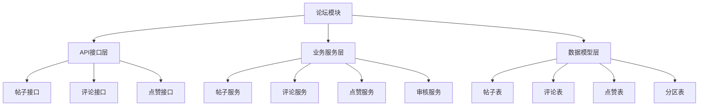
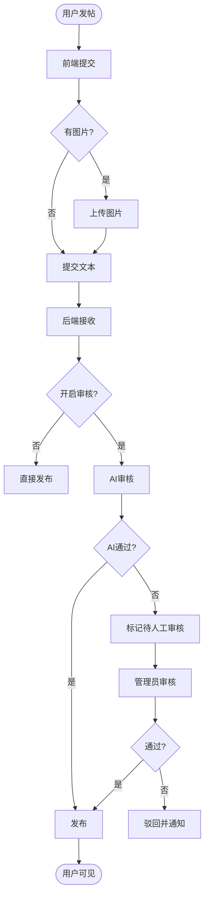

# 校园论坛模块 - 详细落地文档

---

## 🏗️ 一、模块架构

### 1.1 模块分层



---

## 🚪 二、入口说明

### 2.1 前端入口

| 功能 | 路由路径 | 页面位置 | 菜单位置 |
|-----|---------|---------|---------|
| 论坛首页 | `/forum` | `frontend/src/views/forum/ForumIndex.vue` | 主导航 |
| 帖子详情 | `/forum/post/:id` | `frontend/src/views/forum/PostDetail.vue` | 列表点击 |
| 发布帖子 | `/forum/new` | `frontend/src/views/forum/CreatePost.vue` | 发帖按钮 |
| 我的帖子 | `/forum/my` | `frontend/src/views/forum/MyPosts.vue` | 用户菜单 |

### 2.2 后端API入口

| 功能 | 方法 | 路径 | 认证 | 说明 |
|-----|------|------|------|------|
| 分区列表 | GET | `/api/v1/forum/categories` | 否 | 获取分区 |
| 帖子列表 | GET | `/api/v1/forum/posts` | 否 | 获取帖子 |
| 帖子详情 | GET | `/api/v1/forum/posts/:id` | 否 | 帖子详情 |
| 发布帖子 | POST | `/api/v1/forum/posts` | 是 | 发布新帖 |
| 评论 | POST | `/api/v1/forum/posts/:id/comments` | 是 | 发表评论 |
| 点赞 | POST | `/api/v1/forum/posts/:id/like` | 是 | 点赞/取消 |

---

## ⚙️ 三、运转机制

### 3.1 发帖审核流程



---

## ✅ 四、数据标准

### 4.1 数据库表结构

```python
# backend/src/campus_ai/models/forum.py
from sqlalchemy import (
    Column, Integer, String, Text, DateTime, ForeignKey, Boolean,
)
from sqlalchemy.sql import func
from sqlalchemy.orm import relationship
from campus_ai.core.database import Base

class ForumCategory(Base):
    __tablename__ = "forum_category"

    id = Column(Integer, primary_key=True, autoincrement=True)
    name = Column(String(50), nullable=False, unique=True, comment="分区名称")
    slug = Column(String(50), nullable=False, unique=True, comment="URL标识")
    description = Column(String(200), nullable=True, comment="描述")
    icon = Column(String(200), nullable=True, comment="图标")
    sort = Column(Integer, default=0, comment="排序")
    is_active = Column(Boolean, default=True)

    posts = relationship("ForumPost", back_populates="category")

class ForumPost(Base):
    __tablename__ = "forum_post"

    id = Column(Integer, primary_key=True, autoincrement=True)
    title = Column(String(200), nullable=False, comment="标题")
    content = Column(Text, nullable=False, comment="内容")
    images = Column(Text, nullable=True, comment="图片列表JSON")

    category_id = Column(Integer, ForeignKey("forum_category.id"), nullable=False)
    author_id = Column(Integer, ForeignKey("users.id"), nullable=False)

    view_count = Column(Integer, default=0)
    like_count = Column(Integer, default=0)
    comment_count = Column(Integer, default=0)

    status = Column(String(20), default="published", comment="状态")
    is_top = Column(Boolean, default=False)
    is_essence = Column(Boolean, default=False)

    created_at = Column(DateTime(timezone=True), server_default=func.now())
    updated_at = Column(DateTime(timezone=True), server_default=func.now(), onupdate=func.now())

    category = relationship("ForumCategory", back_populates="posts")
    author = relationship("User", foreign_keys=[author_id])
    comments = relationship("ForumComment", back_populates="post")
    likes = relationship("ForumLike", back_populates="post")

class ForumComment(Base):
    __tablename__ = "forum_comment"

    id = Column(Integer, primary_key=True, autoincrement=True)
    post_id = Column(Integer, ForeignKey("forum_post.id"), nullable=False)
    author_id = Column(Integer, ForeignKey("users.id"), nullable=False)
    parent_id = Column(Integer, ForeignKey("forum_comment.id"), nullable=True)
    content = Column(Text, nullable=False)
    like_count = Column(Integer, default=0)
    is_deleted = Column(Boolean, default=False)
    created_at = Column(DateTime(timezone=True), server_default=func.now())

    post = relationship("ForumPost", back_populates="comments")
    author = relationship("User", foreign_keys=[author_id])
    parent = relationship("ForumComment", remote_side=[id])
    replies = relationship("ForumComment", back_populates="parent")

class ForumLike(Base):
    __tablename__ = "forum_like"

    id = Column(Integer, primary_key=True, autoincrement=True)
    post_id = Column(Integer, ForeignKey("forum_post.id"), nullable=False)
    user_id = Column(Integer, ForeignKey("users.id"), nullable=False)
    created_at = Column(DateTime(timezone=True), server_default=func.now())

    post = relationship("ForumPost", back_populates="likes")

    __table_args__ = (
        dict(unique_together=['post_id', 'user_id']),
    )
```

### 4.2 论坛分区标准

| 分区标识 | 分区名称 | 说明 |
|---------|---------|------|
| `study` | 学习交流 | 课程讨论、学习资料、经验分享 |
| `life` | 校园生活 | 日常、美食、宿舍、校园活动 |
| `job` | 求职就业 | 实习、校招、就业经验、内推 |
| `activity` | 活动社团 | 社团招新、活动通知、兴趣小组 |
| `emotion` | 情感交友 | 心情、树洞、交友 |
| `feedback` | 意见反馈 | 对学校的建议、问题反馈 |
| `other` | 其他 | 其他话题 |

---

## 📝 五、落地步骤

### 第一步: 创建数据模型

**文件**: `backend/src/campus_ai/models/forum.py`

```python
# 见上文 4.1
```

### 第二步: 创建服务

**文件**: `backend/src/campus_ai/services/forum_service.py`

```python
from typing import List, Optional
from sqlalchemy.ext.asyncio import AsyncSession
from sqlalchemy import select, desc

from campus_ai.models.forum import (
    ForumCategory, ForumPost, ForumComment, ForumLike
)
from campus_ai.models.user import User

class ForumService:
    def __init__(self, db: AsyncSession):
        self.db = db

    async def get_categories(self) -> List[ForumCategory]:
        """获取分区列表"""
        result = await self.db.execute(
            select(ForumCategory)
            .where(ForumCategory.is_active == True)
            .order_by(ForumCategory.sort)
        )
        return list(result.scalars().all())

    async def get_posts(
        self,
        category_id: int = None,
        keyword: str = None,
        limit: int = 50,
        offset: int = 0
    ) -> List[ForumPost]:
        """获取帖子列表"""
        query = select(ForumPost).where(ForumPost.status == "published")

        if category_id:
            query = query.where(ForumPost.category_id == category_id)
        if keyword:
            query = query.where(
                ForumPost.title.contains(keyword) | ForumPost.content.contains(keyword)
            )

        query = query.order_by(
            desc(ForumPost.is_top),
            desc(ForumPost.created_at)
        ).limit(limit).offset(offset)

        result = await self.db.execute(query)
        return list(result.scalars().all())

    async def get_post(self, post_id: int) -> Optional[ForumPost]:
        """获取帖子详情"""
        result = await self.db.execute(select(ForumPost).where(ForumPost.id == post_id))
        post = result.scalar_one_or_none()

        if post:
            # 更新浏览量
            post.view_count += 1
            await self.db.commit()
            await self.db.refresh(post)

        return post

    async def create_post(
        self,
        title: str,
        content: str,
        category_id: int,
        author_id: int,
        images: List[str] = None
    ) -> ForumPost:
        """创建帖子"""
        post = ForumPost(
            title=title,
            content=content,
            category_id=category_id,
            author_id=author_id,
            images=str(images) if images else None,
            status="published"
        )
        self.db.add(post)
        await self.db.commit()
        await self.db.refresh(post)
        return post

    async def get_comments(self, post_id: int) -> List[ForumComment]:
        """获取评论"""
        result = await self.db.execute(
            select(ForumComment)
            .where(ForumComment.post_id == post_id, ForumComment.is_deleted == False)
            .order_by(ForumComment.created_at)
        )
        return list(result.scalars().all())

    async def create_comment(
        self,
        post_id: int,
        author_id: int,
        content: str,
        parent_id: int = None
    ) -> ForumComment:
        """发表评论"""
        comment = ForumComment(
            post_id=post_id,
            author_id=author_id,
            content=content,
            parent_id=parent_id
        )
        self.db.add(comment)

        # 更新评论数
        post_result = await self.db.execute(select(ForumPost).where(ForumPost.id == post_id))
        post = post_result.scalar_one_or_none()
        if post:
            post.comment_count += 1

        await self.db.commit()
        await self.db.refresh(comment)
        return comment

    async def toggle_like(self, post_id: int, user_id: int) -> bool:
        """点赞/取消点赞"""
        result = await self.db.execute(
            select(ForumLike).where(
                ForumLike.post_id == post_id, ForumLike.user_id == user_id
            )
        )
        like = result.scalar_one_or_none()

        post_result = await self.db.execute(select(ForumPost).where(ForumPost.id == post_id))
        post = post_result.scalar_one()

        if like:
            # 取消点赞
            await self.db.delete(like)
            post.like_count -= 1
            await self.db.commit()
            return False
        else:
            # 点赞
            new_like = ForumLike(post_id=post_id, user_id=user_id)
            self.db.add(new_like)
            post.like_count += 1
            await self.db.commit()
            return True

    async def has_liked(self, post_id: int, user_id: int) -> bool:
        """检查是否已点赞"""
        result = await self.db.execute(
            select(ForumLike).where(
                ForumLike.post_id == post_id, ForumLike.user_id == user_id
            )
        )
        return result.scalar_one_or_none() is not None
```

### 第三步: 创建API路由

**文件**: `backend/src/campus_ai/api/v1/forum.py`

```python
from typing import List, Optional
from fastapi import APIRouter, Depends, HTTPException, Query
from sqlalchemy.ext.asyncio import AsyncSession

from campus_ai.core.database import get_db
from campus_ai.core.security import get_current_active_user, optional_user
from campus_ai.models.user import User
from campus_ai.schemas.forum import (
    CategoryResponse,
    PostResponse,
    PostDetailResponse,
    CreatePostRequest,
    CommentResponse,
    CreateCommentRequest,
)
from campus_ai.services.forum_service import ForumService

router = APIRouter(prefix="/forum", tags=["论坛"])

@router.get("/categories", response_model=List[CategoryResponse])
async def get_categories(db: AsyncSession = Depends(get_db)):
    """获取分区列表"""
    service = ForumService(db)
    categories = await service.get_categories()
    return [CategoryResponse.model_validate(c) for c in categories]

@router.get("/posts", response_model=List[PostResponse])
async def get_posts(
    category_id: int = None,
    keyword: str = None,
    limit: int = 50,
    offset: int = 0,
    db: AsyncSession = Depends(get_db),
):
    """获取帖子列表"""
    service = ForumService(db)
    posts = await service.get_posts(category_id, keyword, limit, offset)
    return [PostResponse.model_validate(p) for p in posts]

@router.get("/posts/{post_id}", response_model=PostDetailResponse)
async def get_post(
    post_id: int,
    current_user: Optional[User] = Depends(optional_user),
    db: AsyncSession = Depends(get_db),
):
    """获取帖子详情"""
    service = ForumService(db)
    post = await service.get_post(post_id)
    if not post:
        raise HTTPException(status_code=404, detail="帖子不存在")

    # 获取评论
    comments = await service.get_comments(post_id)

    # 检查是否已点赞
    has_liked = False
    if current_user:
        has_liked = await service.has_liked(post_id, current_user.id)

    return PostDetailResponse(
        **PostResponse.model_validate(post).model_dump(),
        comments=[CommentResponse.model_validate(c) for c in comments],
        has_liked=has_liked
    )

@router.post("/posts", response_model=PostResponse)
async def create_post(
    request: CreatePostRequest,
    current_user: User = Depends(get_current_active_user),
    db: AsyncSession = Depends(get_db),
):
    """发布帖子"""
    service = ForumService(db)
    post = await service.create_post(
        title=request.title,
        content=request.content,
        category_id=request.category_id,
        author_id=current_user.id,
        images=request.images
    )
    return PostResponse.model_validate(post)

@router.post("/posts/{post_id}/comments", response_model=CommentResponse)
async def create_comment(
    post_id: int,
    request: CreateCommentRequest,
    current_user: User = Depends(get_current_active_user),
    db: AsyncSession = Depends(get_db),
):
    """发表评论"""
    service = ForumService(db)
    comment = await service.create_comment(
        post_id=post_id,
        author_id=current_user.id,
        content=request.content,
        parent_id=request.parent_id
    )
    return CommentResponse.model_validate(comment)

@router.post("/posts/{post_id}/like")
async def toggle_like(
    post_id: int,
    current_user: User = Depends(get_current_active_user),
    db: AsyncSession = Depends(get_db),
):
    """点赞/取消点赞"""
    service = ForumService(db)
    liked = await service.toggle_like(post_id, current_user.id)
    return {"liked": liked}
```

### 第四步: 前端页面

**文件**: `frontend/src/views/forum/ForumIndex.vue`

```vue
<template>
  <div class="forum">
    <div class="header">
      <h2>校园论坛</h2>
      <button @click="goCreate" class="create-btn">+ 发布帖子</button>
    </div>

    <div class="tabs">
      <div
        v-for="cat in categories"
        :key="cat.id"
        class="tab"
        :class="{ active: selectedCategory === cat.id }"
        @click="selectCategory(cat.id)"
      >
        {{ cat.name }}
      </div>
    </div>

    <div class="search-bar">
      <input v-model="keyword" placeholder="搜索帖子..." />
      <button @click="handleSearch">搜索</button>
    </div>

    <div class="post-list">
      <div
        v-for="post in posts"
        :key="post.id"
        class="post-item"
        @click="goDetail(post.id)"
      >
        <div class="left">
          <div class="title" :class="{ top: post.isTop, essence: post.isEssence }">
            <span v-if="post.isTop" class="tag">置顶</span>
            <span v-if="post.isEssence" class="tag essence">精华</span>
            {{ post.title }}
          </div>
          <div class="meta">
            <span>{{ post.author?.nickname || '匿名用户' }}</span>
            <span>发布于 {{ formatDate(post.createdAt) }}</span>
          </div>
        </div>
        <div class="right">
          <span>👁️ {{ post.viewCount }}</span>
          <span>💬 {{ post.commentCount }}</span>
          <span>❤️ {{ post.likeCount }}</span>
        </div>
      </div>
    </div>
  </div>
</template>

<script setup>
import { ref, onMounted } from 'vue'
import { useRouter } from 'vue-router'
import { getCategories, getPosts } from '@/api/forum'

const router = useRouter()
const categories = ref([])
const posts = ref([])
const selectedCategory = ref(null)
const keyword = ref('')

function selectCategory(id) {
  selectedCategory.value = id
  loadPosts()
}

async function loadCategories() {
  categories.value = await getCategories()
  if (categories.value.length > 0) {
    selectedCategory.value = categories.value[0].id
  }
}

async function loadPosts() {
  posts.value = await getPosts({
    categoryId: selectedCategory.value,
    keyword: keyword.value || undefined
  })
}

function handleSearch() {
  loadPosts()
}

function goDetail(id) {
  router.push(`/forum/post/${id}`)
}

function goCreate() {
  router.push('/forum/new')
}

function formatDate(dateString) {
  const date = new Date(dateString)
  return date.toLocaleDateString()
}

onMounted(() => {
  loadCategories()
})
</script>

<style scoped>
.forum { padding: 20px; max-width: 900px; margin: 0 auto; }
.header { display: flex; justify-content: space-between; align-items: center; margin-bottom: 20px; }
.create-btn { background: #4CAF50; color: white; border: none; padding: 10px 20px; border-radius: 4px; cursor: pointer; }
.tabs { display: flex; gap: 10px; margin-bottom: 20px; flex-wrap: wrap; }
.tab { padding: 8px 16px; background: #f0f0f0; border-radius: 20px; cursor: pointer; }
.tab.active { background: #4CAF50; color: white; }
.search-bar { display: flex; gap: 10px; margin-bottom: 20px; }
.search-bar input { flex: 1; padding: 10px; border: 1px solid #ddd; border-radius: 4px; }
.post-item { display: flex; justify-content: space-between; padding: 15px; border-bottom: 1px solid #eee; cursor: pointer; }
.post-item:hover { background: #f9f9f9; }
.tag { background: #FF5722; color: white; padding: 2px 6px; border-radius: 3px; font-size: 0.8em; margin-right: 5px; }
.tag.essence { background: #FFC107; }
.meta { font-size: 0.8em; color: #999; margin-top: 5px; }
.right { display: flex; gap: 15px; color: #999; font-size: 0.9em; }
</style>
```

### 第五步: 帖子详情页

**文件**: `frontend/src/views/forum/PostDetail.vue`

```vue
<template>
  <div class="post-detail" v-if="post">
    <button @click="$router.back()" class="back">← 返回</button>

    <div class="post-header">
      <h1>{{ post.title }}</h1>
      <div class="meta">
        <span>作者: {{ post.author?.nickname }}</span>
        <span>发布于: {{ formatDate(post.createdAt) }}</span>
        <span>浏览: {{ post.viewCount }}</span>
      </div>
    </div>

    <div class="post-content" v-html="post.content"></div>

    <div class="post-images" v-if="post.images?.length">
      
    </div>

    <div class="post-actions">
      <button @click="handleLike" :class="{ liked: post.hasLiked }">
        ❤️ {{ post.likeCount }}
      </button>
      <button>💬 {{ post.commentCount }}</button>
    </div>

    <div class="comments">
      <h3>评论 ({{ post.comments?.length || 0 }})</h3>
      <div class="comment-input">
        <textarea v-model="newComment" placeholder="发表评论..." />
        <button @click="submitComment">发表</button>
      </div>
      <div class="comment-list">
        <div v-for="comment in post.comments" :key="comment.id" class="comment">
          <div class="comment-author">{{ comment.author?.nickname }}</div>
          <div class="comment-content">{{ comment.content }}</div>
          <div class="comment-time">{{ formatDate(comment.createdAt) }}</div>
        </div>
      </div>
    </div>
  </div>
</template>

<script setup>
import { ref, onMounted } from 'vue'
import { useRoute, useRouter } from 'vue-router'
import { getPost, toggleLike as toggleLikeApi, createComment } from '@/api/forum'
import { useUserStore } from '@/store/modules/user'

const route = useRoute()
const router = useRouter()
const userStore = useUserStore()

const post = ref(null)
const newComment = ref('')

async function loadPost() {
  post.value = await getPost(route.params.id)
}

async function handleLike() {
  if (!userStore.isLoggedIn) {
    router.push('/login')
    return
  }
  const result = await toggleLikeApi(post.value.id)
  if (result.liked) {
    post.value.likeCount++
    post.value.hasLiked = true
  } else {
    post.value.likeCount--
    post.value.hasLiked = false
  }
}

async function submitComment() {
  if (!newComment.value.trim()) return
  await createComment(post.value.id, { content: newComment.value })
  newComment.value = ''
  loadPost()
}

function formatDate(dateString) {
  return new Date(dateString).toLocaleString()
}

onMounted(() => {
  loadPost()
})
</script>

<style scoped>
.post-detail { max-width: 800px; margin: 0 auto; padding: 20px; }
.back { background: none; border: none; color: #666; cursor: pointer; margin-bottom: 20px; }
.post-header h1 { margin-bottom: 10px; }
.meta { color: #999; font-size: 0.9em; }
.post-content { margin: 30px 0; line-height: 1.8; }
.post-actions { display: flex; gap: 10px; padding: 20px 0; border-top: 1px solid #eee; }
.post-actions button { padding: 10px 20px; border: 1px solid #ddd; background: white; border-radius: 4px; cursor: pointer; }
.post-actions button.liked { background: #ffebee; color: #e91e63; }
.comments { margin-top: 30px; }
.comment-input { display: flex; gap: 10px; margin-bottom: 20px; }
.comment-input textarea { flex: 1; padding: 10px; min-height: 80px; }
.comment { padding: 15px; border-bottom: 1px solid #f0f0f0; }
.comment-author { font-weight: bold; }
.comment-time { color: #999; font-size: 0.8em; }
</style>
```

---

## 🧪 六、测试验收

| 检查项 | 验收标准 |
|-------|---------|
| 浏览帖子 | 能看到帖子列表和详情 |
| 发布帖子 | 能正常发布新帖子 |
| 发表评论 | 能评论和回复 |
| 点赞 | 能点赞和取消 |
| 分区浏览 | 分区分区浏览 |
| 搜索功能 | 关键词搜索有效 |
