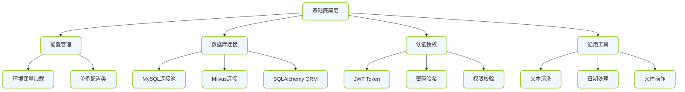
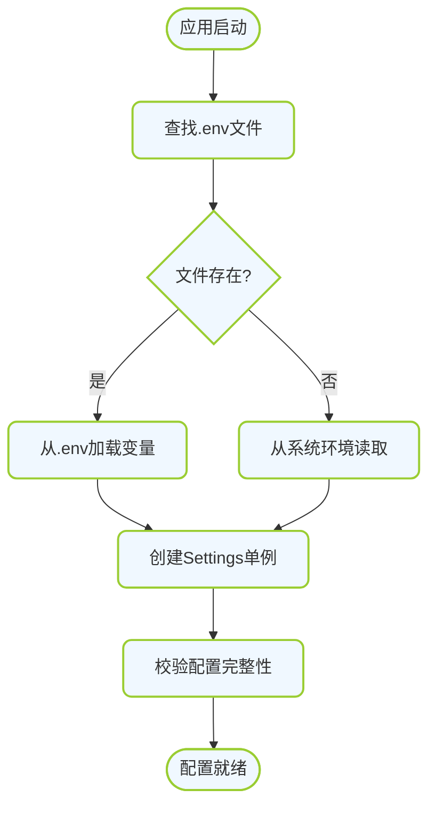
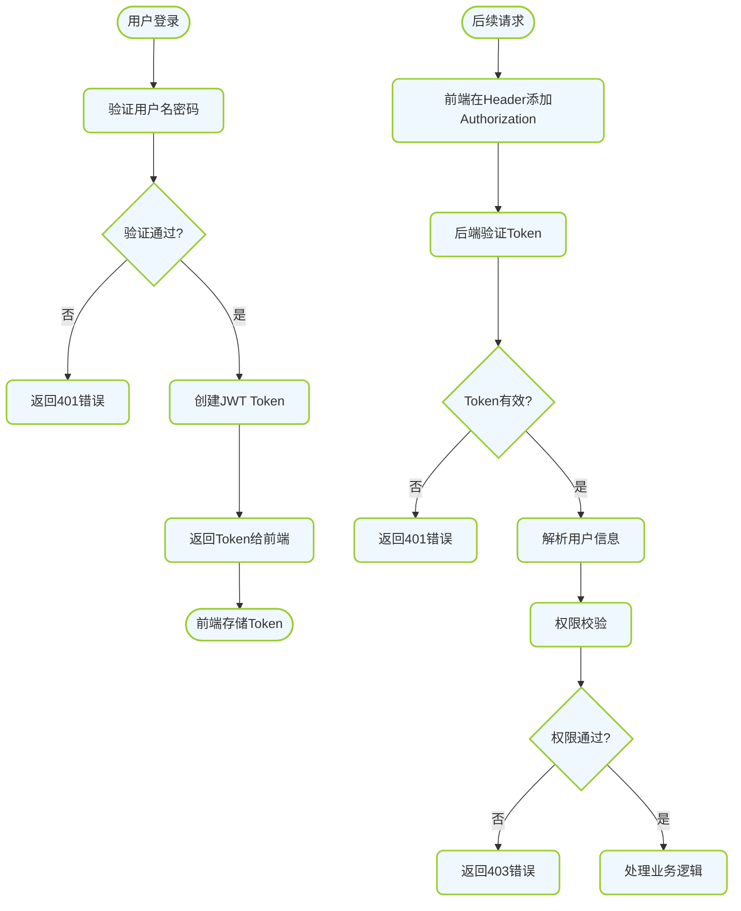

# 基础底座层详细设计

---

## 🏗️ 一、基础底座层架构

### 1.1 组成模块



---

## ⚙️ 二、配置管理模块

### 2.1 入口说明

- **文件位置**: `backend/src/campus_ai/core/config.py`
- **加载时机**: 应用启动时自动加载
- **配置来源`: `.env` 文件 + 环境变量

### 2.2 运转机制



### 2.3 数据标准 - 配置项清单

| 配置项 | 类型 | 必填 | 默认值 | 说明 | 合格标准 |
|-------|------|------|--------|------|---------|
| `APP_NAME` | str | 否 | CampusAI | 应用名称 | 非空字符串 |
| `DEBUG` | bool | 否 | True | 调试模式 | true/false |
| `SECRET_KEY` | str | 是 | - | JWT密钥 | 至少32字符 |
| `ALGORITHM` | str | 否 | HS256 | JWT算法 | HS256/RS256 |
| `ACCESS_TOKEN_EXPIRE_MINUTES` | int | 否 | 60*24*7 | Token过期时间(分钟) | 正数 |
| `MYSQL_HOST` | str | 是 | localhost | MySQL主机 | 可解析主机名/IP |
| `MYSQL_PORT` | int | 否 | 3306 | MySQL端口 | 1-65535 |
| `MYSQL_USER` | str | 是 | - | MySQL用户 | 非空字符串 |
| `MYSQL_PASSWORD` | str | 是 | - | MySQL密码 | 非空字符串 |
| `MYSQL_DATABASE` | str | 是 | - | MySQL数据库名 | 非空字符串 |
| `MILVUS_URI` | str | 否 | http://localhost:19530 | Milvus地址 | 有效的URL |
| `OPENAI_API_KEY` | str | 否 | - | OpenAI API密钥 | sk-开头 |
| `OPENAI_BASE_URL` | str | 否 | https://api.openai.com/v1 | API Base URL | 有效的URL |
| `MINERU_PATH` | str | 否 | - | mineru可执行文件路径 | 存在的文件路径 |
| `UPLOAD_DIR` | str | 否 | ./uploads | 上传目录 | 可写路径 |

### 2.4 落地步骤

**Step 1: 创建配置类**

```python
# backend/src/campus_ai/core/config.py
from pydantic_settings import BaseSettings
from functools import lru_cache

class Settings(BaseSettings):
    APP_NAME: str = "CampusAI"
    DEBUG: bool = True
    SECRET_KEY: str = "your-secret-key-change-in-production"
    ALGORITHM: str = "HS256"
    ACCESS_TOKEN_EXPIRE_MINUTES: int = 60 * 24 * 7

    MYSQL_HOST: str = "localhost"
    MYSQL_PORT: int = 3306
    MYSQL_USER: str = "root"
    MYSQL_PASSWORD: str = ""
    MYSQL_DATABASE: str = "campus_ai"

    MILVUS_URI: str = "http://localhost:19530"

    OPENAI_API_KEY: str = ""
    OPENAI_BASE_URL: str = "https://api.openai.com/v1"

    MINERU_PATH: str = ""
    UPLOAD_DIR: str = "./uploads"

    model_config = {
        "env_file": ".env",
        "env_file_encoding": "utf-8",
    }

@lru_cache()
def get_settings():
    return Settings()
```

**Step 2: 创建 .env.example 文件**

```env
# backend/.env.example
APP_NAME=CampusAI
DEBUG=True
SECRET_KEY=change-this-in-production-at-least-32-chars
ALGORITHM=HS256
ACCESS_TOKEN_EXPIRE_MINUTES=10080

MYSQL_HOST=localhost
MYSQL_PORT=3306
MYSQL_USER=root
MYSQL_PASSWORD=your_password
MYSQL_DATABASE=campus_ai

MILVUS_URI=http://localhost:19530

OPENAI_API_KEY=sk-your-api-key
OPENAI_BASE_URL=https://api.openai.com/v1

MINERU_PATH=/path/to/mineru
UPLOAD_DIR=./uploads
```

**Step 3: 复制 .env.example 为 .env 并填写真实值**

**Step 4: 验证配置加载**

```python
# 测试脚本
from campus_ai.core.config import get_settings

settings = get_settings()
print(f"APP_NAME: {settings.APP_NAME}")
print(f"MYSQL_HOST: {settings.MYSQL_HOST}")
```

---

## 🗄️ 三、数据库连接模块

### 3.1 入口说明

- **文件位置**: `backend/src/campus_ai/core/database.py`
- **获取方式**: 通过依赖注入 `get_db()` 获取会话
- **连接类型**: 异步连接池 (asyncmy)

### 3.2 运转机制

```mermaid
flowchart TD
    classDef node fill:#F0F8FF,stroke:#9ACD32,stroke-width:2px,rx:8px
    classDef startend fill:#E6F3FF,stroke:#B8860B,stroke-width:3px,rx:10px

    A([请求开始]):::startend --> B[调用get_db()]
    B --> C{连接池有空闲连接?}
    C -->|是| D[复用空闲连接]
    C -->|否| E[创建新连接]
    D --> F[创建Session会话]
    E --> F
    F --> G[传递给路由处理函数]
    G --> H{请求成功?}
    H -->|是| I[提交事务commit]
    H -->|否| J[回滚事务rollback]
    I --> K[关闭Session归还连接]
    J --> K
    K --> L([请求结束]):::startend

    class A,B,C,D,E,F,G,H,I,J,K,L node
```

### 3.3 数据标准 - 连接池配置

| 配置项 | 推荐值 | 说明 | 合格标准 |
|-------|--------|------|---------|
| `pool_size` | 5-20 | 连接池大小 | 根据并发量调整 |
| `max_overflow` | 10 | 最大溢出连接数 | >=0 |
| `pool_timeout` | 30 | 获取连接超时(秒) | >0 |
| `pool_recycle` | 3600 | 连接回收时间(秒) | >0 |
| `echo` | False | 是否输出SQL日志 | true/false |

### 3.4 落地步骤

**Step 1: 创建数据库连接模块**

```python
# backend/src/campus_ai/core/database.py
from sqlalchemy.ext.asyncio import create_async_engine, AsyncSession, async_sessionmaker
from sqlalchemy.orm import declarative_base
from campus_ai.core.config import get_settings

settings = get_settings()

# 构建数据库URL
DATABASE_URL = (
    f"mysql+asyncmy://{settings.MYSQL_USER}:{settings.MYSQL_PASSWORD}"
    f"@{settings.MYSQL_HOST}:{settings.MYSQL_PORT}/{settings.MYSQL_DATABASE}"
)

# 创建异步引擎
engine = create_async_engine(
    DATABASE_URL,
    pool_size=10,
    max_overflow=20,
    pool_timeout=30,
    pool_recycle=3600,
    echo=settings.DEBUG,
)

# 创建会话工厂
AsyncSessionLocal = async_sessionmaker(
    engine,
    class_=AsyncSession,
    expire_on_commit=False,
)

# 创建基类
Base = declarative_base()

# 依赖注入函数
async def get_db():
    async with AsyncSessionLocal() as session:
        try:
            yield session
            await session.commit()
        except Exception:
            await session.rollback()
            raise
```

**Step 2: Milvus 连接模块**

```python
# backend/src/campus_ai/core/milvus.py
from pymilvus import connections, Collection, utility
from campus_ai.core.config import get_settings

settings = get_settings()

class MilvusClient:
    _instance = None
    _connected = False

    def __new__(cls):
        if cls._instance is None:
            cls._instance = super().__new__(cls)
        return cls._instance

    def connect(self):
        if not self._connected:
            connections.connect(uri=settings.MILVUS_URI)
            self._connected = True

    def get_collection(self, collection_name: str):
        self.connect()
        if utility.has_collection(collection_name):
            return Collection(collection_name)
        return None

    def create_collection(self, collection_name: str, schema):
        self.connect()
        if not utility.has_collection(collection_name):
            return Collection(name=collection_name, schema=schema)
        return Collection(collection_name)

milvus_client = MilvusClient()
```

**Step 3: 测试数据库连接**

```python
# 测试脚本
import asyncio
from campus_ai.core.database import get_db
from campus_ai.core.milvus import milvus_client

async def test_mysql():
    async for db in get_db():
        # 执行简单查询
        result = await db.execute("SELECT 1")
        print("MySQL连接成功:", result.scalar())

async def test_milvus():
    milvus_client.connect()
    print("Milvus连接成功")

asyncio.run(test_mysql())
asyncio.run(test_milvus())
```

---

## 🔐 四、认证授权模块

### 4.1 入口说明

- **文件位置**: `backend/src/campus_ai/core/security.py`
- **主要功能**: 密码哈希、JWT创建/验证、权限校验
- **依赖**: 依赖注入 `get_current_user()` 获取当前用户

### 4.2 运转机制 - JWT认证流程



### 4.3 数据标准 - JWT Payload 结构

| 字段 | 类型 | 必填 | 说明 | 合格标准 |
|-----|------|------|------|---------|
| `sub` | str | 是 | 主题(用户ID) | 非空字符串 |
| `exp` | int | 是 | 过期时间戳 | Unix时间戳 |
| `iat` | int | 是 | 签发时间戳 | Unix时间戳 |
| `type` | str | 是 | Token类型 | "access"/"refresh" |
| `role` | str | 是 | 用户角色 | "student"/"teacher"/"admin" |

### 4.4 数据标准 - 用户角色权限

| 角色 | 权限范围 | 说明 |
|-----|---------|------|
| `student` | 基础功能访问 | 浏览、查询、报名、发帖等 |
| `teacher` | 班级/课程管理 | 学生功能 + 班级管理、课程管理 |
| `admin` | 全系统管理 | 所有功能 + 用户管理、内容审核、系统配置 |

### 4.5 落地步骤

**Step 1: 创建安全模块**

```python
# backend/src/campus_ai/core/security.py
from datetime import datetime, timedelta
from typing import Optional
from jose import JWTError, jwt
from passlib.context import CryptContext
from fastapi import Depends, HTTPException, status
from fastapi.security import OAuth2PasswordBearer
from sqlalchemy.ext.asyncio import AsyncSession
from sqlalchemy import select

from campus_ai.core.config import get_settings
from campus_ai.core.database import get_db
from campus_ai.models.user import User

settings = get_settings()

# 密码哈希上下文
pwd_context = CryptContext(schemes=["bcrypt"], deprecated="auto")

# OAuth2 Bearer Token
oauth2_scheme = OAuth2PasswordBearer(tokenUrl="/api/v1/auth/login")

def verify_password(plain_password: str, hashed_password: str) -> bool:
    """验证密码"""
    return pwd_context.verify(plain_password, hashed_password)

def get_password_hash(password: str) -> str:
    """生成密码哈希"""
    return pwd_context.hash(password)

def create_access_token(data: dict, expires_delta: Optional[timedelta] = None) -> str:
    """创建访问Token"""
    to_encode = data.copy()
    if expires_delta:
        expire = datetime.utcnow() + expires_delta
    else:
        expire = datetime.utcnow() + timedelta(minutes=settings.ACCESS_TOKEN_EXPIRE_MINUTES)
    to_encode.update({"exp": expire, "iat": datetime.utcnow()})
    encoded_jwt = jwt.encode(to_encode, settings.SECRET_KEY, algorithm=settings.ALGORITHM)
    return encoded_jwt

async def get_current_user(
    token: str = Depends(oauth2_scheme),
    db: AsyncSession = Depends(get_db)
) -> User:
    """获取当前用户"""
    credentials_exception = HTTPException(
        status_code=status.HTTP_401_UNAUTHORIZED,
        detail="无法验证凭证",
        headers={"WWW-Authenticate": "Bearer"},
    )
    try:
        payload = jwt.decode(token, settings.SECRET_KEY, algorithms=[settings.ALGORITHM])
        user_id: str = payload.get("sub")
        token_type: str = payload.get("type")
        if user_id is None or token_type != "access":
            raise credentials_exception
    except JWTError:
        raise credentials_exception

    result = await db.execute(select(User).where(User.id == int(user_id)))
    user = result.scalar_one_or_none()
    if user is None:
        raise credentials_exception
    return user

async def get_current_active_user(
    current_user: User = Depends(get_current_user)
) -> User:
    """获取当前激活用户"""
    if not current_user.is_active:
        raise HTTPException(status_code=400, detail="用户未激活")
    return current_user

class RoleChecker:
    """角色权限检查器"""
    def __init__(self, allowed_roles: list):
        self.allowed_roles = allowed_roles

    async def __call__(
        self, current_user: User = Depends(get_current_active_user)
    ) -> User:
        if current_user.role not in self.allowed_roles:
            raise HTTPException(
                status_code=status.HTTP_403_FORBIDDEN,
                detail="权限不足"
            )
        return current_user
```

**Step 2: 使用示例 - 路由中使用权限控制**

```python
from fastapi import APIRouter, Depends
from campus_ai.core.security import get_current_active_user, RoleChecker
from campus_ai.models.user import User

router = APIRouter()

@router.get("/profile")
async def get_profile(
    current_user: User = Depends(get_current_active_user)
):
    """所有登录用户都可以访问"""
    return current_user

@router.get("/admin/dashboard")
async def admin_dashboard(
    current_user: User = Depends(RoleChecker(["admin"]))
):
    """仅管理员可访问"""
    return {"message": "管理员面板"}
```

**Step 3: 测试认证功能**

```python
# 测试密码哈希
hash1 = get_password_hash("test123")
assert verify_password("test123", hash1) == True

# 测试Token创建
token = create_access_token(data={"sub": "1", "type": "access", "role": "student"})
print("Token:", token)
```

---

## 🛠️ 五、通用工具模块

### 5.1 入口说明

- **文件位置**: `backend/src/campus_ai/core/utils/`
- **包含工具**: 文本清洗、日期处理、文件操作、文档处理等
- **使用方式**: 直接 import 使用

### 5.2 工具清单与落地标准

| 工具文件 | 功能 | 输入标准 | 输出标准 |
|---------|------|---------|---------|
| `text_cleaner.py` | 文本清洗 | 任意字符串 | 规范化纯文本 |
| `embedder.py` | 向量嵌入 | 文本字符串 | float32数组, 维度固定 |
| `llm_client.py` | LLM调用 | Prompt字符串 | LLM返回文本 |
| `mineru_helper.py` | mineru调用 | PDF文件路径 | Markdown文本 |
| `crawler_base.py` | 爬虫基类 | URL字符串 | HTML/JSON响应 |
| `document_processor.py` | 文档处理 | 各种格式文档 | 标准化文本 |

### 5.3 落地步骤 - 文本清洗工具示例

```python
# backend/src/campus_ai/core/utils/text_cleaner.py
import re
from typing import Optional

class TextCleaner:
    @staticmethod
    def clean(text: str) -> str:
        """
        清洗文本
        
        输入标准: 任意字符串, 允许None/空字符串
        输出标准: 规范化纯文本
            - 去除多余空白
            - 统一换行符
            - 去除不可见字符
            - 保留必要标点
        """
        if not text:
            return ""

        # 1. 统一换行符
        text = text.replace("\r\n", "\n").replace("\r", "\n")

        # 2. 去除不可见字符(保留\n\t)
        text = re.sub(r"[\x00-\x08\x0B\x0C\x0E-\x1F\x7F]", "", text)

        # 3. 合并多余空白行
        text = re.sub(r"\n{3,}", "\n\n", text)

        # 4. 去除行首尾空白
        lines = [line.strip() for line in text.split("\n")]
        text = "\n".join(lines)

        # 5. 去除首尾空白
        text = text.strip()

        return text

    @staticmethod
    def normalize_spaces(text: str) -> str:
        """规范化空格"""
        return re.sub(r"\s+", " ", text).strip()

text_cleaner = TextCleaner()
```

---

## ✅ 六、基础底座层验收标准

### 6.1 检查清单

| 检查项 | 验收标准 | 验证方法 |
|-------|---------|---------|
| 配置加载 | .env文件正确加载, 配置项可读取 | 运行测试脚本 |
| MySQL连接 | 可连接数据库, 执行SQL查询 | 运行测试脚本 |
| Milvus连接 | 可连接Milvus, 创建集合 | 运行测试脚本 |
| 密码哈希 | 可生成哈希, 可验证密码 | 单元测试 |
| JWT创建 | 可生成Token, 包含正确字段 | 单元测试 |
| JWT验证 | 可验证Token有效性 | 单元测试 |
| 权限控制 | 角色权限正确拦截 | API测试 |
| 工具函数 | 文本清洗等工具正常工作 | 单元测试 |

### 6.2 测试用例示例

```python
# tests/test_base.py
import pytest
from campus_ai.core.config import get_settings
from campus_ai.core.security import verify_password, get_password_hash
from campus_ai.core.utils.text_cleaner import text_cleaner

class TestConfig:
    def test_settings_load(self):
        settings = get_settings()
        assert settings.APP_NAME is not None
        assert settings.SECRET_KEY is not None

class TestSecurity:
    def test_password_hash(self):
        password = "test123456"
        hashed = get_password_hash(password)
        assert verify_password(password, hashed) is True
        assert verify_password("wrong", hashed) is False

class TestTextCleaner:
    def test_clean_text(self):
        dirty = "  Hello \r\n World  \x00 "
        clean = text_cleaner.clean(dirty)
        assert clean == "Hello\nWorld"
```
