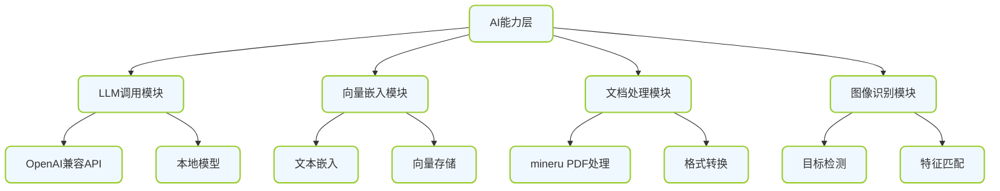
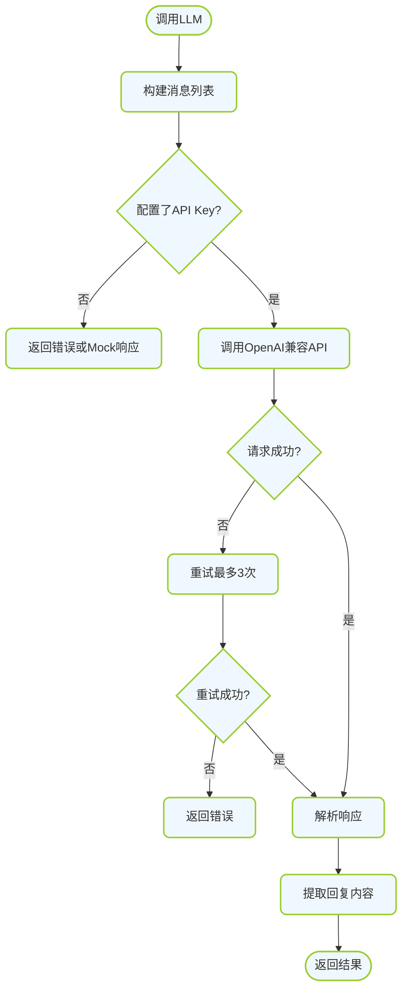
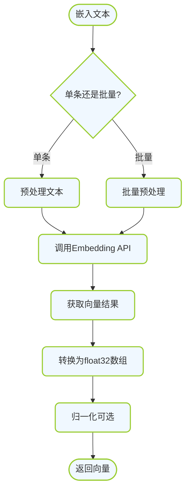
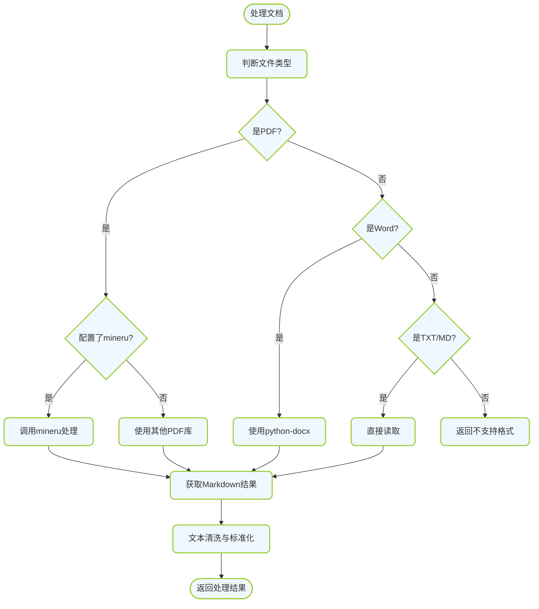

# AI能力层详细设计

---

## 🏗️ 一、AI能力层架构

### 1.1 组成模块



---

## 🤖 二、LLM调用模块

### 2.1 入口说明

- **文件位置**: `backend/src/campus_ai/core/utils/llm_client.py`
- **调用方式**: `llm_client.chat(messages, **kwargs)`
- **兼容性**: 支持 OpenAI 兼容接口

### 2.2 运转机制



### 2.3 数据标准 - 消息格式

| 字段 | 类型 | 必填 | 说明 | 合格标准 |
|-----|------|------|------|---------|
| `role` | str | 是 | 角色 | "system"/"user"/"assistant" |
| `content` | str | 是 | 内容 | 非空字符串 |

### 2.4 数据标准 - LLM响应标准

| 项目 | 标准 | 说明 |
|-----|------|------|
| 响应时间 | < 30秒 | 超过30秒视为超时 |
| 内容格式 | Markdown/纯文本 | 返回结构化内容 |
| 错误处理 | 抛出明确异常 | 包含错误码和消息 |
| Token预估 | 可选 | 预估消耗Token数 |

### 2.5 落地步骤

**Step 1: 创建 LLM 客户端**

```python
# backend/src/campus_ai/core/utils/llm_client.py
from typing import List, Dict, Any, Optional
import openai
from campus_ai.core.config import get_settings

settings = get_settings()

class LLMClient:
    def __init__(self):
        self.client = openai.AsyncOpenAI(
            api_key=settings.OPENAI_API_KEY,
            base_url=settings.OPENAI_BASE_URL,
        )
        self.default_model = "gpt-3.5-turbo"
        self.max_retries = 3

    async def chat(
        self,
        messages: List[Dict[str, str]],
        model: Optional[str] = None,
        temperature: float = 0.7,
        max_tokens: Optional[int] = None,
        **kwargs
    ) -> str:
        """
        调用LLM聊天接口
        
        输入: messages列表, 每个元素包含role和content
        输出: 纯文本回复
        """
        if not settings.OPENAI_API_KEY:
            return "[API Key未配置] 这是一个模拟回复"

        model = model or self.default_model
        last_exception = None

        for attempt in range(self.max_retries):
            try:
                response = await self.client.chat.completions.create(
                    model=model,
                    messages=messages,
                    temperature=temperature,
                    max_tokens=max_tokens,
                    **kwargs
                )
                return response.choices[0].message.content or ""
            except Exception as e:
                last_exception = e
                if attempt < self.max_retries - 1:
                    import asyncio
                    await asyncio.sleep(2 ** attempt)  # 指数退避
                continue

        raise Exception(f"LLM调用失败: {last_exception}")

    async def chat_with_system(
        self,
        user_prompt: str,
        system_prompt: str = "你是一个有帮助的助手",
        **kwargs
    ) -> str:
        """带System Prompt的便捷调用"""
        messages = [
            {"role": "system", "content": system_prompt},
            {"role": "user", "content": user_prompt},
        ]
        return await self.chat(messages, **kwargs)

llm_client = LLMClient()
```

**Step 2: 使用示例**

```python
# 使用示例
from campus_ai.core.utils.llm_client import llm_client

async def example():
    response = await llm_client.chat_with_system(
        user_prompt="介绍一下你自己",
        system_prompt="你是一个校园AI助手"
    )
    print(response)
```

---

## 🔢 三、向量嵌入模块

### 3.1 入口说明

- **文件位置**: `backend/src/campus_ai/core/utils/embedder.py`
- **调用方式**: `embedder.embed(text)` 或 `embedder.embed_batch(texts)`
- **输出**: float32 数组, 维度需保持一致

### 3.2 运转机制



### 3.3 数据标准 - 向量规范

| 项目 | 标准值 | 说明 |
|-----|--------|------|
| 数据类型 | float32 | 统一使用float32 |
| 向量维度 | 1536 / 1024 / 768 | 根据模型确定, 固定不变 |
| 归一化 | L2归一化可选 | 推荐归一化 |
| 最大输入长度 | 8192 tokens | 超长文本需截断 |

### 3.4 数据标准 - 文本预处理规范

| 处理步骤 | 说明 | 合格标准 |
|---------|------|---------|
| 去除多余空白 | 合并多个空格、换行 | 不影响语义 |
| 特殊字符处理 | 保留中文、英文、数字、标点 | 不乱码 |
| 长度截断 | 超长文本截断到最大长度 | 保留关键信息 |

### 3.5 落地步骤

**Step 1: 创建向量嵌入模块**

```python
# backend/src/campus_ai/core/utils/embedder.py
from typing import List, Optional
import numpy as np
import openai
from campus_ai.core.config import get_settings
from campus_ai.core.utils.text_cleaner import text_cleaner

settings = get_settings()

class Embedder:
    def __init__(self):
        self.client = openai.AsyncOpenAI(
            api_key=settings.OPENAI_API_KEY,
            base_url=settings.OPENAI_BASE_URL,
        )
        self.default_model = "text-embedding-3-small"
        self.embedding_dim = 1536
        self.max_tokens = 8192

    async def embed(self, text: str, model: Optional[str] = None) -> np.ndarray:
        """
        嵌入单条文本
        
        输入: 文本字符串
        输出: float32数组, shape=(embedding_dim,)
        """
        if not text or not text.strip():
            return np.zeros(self.embedding_dim, dtype=np.float32)

        # 预处理文本
        text = text_cleaner.clean(text)

        if not settings.OPENAI_API_KEY:
            # Mock向量
            return np.random.randn(self.embedding_dim).astype(np.float32)

        model = model or self.default_model

        response = await self.client.embeddings.create(
            model=model,
            input=text[:8000],  # 截断超长文本
        )

        embedding = response.data[0].embedding
        return np.array(embedding, dtype=np.float32)

    async def embed_batch(self, texts: List[str], model: Optional[str] = None) -> List[np.ndarray]:
        """批量嵌入文本"""
        embeddings = []
        for text in texts:
            emb = await self.embed(text, model)
            embeddings.append(emb)
        return embeddings

    def normalize(self, vector: np.ndarray) -> np.ndarray:
        """L2归一化向量"""
        norm = np.linalg.norm(vector)
        if norm == 0:
            return vector
        return vector / norm

embedder = Embedder()
```

**Step 2: 使用示例**

```python
from campus_ai.core.utils.embedder import embedder

async def example():
    # 单条嵌入
    vec = await embedder.embed("这是一段测试文本")
    print(f"向量维度: {vec.shape}")

    # 批量嵌入
    vecs = await embedder.embed_batch(["文本1", "文本2", "文本3"])
    print(f"批量嵌入数量: {len(vecs)}")
```

---

## 📄 四、文档处理模块

### 4.1 入口说明

- **文件位置**: `backend/src/campus_ai/core/utils/mineru_helper.py` 和 `document_processor.py`
- **支持格式**: PDF (优先使用 mineru), Word, TXT, MD
- **输出格式**: 标准化 Markdown 文本

### 4.2 运转机制



### 4.3 数据标准 - 文档处理规范

| 项目 | 标准 | 说明 |
|-----|------|------|
| 输入文件大小 | < 50MB | 超大文件需特殊处理 |
| 输出格式 | UTF-8编码 Markdown | 统一输出格式 |
| 图片处理 | 提取到本地目录 | 链接使用相对路径 |
| 结构保留 | 保留标题层级、表格等 | 尽量还原文档结构 |
| 错误处理 | 失败返回明确错误信息 | 不抛出异常中断流程 |

### 4.4 落地步骤

**Step 1: 创建 mineru 辅助模块**

```python
# backend/src/campus_ai/core/utils/mineru_helper.py
import os
import subprocess
import tempfile
from pathlib import Path
from typing import Optional
from campus_ai.core.config import get_settings

settings = get_settings()

class MineruHelper:
    def __init__(self):
        self.mineru_path = settings.MINERU_PATH or "mineru"

    def is_available(self) -> bool:
        """检查mineru是否可用"""
        if not self.mineru_path:
            return False
        try:
            result = subprocess.run(
                [self.mineru_path, "--version"],
                capture_output=True,
                text=True,
                timeout=10
            )
            return result.returncode == 0
        except Exception:
            return False

    def process_pdf(self, pdf_path: str, output_dir: Optional[str] = None) -> str:
        """
        使用mineru处理PDF
        
        输入: PDF文件路径
        输出: Markdown文本内容
        """
        if not os.path.exists(pdf_path):
            raise FileNotFoundError(f"PDF文件不存在: {pdf_path}")

        if output_dir is None:
            output_dir = tempfile.mkdtemp()

        # 调用mineru
        cmd = [
            self.mineru_path,
            pdf_path,
            "--output-dir", output_dir,
            "--format", "markdown"
        ]

        try:
            result = subprocess.run(
                cmd,
                capture_output=True,
                text=True,
                timeout=300  # 5分钟超时
            )

            if result.returncode != 0:
                raise Exception(f"mineru执行失败: {result.stderr}")

            # 查找输出的md文件
            pdf_name = Path(pdf_path).stem
            md_files = list(Path(output_dir).glob(f"{pdf_name}*.md"))

            if not md_files:
                raise Exception("未找到mineru输出的Markdown文件")

            # 读取内容
            with open(md_files[0], "r", encoding="utf-8") as f:
                content = f.read()

            return content

        except subprocess.TimeoutExpired:
            raise Exception("mineru处理超时")

mineru_helper = MineruHelper()
```

**Step 2: 创建文档处理器**

```python
# backend/src/campus_ai/core/utils/document_processor.py
import os
from pathlib import Path
from typing import Optional
from .mineru_helper import mineru_helper
from .text_cleaner import text_cleaner

class DocumentProcessor:
    def __init__(self, upload_dir: str = "./uploads"):
        self.upload_dir = Path(upload_dir)
        self.upload_dir.mkdir(parents=True, exist_ok=True)

    def process_file(self, file_path: str) -> str:
        """
        处理文档文件
        
        输入: 文件路径
        输出: 标准化文本内容
        """
        ext = Path(file_path).suffix.lower()

        if ext == ".pdf":
            return self._process_pdf(file_path)
        elif ext in [".docx", ".doc"]:
            return self._process_word(file_path)
        elif ext in [".txt", ".md"]:
            return self._process_text(file_path)
        else:
            raise ValueError(f"不支持的文件格式: {ext}")

    def _process_pdf(self, pdf_path: str) -> str:
        """处理PDF文件"""
        if mineru_helper.is_available():
            try:
                content = mineru_helper.process_pdf(pdf_path)
                return text_cleaner.clean(content)
            except Exception as e:
                print(f"mineru处理失败, 回退到简单方式: {e}")

        # 回退方案: 使用pdfplumber或其他库
        return self._process_pdf_simple(pdf_path)

    def _process_pdf_simple(self, pdf_path: str) -> str:
        """简单PDF处理(备选方案)"""
        try:
            import pdfplumber
            text_parts = []
            with pdfplumber.open(pdf_path) as pdf:
                for page in pdf.pages:
                    text = page.extract_text()
                    if text:
                        text_parts.append(text)
            content = "\n\n".join(text_parts)
            return text_cleaner.clean(content)
        except ImportError:
            raise Exception("需要安装pdfplumber: uv add pdfplumber")

    def _process_word(self, docx_path: str) -> str:
        """处理Word文档"""
        try:
            from docx import Document
            doc = Document(docx_path)
            text_parts = []
            for para in doc.paragraphs:
                text_parts.append(para.text)
            for table in doc.tables:
                for row in table.rows:
                    row_text = " | ".join(cell.text for cell in row.cells)
                    text_parts.append(row_text)
            content = "\n".join(text_parts)
            return text_cleaner.clean(content)
        except ImportError:
            raise Exception("需要安装python-docx: uv add python-docx")

    def _process_text(self, txt_path: str) -> str:
        """处理纯文本文件"""
        with open(txt_path, "r", encoding="utf-8") as f:
            content = f.read()
        return text_cleaner.clean(content)

document_processor = DocumentProcessor()
```

---

## ✅ 五、AI能力层验收标准

### 5.1 检查清单

| 检查项 | 验收标准 | 验证方法 |
|-------|---------|---------|
| LLM调用 | 可正常调用API返回回复 | 调用测试 |
| 向量嵌入 | 可生成固定维度向量 | 调用测试 |
| PDF处理 | mineru可用时可处理PDF | 测试文档处理 |
| 格式兼容 | 支持多种文档格式 | 多格式测试 |
| 错误处理 | 失败时有明确错误信息 | 异常测试 |
| Mock模式 | 无API Key时可运行 | 测试Mock模式 |
