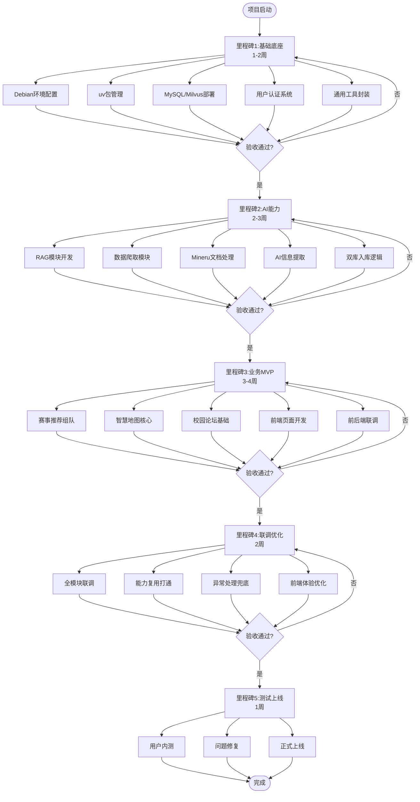
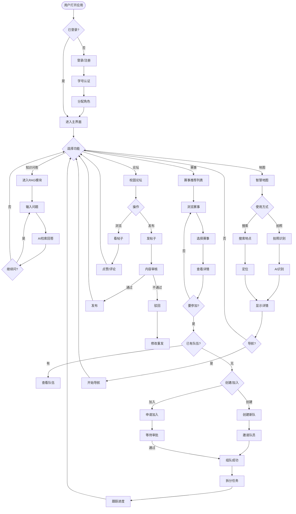
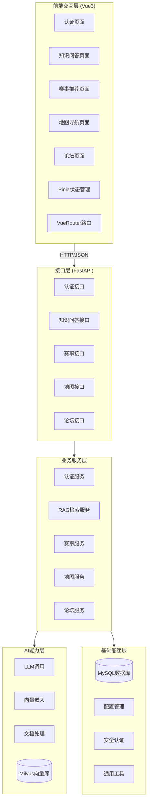

# 系统总流程图

---

## 项目开发里程碑

```mermaid
flowchart TD
    Start([项目启动]) --> M1

    M1[里程碑1:基础底座<br/>1-2周]
    M1 --> A1[Debian环境配置]
    M1 --> A2[uv包管理]
    M1 --> A3[MySQL/Milvus部署]
    M1 --> A4[用户认证系统]
    M1 --> A5[通用工具封装]

    A1 --> Check1{验收通过?}
    A2 --> Check1
    A3 --> Check1
    A4 --> Check1
    A5 --> Check1

    Check1 -->|否| M1
    Check1 -->|是| M2

    M2[里程碑2:AI能力<br/>2-3周]
    M2 --> B1[RAG模块开发]
    M2 --> B2[数据爬取模块]
    M2 --> B3[Mineru文档处理]
    M2 --> B4[AI信息提取]
    M2 --> B5[双库入库逻辑]

    B1 --> Check2
    B2 --> Check2
    B3 --> Check2
    B4 --> Check2
    B5 --> Check2

    Check2{验收通过?} -->|否| M2
    Check2 -->|是| M3

    M3[里程碑3:业务MVP<br/>3-4周]
    M3 --> C1[赛事推荐组队]
    M3 --> C2[智慧地图核心]
    M3 --> C3[校园论坛基础]
    M3 --> C4[前端页面开发]
    M3 --> C5[前后端联调]

    C1 --> Check3
    C2 --> Check3
    C3 --> Check3
    C4 --> Check3
    C5 --> Check3

    Check3{验收通过?} -->|否| M3
    Check3 -->|是| M4

    M4[里程碑4:联调优化<br/>2周]
    M4 --> D1[全模块联调]
    M4 --> D2[能力复用打通]
    M4 --> D3[异常处理兜底]
    M4 --> D4[前端体验优化]

    D1 --> Check4
    D2 --> Check4
    D3 --> Check4
    D4 --> Check4

    Check4{验收通过?} -->|否| M4
    Check4 -->|是| M5

    M5[里程碑5:测试上线<br/>1周]
    M5 --> E1[用户内测]
    M5 --> E2[问题修复]
    M5 --> E3[正式上线]

    E1 --> Done([完成])
    E2 --> Done
    E3 --> Done
```

---

## 用户完整操作流程

```mermaid
flowchart TD
    Start([用户打开应用]) --> LoginCheck{已登录?}

    LoginCheck -->|否| Login[登录/注册]
    Login --> Auth[学号认证]
    Auth --> Role[分配角色]
    Role --> Main[进入主界面]

    LoginCheck -->|是| Main

    Main --> Menu{选择功能}

    Menu -->|知识问答| RAG[进入RAG模块]
    RAG --> Ask[输入问题]
    Ask --> AIAns[AI检索回答]
    AIAns --> MoreQ{继续问?}
    MoreQ -->|是| Ask
    MoreQ -->|否| Menu

    Menu -->|赛事| Contest[赛事推荐列表]
    Contest --> Browse[浏览赛事]
    Browse --> Select[选择赛事]
    Select --> Detail[查看详情]
    Detail --> Join{要参加?}
    Join -->|是| Team{已有队伍?}
    Join -->|否| Browse

    Team -->|有| TeamInfo[查看队伍]
    Team -->|无| CreateJoin{创建/加入}
    CreateJoin -->|创建| CreateTeam[创建新队]
    CreateJoin -->|加入| JoinTeam[申请加入]
    CreateTeam --> Invite[邀请队员]
    JoinTeam --> Wait[等待审批]
    Invite --> Success[组队成功]
    Wait -->|通过| Success
    Success --> Tasks[拆分任务]
    Tasks --> Track[跟踪进度]
    Track --> Menu

    Menu -->|地图| Map[智慧地图]
    Map --> MapChoice{使用方式}
    MapChoice -->|拍照| Photo[拍照识别]
    MapChoice -->|搜索| Search[搜索地点]
    Photo --> Identify[AI识别]
    Search --> Locate[定位]
    Identify --> Show[显示详情]
    Locate --> Show
    Show --> Nav{导航?}
    Nav -->|是| NavStart[开始导航]
    Nav -->|否| Menu
    NavStart --> Menu

    Menu -->|论坛| Forum[校园论坛]
    Forum --> ForumChoice{操作}
    ForumChoice -->|浏览| ViewPost[看帖子]
    ForumChoice -->|发布| NewPost[发帖子]
    ViewPost --> Interact[点赞/评论]
    NewPost --> Audit[内容审核]
    Audit -->|通过| Publish[发布]
    Audit -->|不通过| Reject[驳回]
    Reject --> Edit[修改重发]
    Publish --> Menu
    Interact --> Menu
```

---

## 系统架构分层

```mermaid
flowchart TB
    subgraph Frontend["前端交互层 (Vue3)"]
        AuthUI[认证页面]
        RAGUI[知识问答页面]
        ContestUI[赛事推荐页面]
        MapUI[地图导航页面]
        ForumUI[论坛页面]
        Store[Pinia状态管理]
        Router[VueRouter路由]
    end

    Frontend -- HTTP/JSON --> API

    subgraph API["接口层 (FastAPI)"]
        AuthAPI[认证接口]
        RAGAPI[知识问答接口]
        ContestAPI[赛事接口]
        MapAPI[地图接口]
        ForumAPI[论坛接口]
    end

    API --> Service

    subgraph Service["业务服务层"]
        AuthService[认证服务]
        RAGService[RAG检索服务]
        ContestService[赛事服务]
        MapService[地图服务]
        ForumService[论坛服务]
    end

    Service --> Base

    subgraph Base["AI能力层"]
        LLM[LLM调用]
        Embedding[向量嵌入]
        DocProc[文档处理]
        VectorDB[(Milvus向量库)]
    end

    Service --> DB

    subgraph DB["基础底座层"]
        MySQL[(MySQL数据库)]
        Config[配置管理]
        Security[安全认证]
        Utils[通用工具]
    end
```
