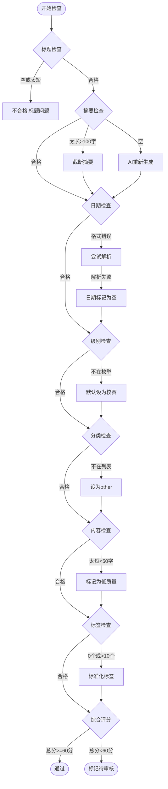

# 数据处理详细流程

---

## 赛事数据处理全流程

```mermaid
flowchart TD
    Start([定时任务触发<br/>每2小时]) --> Crawl

    subgraph Crawl["1. 数据爬取阶段"]
        Crawl[配置爬取源] --> List[爬取列表页]
        List --> ForEach{逐条处理}
        ForEach --> CheckExist{URL已存在?}
        CheckExist -->|是| Skip[跳过]
        CheckExist -->|否| Detail[爬取详情页]
        Detail --> Download{有附件?}
        Download -->|是| DownFile[下载附件]
        Download -->|否| SaveRaw
        DownFile --> SaveRaw[(保存原始数据<br/>MySQL Raw表)]
    end

    SaveRaw --> Preprocess

    subgraph Preprocess["2. 预处理阶段"]
        Preprocess[读取待处理数据] --> CheckFile{附件类型?}
        CheckFile -->|PDF| Mineru{Mineru可用?}
        Mineru -->|是| CallMineru[调用Mineru转换<br/>PDF→Markdown]
        Mineru -->|否| Fallback[备用方案<br/>pdfplumber]
        CheckFile -->|Word| Docx[python-docx读取]
        CheckFile -->|其他| Other[直接读取]
        CallMineru --> Clean
        Fallback --> Clean
        Docx --> Clean
        Other --> Clean

        Clean[文本清洗<br/>去噪/规范化] --> Out[输出标准化文本]
    end

    Out --> AI

    subgraph AI["3. AI处理阶段"]
        AI[调用LLM] --> Prompt[构建提取Prompt]
        Prompt --> LLMCall[发送给LLM]
        LLMCall --> ParseJSON[解析JSON响应]
        ParseJSON --> Extract{提取成功?}
        Extract -->|否| MarkError[标记异常]
        Extract -->|是| Verify[合规校验]

        Verify --> GenSummary[生成极简摘要<br/>100字内]
        GenSummary --> Classify[自动分档<br/>校赛/省赛/国赛]
        Classify --> Tag[赛道分类<br/>打标签]
        Tag --> CheckData{数据合格?}
        CheckData -->|否| MarkPending[标记待审核]
        CheckData -->|是| Ready[AI校验通过]
    end

    Ready --> Storage
    MarkError --> Storage
    MarkPending --> Storage

    subgraph Storage["4. 数据入库阶段"]
        Storage[准备入库] --> GenVec[生成向量嵌入]
        GenVec --> MySQL[(存入MySQL<br/>结构化数据)]
        GenVec --> Milvus[(存入Milvus<br/>向量数据)]

        MySQL --> Update[更新关联关系]
        Milvus --> Update
        Update --> Notify[触发推荐更新]
    end

    Notify --> Done([数据处理完成])
```

---

## RAG知识问答流程

```mermaid
flowchart TD
    User([用户输入问题]) --> QProcess

    subgraph QProcess["问题处理"]
        QProcess[接收问题] --> CleanQ[清洗/规范化]
        CleanQ --> Intent[意图识别<br/>可选]
        Intent --> VecQ[问题向量化]
    end

    VecQ --> Search

    subgraph Search["检索阶段"]
        Search[Milvus检索] --> TopK[Top-K相似块<br/>默认K=5]
        TopK --> Filter[过滤条件<br/>分类/权限]
        Filter --> ReRank[重排序<br/>可选]
    end

    ReRank --> Build

    subgraph Build["构建上下文"]
        Build[获取元数据] --> Context[拼接参考内容]
        Context --> History[加入对话历史<br/>可选]
        History --> Prompt[构建最终Prompt]
    end

    Prompt --> Gen

    subgraph Gen["生成答案"]
        Gen[调用LLM] --> Stream{流式?}
        Stream -->|是| StreamOut[流式输出]
        Stream -->|否| Normal[普通输出]
        StreamOut --> PostProc
        Normal --> PostProc
        PostProc[后处理<br/>格式/引用]
    end

    PostProc --> Response

    subgraph Response["返回结果"]
        Response[组装响应] --> Answer[答案文本]
        Response --> Sources[参考来源]
        Response --> Time[响应时间]
    end

    Answer --> Display([前端显示])
    Sources --> Display
    Time --> Display
```

---

## 数据质量检查流程


