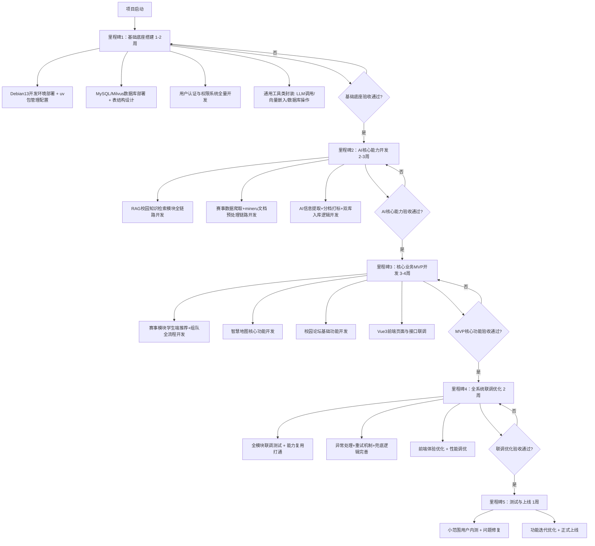
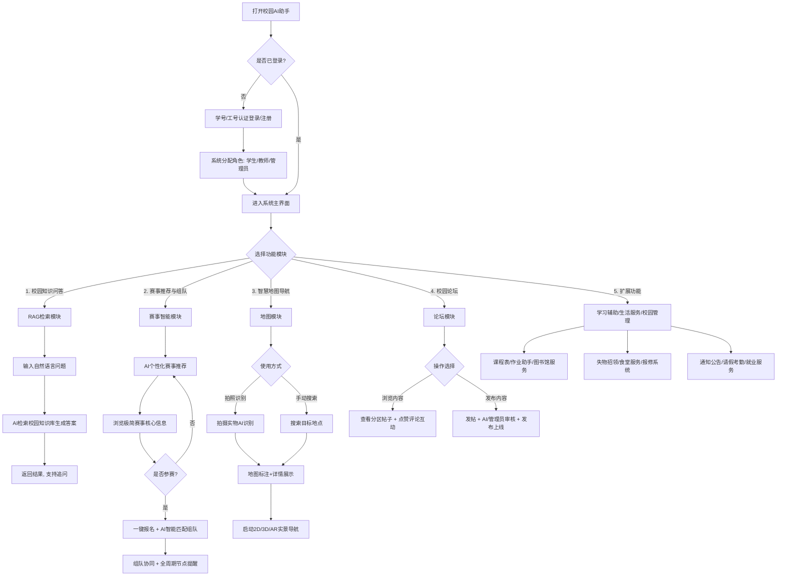
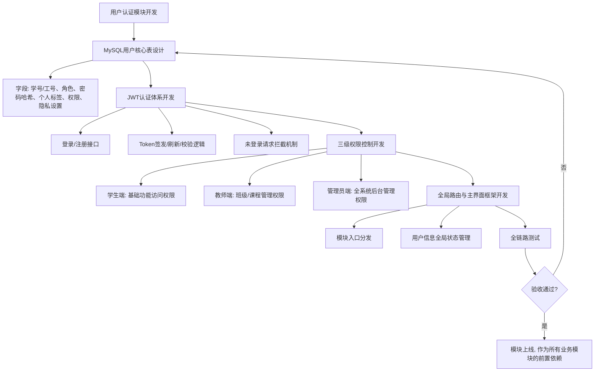
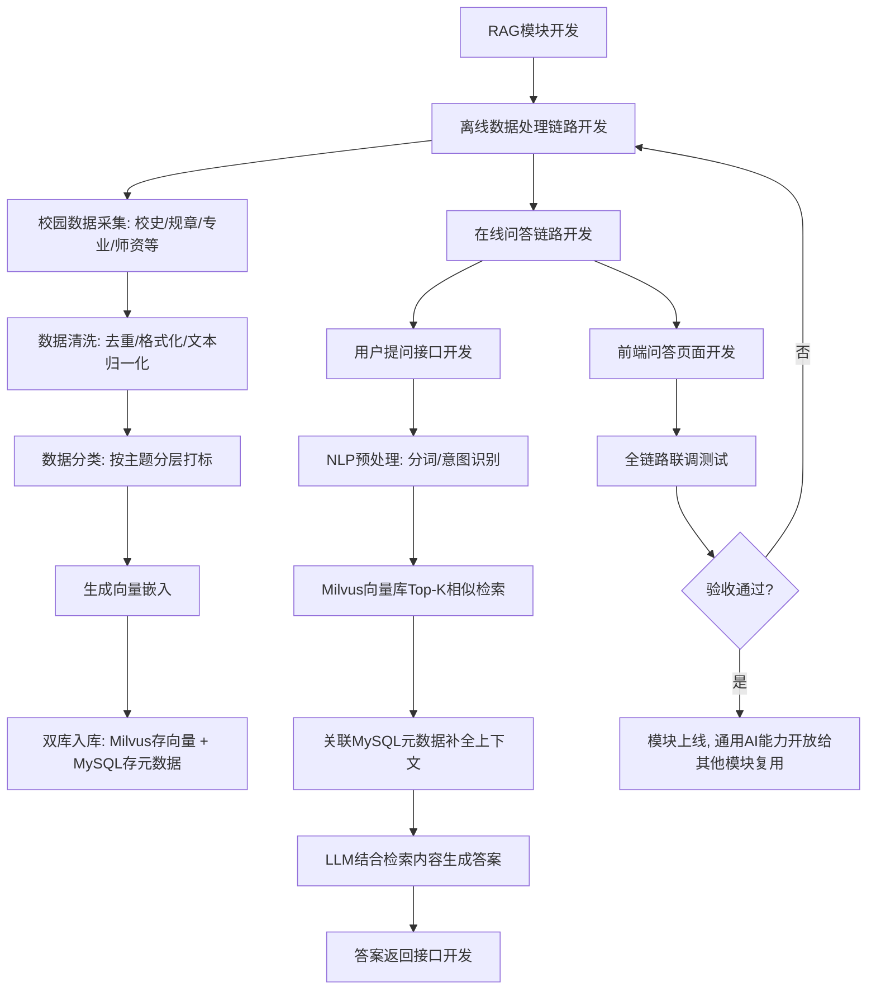
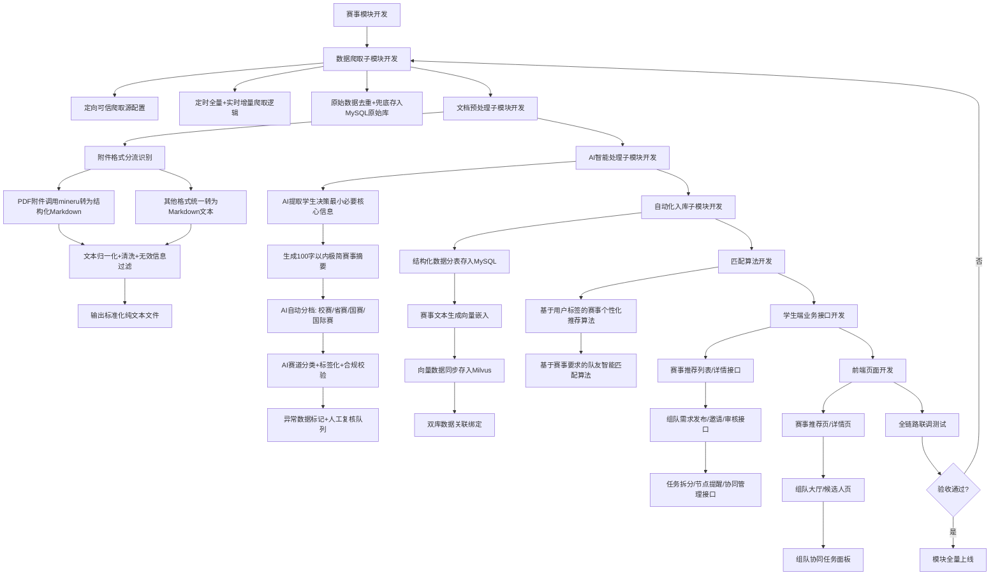
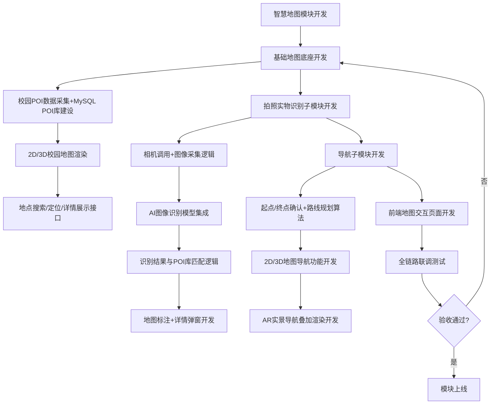
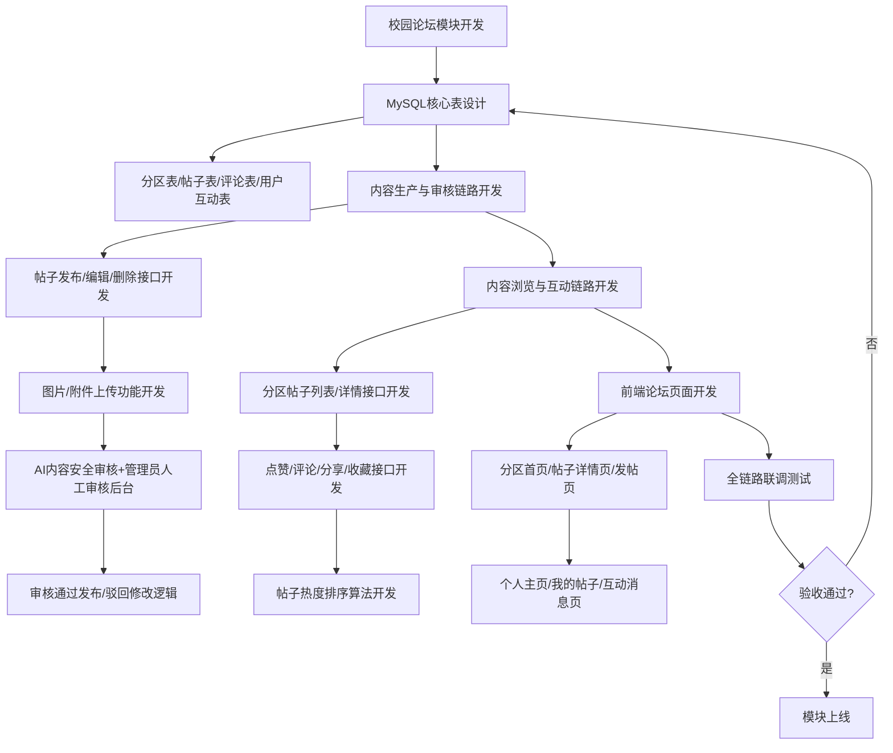

# 校园AI助手开发全流程流程图
以下流程图完全贴合你的开发技术栈与开发节奏，分为「**项目开发里程碑总览**」「**系统业务全闭环总流程**」「**核心模块开发闭环流程**」三部分，可直接作为开发执行蓝图使用，所有mermaid代码均支持标准Markdown渲染。

---

## 一、项目开发里程碑总览流程图（开发执行顺序总纲）
明确从0到1的开发先后顺序，规避依赖倒置问题，严格按优先级推进

---

## 二、系统业务全闭环总流程图（用户端完整业务骨架）
覆盖所有核心功能的用户操作全流程，是整个系统的业务顶层设计

---

## 三、核心模块开发闭环流程图（按开发优先级排序）
### 模块1：基础底座与用户认证模块（开发优先级：最高，必须最先完成）

### 模块2：RAG校园知识检索模块（开发优先级：次高，AI能力底座）

### 模块3：赛事智能推荐与组队模块（开发优先级：中高，核心需求全链路细化）

### 模块4：智慧地图与AR导航模块（开发优先级：中，独立业务模块）

### 模块5：校园论坛模块（开发优先级：中，独立业务模块）
